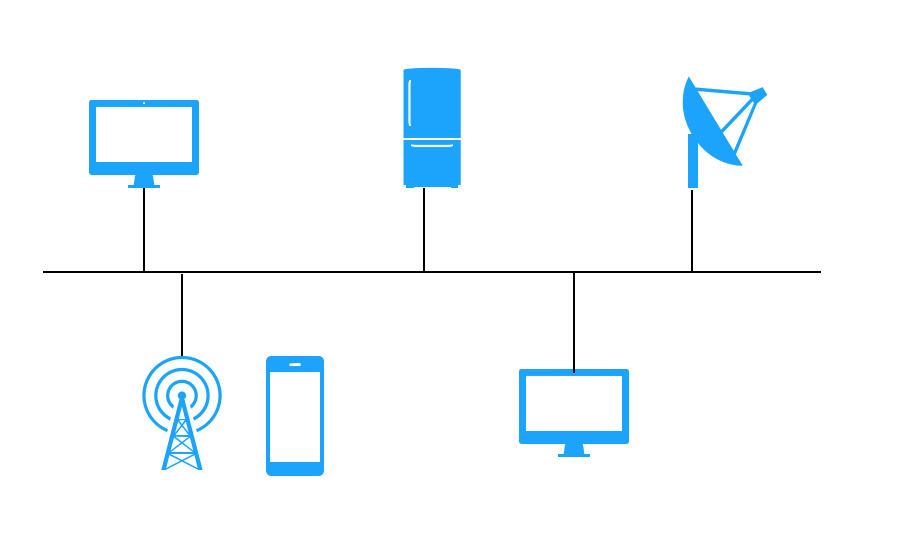

Hace poco encontré el sitio [roadmap.sh](https://roadmap.sh/) donde los autores proponen roadmaps para distintos roles TI modernos. Es decir, una serie de conocimientos básicos que se deben dominar por cada rol.

En particular para un Backend Developer proponen el siguiente roadmap:


Interesante propuesta. No la voy a cuestionar, porque pensando en nuevos artículos para este blog, decidí abordar cada uno de los puntos de este roadmap, en una serie, de modo que vamos revisando cada uno de estos conceptos usando código.

La idea es la siguiente, por cada uno de los rectángulos que salen en este mapa vamos a escribir código que nos permita entender cada uno de estos conceptos.

## ¿Cómo funciona Internet?

De acuerdo a este mapa de competencias, para ser un desarrollador backend moderno, lo que primero deberíamos entender es cómo funciona internet.

Interesante pregunta, pero la respuesta no es sencilla. Pero veamos que podemos hacer.

No voy a entrar a explicar todos los conceptos necesarios para entender cómo funcionan las redes. Tampoco explicaré qué son los protocolos de redes. Hay libros, y videos, y miles de posts que explican cómo funcionan las redes en general. Asumiremos que entienden lo básico, y si no, es la oportunidad de investigar estos temas.

Para efectos de este ejercicio me basaré en este video:



En el video se plantea que una abtracción útil es pensar en internet como un cable:



Directa o indirectamente todos los conectados a internet llegan a este "cable". 

Hoy en día hay todo tipo de dispositivos que se conectan a internet.
Estos dispositivos pueden actuar como "clientes", que consumen algún "servicio" o  "servidores", que prestan un "servicio".
En esencia internet es un "cable" que conecta clientes con servidores.

Entonces, una forma de entender cómo funciona internet, y de modo que sea útil para un desarrollador backend, es construyendo un servidor y por supuesto un cliente.

Vamos a escribir un servidor que preste un servicio muy simple que llamaremos `echo`.

## Programando un servidor

`echo` es un servicio que publicaremos en internet y que es muy sencillo, recibe un texto y responde el mismo texto que recibe.

Cada servicio en internet es una pieza de software que se ejecuta en un "host", a veces también llamado servidor, y que es una pieza de hardware con poder de cómputo, y al que se le asigna una dirección IP, que es un número que nos permite localizarlo.

Por ahora `echo` es un servicio que publicaremos en nuestro computador local, también conocido como localhost, cuya dirección es 127.0.0.1. Pero atención, esta dirección IP en particular es una referencia local, siempre se refiere a la máquina donde estás trabajando.  Más adelante veremos como publicar nuestro servicio y darle una dirección IP real que puedan usar otros.

Cómo en un host pueden haber muchos servicios ejecutándose, cada uno usa una puerta (port), que es un número, normalmente solicitado al sistema operativo, y por donde se publica el servicio. Más adelante, cuando revisemos otros conceptos (como hosting) vamos a profundizar en todo esto.

Por ahora, sólo nos interesa saber que un servicio tiene una dirección IP (127.0.0.1 por ahora) y un puerto (usaremos el 12345).

Para crear nuestro servicio usaremos el lenguaje Python.

Para permitir la comunicación en internet, hace muchos años atrás se invento una abstracción de programación muy útil llamada socket[^1].

El concepto de socket fue introducido en Unix BSD 2.1. Este modelo nos permite tratar la capa de red como si fueran archivos estándares de Unix. Para usarlos en Python debemos usar la biblioteca sockets.

Como vamos a crear un servidor lo que necesitamos crear un socket y para eso hacemos lo siguiente:

```python
import socket
import sys

sock = socket.socket(socket.AF_INET, socket.SOCK_STREAM)
```

Lo que hacemos acá es crear un socket, que guardamos en la variable `sock`, y que soporta el protocolo [IPV4](https://es.wikipedia.org/wiki/IPv4), esto se logra al usar la constante `socket.AF_INET` como el primer argumento en la llamada a `socket.socket`, si quisieramos usar el protocolo [IPV6](https://es.wikipedia.org/wiki/IPv6) podemos usar la constante `socket.AF_INET6`. El protocolo IP es el protocolo de red básico en internet. Por supuesto se pueden abrir sockets que usen otros protocolos de red.

El segundo argumento define el tipo de socket que usaremos, en este caso `socket.SOCK_STREAM`. Los sockets de este tipo garantizan que el despacho de los datos respetara el orden en que se envíen y no se perderán los paquetes. Por ejemplo, si enviamos "A", "B" y "C", a través de la red la secuencia se mantendrá y en el otro extremo de la red llegará "A", "B", y "C". Este tipo de sockets usa el protocolo TCP para garantizar esto. Para entender qué es TCP sugiero partir por esta entrada en Wikipedia: https://es.wikipedia.org/wiki/Protocolo_de_control_de_transmisi%C3%B3n. Hay otro protocolo, como [UDP](https://es.wikipedia.org/wiki/Protocolo_de_datagramas_de_usuario), que no brinda estas garantías, pero no nos serviría para este ejercicio. Para profundizar sobre la familia de protocolos en internet puedes partir por este enlace en wikipedia: https://es.wikipedia.org/wiki/Familia_de_protocolos_de_internet.

Continuemos.

Para poder usar este socket debemos asociarlo a una dirección asociada a nuestro host. Esto se hace mediante la primitiva `bind()` (enlazar). Esto se logra con este código:

```python
server_address = ('localhost', 12345)
sock.bind(server_address)
```

Una vez configurado nuestro socket lo activamos mediante la primitiva `listen()`, y de ese modo estamos en condiciones de aceptar peticiones a nuestro servidor, mediante la primitiva `accept()`.

El siguiente código implementa el motor central de cualquier servidor:

```python
sock.listen(1)

while True:
    connection, client_address = sock.accept()
    process_connection(connection, client_address)
```

Cuando un cliente establece una conexión a nuestro servidor, usando el port público, se produce una negociación entre el cliente y el servidor y producto de esta se crea una nueva conexión (que se deja en la variable `connection`) en un nuevo port, que es asignado por el kernel del sistema operativo. Desde ese punto el resto de la comunicación entre nuestro servidor y el cliente se realizará a través de ese nuevo puerto. La variable `connection` es en realidad un nuevo socket.

Es decir, el puerto 12345 es nuestra puerta de acceso pública, pero después, el resto de la comunicación se ejecuta en otro puerto que se asigna temporalmente mientras dure la ejecución del servicio.

En el código de arriba la función `process_connection` será la que implemente nuestro servicio, en este caso `echo`:

```python
def proocess_connection(connection, client_address):
    try:
        print 'conexión desde la dirección:', client_address
        
        while True:
            data = connection.recv(16)
            if data:
                connection.send_all(data)
            else:
                break
    finally:
        connection.close()
```

Lo que hacemos es leer data desde el socket `connection` usando la primitiva `recv` (16 bytes en cada ciclo).
En la medida que recibamos datos los enviamos de vuelta a través del mismo socket, mediante la primitiva `send_all()`.

Cuando ya no haya más data saldremos del loop y cerraremos el socket (usando la primitiva `close`).

Escribamos todo esto en el archivo socket_server.py que quedará así:

```python
# socket_server.py

import socket
import sys

def process_connection(connection, client_address):
    try:
        print 'conexión desde la dirección:', client_address
        
        while True:
            data = connection.recv(16)
            if data:
                connection.send_all(data)
            else:
                break
    finally:
        connection.close()

sock = socket.socket(socket.AF_INET, socket.SOCK_STREAM)

port = 12345
server_address = ('localhost', port)
sock.bind(server_address)

print 'iniciando servidor en puerto', port
sock.listen(1)

while True:
    connection, client_address = sock.accept()
    process_connection(connection, client_address)
```

Nos falta ahora un cliente que se comunique con este servidor.


## Programando un cliente

El cliente usa sockets igual que el servidor, pero la diferencia es que la conexión se establece usando la primitiva `connect()`.


```python
import socket
import sys

sock = socket.socket(socket.AF_INET, socket.SOCK_STREAM)

port = 12345
server_address = ('localhost', port)
sock.connect(server_address)
```

El mensaje a enviar lo tomaremos de los argumentos que se pasen a nuestro cliente:

```python
try:
    msg = sys.argv[1]
    sock.sendall(msg)

    received = 0
    msg_len = len(msg)
    
    while received < msg_len
        data = sock.recv(16)
        print data
        received += len(data)
finally:
    sock.close()
```

Recordemos que `echo` envía de vuelta el mismo mensaje que recibe.
Por eso que nuestro loop espera que la cantidad de bytes recibidos sea la misma que el largo del mensaje.

Así nuestro cliente queda así:

```python
# socket_client.py
import socket
import sys

sock = socket.socket(socket.AF_INET, socket.SOCK_STREAM)

port = 12345
server_address = ('localhost', port)
sock.connect(server_address)

try:
    msg = sys.argv[1]
    sock.sendall(msg)

    received = 0
    msg_len = len(msg)
    
    while received < msg_len
        data = sock.recv(16)
        print data
        received += len(data)
finally:
    sock.close()

```

Si probamos esto en una ventana ejecutaremos nuestro servidor:

```
python socket_server.py
```

y abriremos otra ventana, donde ejecutaremos nuestro cliente:

```
python socket_client.py "hola mundo"
```

Si todo sale bien en la ventana del cliente deberiamos ver el texto que pasemos como argumento del cliente, en este caso `hola mundo`.


Con esto hemos creado un cliente y un sevidor de internet, completando el primer peldaño en este camino a convertirnos en un desarrolador backend. 

El código de este ejercicio está en este repo GitHub: https://github.com/lnds/desafios-programando.org/tree/master/2020-07-20


## Ejercicios

1. Escribe este ejercicio en tu lenguaje favorito.
2. ¿Qué debes hacer para que el servidor pueda ser accesible desde otros computadores fuera de localhost?
3. Prueba algunas variaciones del servicio, como responder el argumento en mayúsculas.
4. Crea un servicio que responda una "fortune cookie", usando el resultado de llamar al programa [fortune de Unix](https://en.wikipedia.org/wiki/Fortune_(Unix))


[^1]: Para aprender más sobre sockets puedes leer este tutorial https://www.tutorialspoint.com/unix_sockets/what_is_socket.htm.