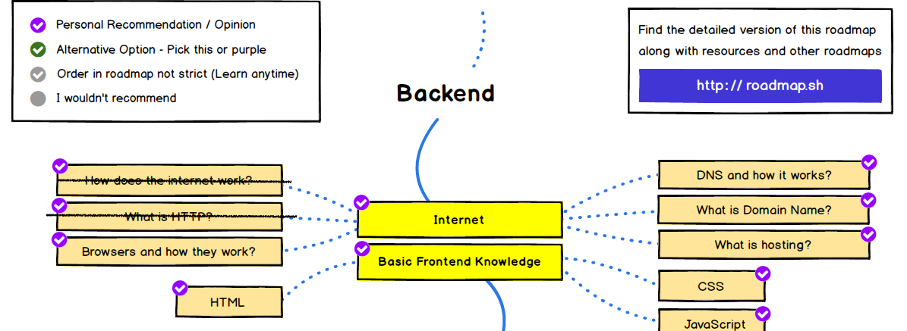
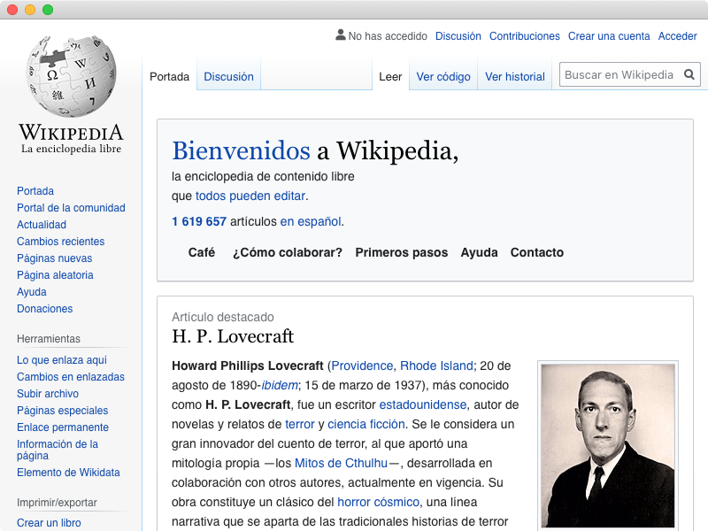

Este es el tercer artículo de esta serie, basada en el Backend Developer Roadmap publicado en el sitio [roadmap.sh](https://roadmap.sh/).

En el [port anterior](/blog/2020/07/031/el-camino-de-un-backend-developer-http/) revisamos las diversas capas OSI y cómo opera el protocolo HTTP. Continuando con nuestro mapa, lo que debemos revisar ahora es cómo funcionan los browsers o navegadores web.



Antes de seguir, aprovecho de comentarles que ahora estos artículos pueden ser apoyados a través de [Kofi](https://ko-fi.com/lnds), si te interesa lo que estoy escribiendo, puedes invitarme a un café, o cerveza, virtual a través de este link: https://ko-fi.com/lnds, tu aporte significa un incentivo para seguir creando contenido de calidad en la red.



## El ambiente universal

Para explicar cómo funciona un navegador web tendría que gastar varios artículos, porque el browser es una de las herramientas más complejas disponibles en nuestros computadores personales.

En la práctica un browser modernos es un sistema operativo dentro de otro sistema operativo. Millones de aplicaciones se despliegan todos los días y operan en los browsers de PCs, teléfonos, tabletas y otros dispositivos.

El navegador se convirtió en la plataforma ubicua y popular, para la cual construimos casi todas nuestras aplicaciones hoy en día. 

Antiguamente se escribían las llamadas aplicaciones de escritorio, que dependían de cada sistema operativo, pero en la actualidad es bastante popular usar herramientas como [Electron](https://www.electronjs.org/) que nos permiten usar todos el poder de HTML y Javascript para construir aplicaciones de escritorio. Para esto usan una versión embebida de algún navegador.

Por otro lado, gracias al navegador nos evitamos el problema de distribuir las aplicaciones, si programamos bien nuestro front end, basta con darle la URL de acceso a nuestros usuarios y sabremos que podrá correr nuestra aplicación en su dispositivo (cualquiera que este sea), sin siquiera importar que sistema operativo está usando.

Usar un navegador es muy simple, e incorporar uno en nuestras aplicaciones no cuesta nada.

Veamos un ejemplo, el siguiente fragmento en Go nos permite usar [Webview](https://github.com/webview/webview), un cliente que usa WebKit tanto en MacOs, Linux como Windows 10:


```go
package main

import (
	"fmt"
	"os"
	"path/filepath"

	"github.com/webview/webview"
)

func main() {
	program := filepath.Base(os.Args[0])
	args := os.Args[1:]
	if len(args) < 1 {
		fmt.Printf("uso: %s url\n", program)
	} else {
		url := args[0]
		fmt.Println("navegando %s", url)
		debug := true
		w := webview.New(debug)
		defer w.Destroy()
		w.SetTitle("Mini Navegador Web")
		w.SetSize(800, 600, webview.HintNone)
		w.Navigate(url)
		w.Run()
	}

}
```

Las primeras líneas son para recibir la URL en la linea de comandos, lo importante es esta sección:


```go
		w := webview.New(debug)
		defer w.Destroy()
		w.SetTitle("Mini Navegador Web")
		w.SetSize(800, 600, webview.HintNone)
		w.Navigate(url)
		w.Run()
````

Con esto creamos un navegador web totalmente funcional, que queda alojado en una venta de 800x600 píxeles en nuestro entorno de escritorio.

Para compilar este programa (que grabaremos en el archivo 'navegador.go'), hacemos:

```bash
$ go build navegador.go
````

Y para usarlo escribimos

```sh
$./navegador https://es.wikipedia.org/
````

Esto abre una ventana en cuyo interior se encuentra la página principal de Wikipedia en español:




Esto, parece sencillo, pero es muy poderoso, si ustedes crean su propia app backend corriendo en el pc local pueden crear un "front" usando `webview` y construir una "aplicación de escritorio" que en realidad usa HTML y Javascript.
Tal como lo hace Electrón.

Por eso decimos que el Browser es la verdadera plataforma universal y ubicua que podemos usar para ejecutar prácticamente cualquier aplicación.

## Cómo funciona un navegador

Pero, sigo si explicar cómo funciona un navegador. Tal como dije antes, esa tarea requeriría de varios posts, pero no es necesario emprender ese trabajo porque hay dos personas que ya lo hicieron muy bien, se trata de Tail Garsiel y Paul Irish quienes escribieron un extenso artículo en HTML Rocks hace unos años atrás, en un artícjlo que se llama: [How Browsers Work: Behind the scenes of modern web browsers](https://www.html5rocks.com/en/tutorials/internals/howbrowserswork/).

Este artículo es un trabajo monumental que se basa en la investigación de la desarrolladora israelí [Tail Garsiel](http://taligarsiel.com/), que analizó el código fuente (millones de lineas de código, principalmente en C++), de varios engines open source, como WebKit y Gecko.

Hay una versión en español del artículo acá: https://www.html5rocks.com/es/tutorials/internals/howbrowserswork/

En ese artículo se describen las principales componentes de un navegador web y que se resumen en este diagrama:


Las componentes y su funcionamiento son más o menos las siguientes[^1]:

- Interfaz de usuario (User Interface): es la parte con la que interactúas, donde se incluye la barra de direcciones, los botones de avance y retroceso, el menú de marcadores, etc. Een general, todas las partes visibles del navegador, excepto la ventana principal donde se muestra la página solicitada.

- Motor de navegación (Browser Engine): es el coordinador de las acciones entre la interfaz y el motor de renderización.

- Motor de renderización (Rendering Engine): es responsable de mostrar el contenido solicitado. Por ejemplo, si el contenido solicitado es HTML, será el responsable de analizar el código HTML y CSS y de mostrar el contenido analizado en la pantalla.

- Módulo de Red (Network): es el módulo responsable de las llamadas de red, como las solicitudes HTTP. Tiene una interfaz independiente de la plataforma y realiza implementaciones en segundo plano para cada plataforma. (Esto se puede implementar usando las técnicas descritas en el [primer](/blog/2020/07/05/el-camino-de-un-backend-developer-en-2020/) y [segundo artículo](https://www.programando.org/blog/2020/07/31/el-camino-del-backend-developer-http/) de esta serie).

- Servidor de la interfaz (UI Backend): permite presentar widgets básicos, como ventanas y cuadros combinados. Muestra una interfaz genérica que no es específica de ninguna plataforma. Utiliza métodos de la interfaz de usuario del sistema operativo en segundo plano.

- Intérprete de JavaScript (JavaScript Interpreter): permite analizar y ejecutar el código JavaScript.

- Almacenamiento de datos (Data Persistence): es una capa de persistencia. El navegador necesita guardar todo tipo de datos en el disco duro (por ejemplo, las cookies). La nueva especificación de HTML (HTML5) define el concepto de "base de datos web", que consiste en una completa (aunque ligera) base de datos del navegador.


Hoy en día se siguen agregando piezas y sub piezas a esta estructura básica, por ejemplo, el motor [Quantum CSS](https://hacks.mozilla.org/2017/08/inside-a-super-fast-css-engine-quantum-css-aka-stylo/) de Mozilla, o las máquinas virtuales de WebAssembly, o algunos [engines de juego](https://blog.mozilla.org/blog/2014/03/18/mozilla-and-unity-bring-unity-game-engine-to-webgl/).

En un browser se combinan muchas técnicas y subdisciplinas de programación:

- Redes, que es la que permite acceder a los recursos que visualizaremos en el navegador.
- Compiladores e Intérpretes, porque se debe hacer un análisis de las páginas web descargadas e interpretar diferentes lenguajes, como CSS, HTML, JavaScript, etc.
- GUI y Computación Gráfica, para renderizar cada página web.
- Gestión de Datos, para manejar el almacenamiento local.
- Seguridad, porque muchas veces la ejecución del código del navegador se mantiene aislado del resto del sistema operativo (por ejemplo, mediante [sandboxing](https://www.howtogeek.com/169139/sandboxes-explained-how-theyre-already-protecting-you-and-how-to-sandbox-any-program/#:~:text=A%20sandbox%20is%20a%20tightly,you%20visit%20in%20a%20sandbox.)
- Criptografía: hoy en día muchos de los protocolos usados para navegar usan técnicas de encriptación avanzadas, además del manejo de certificados digitales.

Y por supuesto mucho ingenio y optimización, porque todos esperamos que nuestros navegadores no fallen.

Cómo podrán ver, el mundo de los navegadores es fascinante y podría dar para una serie tan extensa como la que ya estoy escribiendo. Les recomiendo fuertemente investigar y leer la referencia mencionada, en el próximo capítulo de esta serie jugaremos un poco con el DOM de HTML y haremos algo de lo que hacen los navegadores en el módulo de Rendering. Los espero.


Ejercicios:

- WebView puede ser usado con distintos lenguajes, como Python, Java, Rust, etc. Replica el programa mostrado en tu lenguaje favorito usando WebView.
- Agrega una interfaz de usuarioa  WebView y construye tu propio navegador Web.

El código fuente de navegador está en este repositorio: https://github.com/lnds/desafios-programando.org/tree/master/2020-08-19


[^1]: Adaptado de https://www.html5rocks.com/es/tutorials/internals/howbrowserswork/#The_browser_high_level_structure
