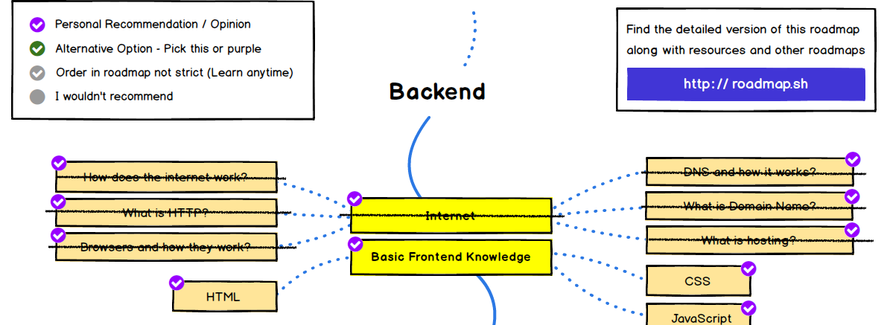

En muchos computadores modernos que usan algún sistema operativo basado en Unix existe un archivo llamado `hosts`. Normalmente se encuentra ubicado en el directorio `/etc/`. Si yo ejecuto el comando `cat /etc/hosts` en mi computador obtengo esto:

        ##
        # Host Database
        #
        # localhost is used to configure the loopback interface
        # when the system is booting.  Do not change this entry.
        ##
        127.0.0.1       localhost
        255.255.255.255 broadcasthost
        ::1             localhost
        # Added by Docker Desktop
        # To allow the same kube context to work on the host and the container:
        127.0.0.1 kubernetes.docker.internal
        # End of section

Este archivo es un resabio de un archivo que se llamaba HOSTS.TXT que era mantenido por el Stanford Research Institute para ARPANET. 
En este registro se mantiene un mapeo simple de direcciones con nombres de servidores. 


Este archivo se repartía entre los pocos miembros de internet y era la forma que se usaba para resolver nombres de servidores con direcciones IP. Con el tiempo, al crecer la cantidad de servidores conectados a la red mantener estos archivos era imposible. Así fue como en 1983 [Paul Mockapetris](https://es.wikipedia.org/wiki/Paul_Mockapetris) diseñó e implementó DNS. Lo notable es que este servicio escaló de unos pocos servidores a soportar la inmensa cantidad de servidores que existen en internet.



En esta segunda parte sobre DNS exploraremos el protocolo en si mismo implementando nada menos que un servidor DNS. Esto nos permitirá aplicar todo lo que hemos revisado hasta ahora sobre protocolos de redes y los conceptos definidos en el [anterior artículo](/blog/2020/09/05/el-camino-del-backend-developer-dns/) de esta serie.

Otra razón de implementar este servidor es mostrar al futuro desarrollador backend los rudimentos de cómo implementar un protocolo binario, algo que puede ser muy útil en su trabajo cuando se requiere cierto nivel de desempeño o prestaciones que no se dan con protocolos de texto, normalmente basados en HTTP.


## Construyendo un servidor DNS


Usaremos Python para construir nuestro servidor. Para esto nos apoyaremos en el excelente trabajo de [Emil Hernvall](http://emilhernvall.github.io), quien escribió una [guía sobre DNS](https://github.com/EmilHernvall/dnsguide) construyendo un servidor DNS en el lenguaje Rust[^1]. 

Los servidores DNS caen en dos tipos de categorías:


- Authoritative Server - un servidor NS que hospeda una o más "zonas". Por ejemplo, el servidor para la zona google.com son ns1.google.com, ns2.google.com, ns3.google.com and ns4.google.com.
- Caching Server - un servidor DNS que realiza busquedas primero verificando en su caché para ver si ya conoce el registro siendo consultado, y si no es el caso realiza una búsqueda recursiva para resolver el nombre. Este es el tipo de servidores que se encuentran en el router de tu casa y los que te asigna tu proveedor de internet.

El servidor que implementaremos en este artículo es un servidor que resuelve recursivamente, sin usar un caché.

## Un servidor DNS en Python

DNS usa UDP[^2] y se ha establecido que por defecto todo servidor DNS "escucha" sus requerimientos a través del puerto 53.

Lo primero que haremos es crear nuestra función principal que tendrá el clásico bucle de atención de un servidor, tal como vimos en los primeros capítulos de esta serie:

```python
def main(host, port):
    server_address = (host, port)
    sock = socket.socket(socket.AF_INET, socket.SOCK_DGRAM)  # DNS es UDP
    sock.bind(server_address)
    while True:
        handle_query(sock)
```

Pondremos todo esto en un script python que llamaremos `dns_server.py` y agregaremos al final de nuestro script esta instrucción:

```python
if __name__ == '__main__':
    main('localhost', 2053)
```

Noten que he elegido usar el puerto 2053, porque el puerto 53 está reservado y no será sencillo ejecutar nuestro servidor para que lo ocupe[^3].

Este código es simple y ya lo hemos visto, así que no requiere mucha explicación, ahora viene implementar la función `handle_query()`.

## La estructura de una consulta

El objetivo de la función `handle_query` es gestionar las consultas que los clientes DNS (como el utilitario `dig`) realizan a nuestro servidor. Para implementarlo debemos primero ser capaces de analizar una consulta, y para esto debemos entender la estructura de estas.

Tanto las consultas como las respuestas de neustro servicio tienen un formato establecido que corresponde a una trama de bytes con la siguiente estructura:


| Sección            | Tamaño     | Tipo              | Propósito                                                                                                |
| ------------------ | -------- | ----------------- | ------------------------------------------------------------------------------------------------------ |
| Header             | 12 Bytes | Encabezado            | Información sobre la consulta o respuesta.                                                                  |
| Question Section   | Variable | Lista de Preguntas | En la práctica contiene sólo una pregunta indicando el nombre del dominio y el tipo de registro de interés. |
| Answer Section     | Variable | Lista de Registros  | Los registros relevantes del tipo solicitado.                                                            |
| Authority Section  | Variable | Lista de Registros   | Una lista de servidores de nombre (registros NS), usados para resolver consultas recursivamente.                          |
| Additional Section | Variable | Lista de Registros   | Registros adicionales, que podrían ser útiles. Por ejemplo, los correspondientes registros tipo A para los registros NS.    |

La primera especificación del protocolo indica que un paquete con una solicitud a DNS tiene un largo máximo de 512 bytes y se realiza a través de UDP. Esto se modificó posteriormente y se puede usar TCP en la actualidad y extender el tamaño del paquete mediante eDNS, pero vamos a adherirnos a la especificación original en este ejercicio.

Dado lo anterior definiremos una constante en nuestro código para controlar el largo máximo del paquete a procesar:

```python
buffer_size = 512
```

El encabezado (Header) es una trama de 12 bytes que codifica información sobre la estructura general del paquete. Su forma es la siguiente:

| Nombre RFC | Nombre Descriptivo    | Largo             | Descripción                                                                                                                                                                         |
| -------- | -------------------- | ------------------ | ----------------------------------------------------------------------------------------------------------------------------------------------------------------------------------- |
| ID       | Packet Identifier    | 16 bits            | Un identificador aleatorio que se asigna a los paquetes de consulta. Los paquetes de respuesta deben responder con el mismo identificador. Este se requiere para diferenciar las respuestas debido a la naturaleza sin estado (_stateless_) de UDP.       |
| QR       | Query Response       | 1 bit              | 0 para consulta, 1 para respuestas.                                                                                                                                                     |
| OPCODE   | Operation Code       | 4 bits             | Tipicamente tiene el valor 0, consultar RFC1035 para más detalles.                                                                                                                                        |
| AA       | Authoritative Answer | 1 bit              | Contiene un 1 si el servidor que responde es autoridad, es decir, es dueño del dominio consultado.                                                                                       |
| TC       | Truncated Message    | 1 bit              | Contiene un 1 si el mensaje excede los 512 bytes. Es una indicación de que la consulta puede ser realizada nuevamente usando TCP, para lo cual no hay limitación en el largo.                     |
| RD       | Recursion Desired    | 1 bit              | Definida por el que envía la pregunta si el servidor debe intentar resolver la consulta recursivamente si no hay una respuesta disponible.                                     |
| RA       | Recursion Available  | 1 bit              | Definida por el servidor para indicar si están o no permitidas las consultads recursivas.                                                                                                         |
| Z        | Reserved             | 3 bits             | Originalmente reservado para uso posterior, hoy se usa para consultas DNSSEC.                                                                                                                 |
| RCODE    | Response Code        | 4 bits             | Definida por el servidor para idnicar el estado de la respuesta, es decir, si ha sido existosa o ha fallod, y en el último caso proveer detalles de la causa de la falla. |
| QDCOUNT  | Question Count       | 16 bits            | El tamaño de la lista en la Question Section                                                                                                                                       |
| ANCOUNT  | Answer Count         | 16 bits            | El tamaño de la lista en la Answer Section                                                                                                                                         |
| NSCOUNT  | Authority Count      | 16 bits            | El tamaño de la lista en la Authority Section                                                                                                                                      |
| ARCOUNT  | Additional Count     | 16 bits            | El tamaño de la lista en la Additional Section                                                                                                                                     |


Este encabezado lo modelaremos en python con la siguiente clase:

```python
from recordclass import RecordClass

class DnsHeader(RecordClass):
    id: int
    response: int
    opcode: int
    authoritative_answer: int
    truncated_message: int
    recursion_desired: int
    recursion_available: int
    z: int
    rescode: int
    questions: int
    answers: int
    authoritative_entries: int
    resource_entries: int
```

Noten que estamos usando el paquete [recordclass](https://pypi.org/project/recordclass/), por conveniencia pues nos permite hacer nuestro código más compacto y aplicar "type hints".

Después del encabezado, viene la sección de preguntas (Query Section), la estructura de una pregunta es la siguiente:

| Campo  | Tipo                  | Descripción                                                                    |
| ------ | ---------------------- | ------------------------------------------------------------------------------ |
| Name   | Secuencia de Etiquetas | El nombre de dominio, codificado en secuencias que describiremos más adelante. |
| Type   | Entero de 2-bytes      | El tipo de registro                                                            |
| Class  | Entero de 2-bytes      | La clase, en la prácita siempre tiene el valor 1.                              |

Esto lo modelaremos en python así:

```python
class DnsQuestion(RecordClass):
    name: str
    qtype: int

```

Noten que no usaremos el campo class, porque siempre tiene 1.

Luego vienen distintos tipos de registros. El protocolo define varios tipos, pero nosotros nos concentraremos en algunos de los más típicos.

Todos los registros tienen el siguiente preámbulo:

| Campo  | Tipo                   | Descripción                                                                             |
| ------ | ---------------------- | --------------------------------------------------------------------------------------- |
| Name   | Secuencia de Etiquetas | El nombre de dominio, codificado en secuencias que describiremos más adelante.          |
| Type   | Entero de 2-bytes      | El tipo de registro                                                                     |
| Class  | Entero de 2-bytes      | La clase, en la prácita siempre tiene el valor 1.                                       |
| TTL    | Entero de 4-bytes      | Time-To-Live, i.e. cuanto tiempo un registro debe estar en caché antes de se requerido. |
| Len    | Entero de 2-bytes      | Largo de la data específica para este tipo de registros.                                |

El primer tipo de registros es el tipo A. Este registro mapea un nombre a una dirección IP. La estructura es la siguiente:

| Campo      | Tipo                   | Descripción                                                                       |
| ---------- | ---------------------- | --------------------------------------------------------------------------------- |
| Preamble   | Preámbulo del registro | El preámbulo según el formato descrito recién, con el campo Len con el valor 4.   |
| IP         | Entero de 4-bytes      | Una dirección IP-address codificada como un entero de 4bytes.                     |

El campo tipo A lo modelaremos así:

```python
class DnsRecord_A(RecordClass):
    domain: str
    addr: str
    ttl: int
```

Noten que sólo almacenamos la información esencial.

Los tipos de registos que implementaremos son los siguientes:

| ID  | Nombre | Descripción                                                 | Codificación                                     |
| --- | ------ | ----------------------------------------------------------- | ------------------------------------------------ |
| 1   | A      | Alias - Mapea nombre a direcciones IP                       | Preámbulo + Cuatro bytes para una dirección IPv4 |
| 2   | NS     | Name Server - La dirección del Servidor DNS para un dominio | Preámbulo + Secuencia de Etiquetas               |
| 5   | CNAME  | Canonical Name - Mapea nombres a nombres                    | Preámbulo + Secuencia de Etiquetas               |
| 15  | MX     | Mail eXchange - El host del servidor de mail de un dominio  | Preámbulo + 2-bytes para prioridad + Secuencia de etiquetas |
| 28  | AAAA   | IPv6 alias                                                  | Preámbulo + dieciseis bytes para direcciones IPv6  |

Para poder convertir una trama de bytes en esta estructura usaremos el paquete [bitstruct](https://pypi.org/project/bitstruct/) que nos permite "empaquetar" y "desempaquetar" estructuras de python a un formato binario.

Todos estos tipos de registros los modelaremos así:

```python
class DnsRecord_AAAA(RecordClass):
    domain: str
    addr: str
    ttl: int


class DnsRecord_CNAME(RecordClass):
    domain: str
    host: str
    ttl: int


class DnsRecord_NS(RecordClass):
    domain: str
    host: str
    ttl: int


class DnsRecord_MX(RecordClass):
    domain: str
    addr: str
    ttl: int
    priority: int


class DnsRecord_UNKNOWN(RecordClass):
    domain: str
    qtype: int
    data_len: int
    ttl: int
```


Noten que hemos agregado una clase llamada `DnsRecord_UNKNOWN` con la que manejaremos el resto de los tipos que no hemos enumerado acá.

Como cada tipo se identifica por un número definiremos estas constantes para poder usarlas en nuestro analizador de paquetes:


```python
UNKNOWN = 0
A = 1
NS = 2
CNAME = 5
MX = 15
AAAA = 28
```

Todos estos elementos se agrupan en la clase `DnsPacket`:


```python
class DnsPacket(RecordClass):
    header: DnsHeader
    questions: list
    answers: list
    authorities: list
    resources: list
```


## Analizando un paquete DNS

Ahora podemos construir una función que nos permita analizar los paquetes a partir de un arreglo de bytes:

```python

HEADER_BINARY_STRUCT = ">u16>u1>u4>u1>u1>u1>u1>u3>u4>u16>u16>u16>u16"

def parse_packet(buf):
    unpacked = unpack(HEADER_BINARY_STRUCT, buf)
    header = DnsHeader(*unpacked)
    pos = 12
    pos, questions = parse_questions(header, pos, buf)
    pos, answers = parse_answers(header, pos, buf)
    pos, authorities = parse_authorities(header, pos, buf)
    pos, resources = parse_resources(header, pos, buf)
    return DnsPacket(header, questions, answers, authorities, resources)
```

Para poder analizar los paquetes usaremos la biblioteca [bitstruct](https://pypi.org/project/bitstruct/).

Por ejemplo, si la variable `buf` contiene 12 bytes, estos pueden ser convertidos a la estructura DnsHeader mediante este código:

```python
HEADER_BINARY_STRUCT = ">u16>u1>u4>u1>u1>u1>u1>u3>u4>u16>u16>u16>u16"

unpacked = unpack(HEADER_BINARY_STRUCT, buf)
header = DnsHeader(*unpacked)
```

La función unpack realiza toda la magia de interpretar los bytes en buffer como tramas de bits que son agrupados.

La notación ">u16", indica que lo que viene es un entero sin signo de tamaño 16 bits y sus bits más significativos están a la izquierda (big endian)[^4].

Noten que cada función `parse_XXXX` recibe el encabezado, una variable `pos` y el buffer de entrada (un arreglo de bytes).
Es responsabilidad de cada función incrementar pos y retornarlo, esto permite posicionar la lectura de nuestro analizador.

Este es el código de las funciones para analizar cada una de las partes de un paquete DNS:

```python
def parse_elements(limit, pos, buf, parser):
    result = []
    for i in range(0, limit):
        pos, e = parser(pos, buf)
        result.append(e)
    return pos, result

def parse_questions(header, pos, buf):
    return parse_elements(header.questions, pos, buf, parse_question)


def parse_answers(header, pos, buf):
    return parse_elements(header.answers, pos, buf, parse_dns_record)


def parse_authorities(header, pos, buf):
    return parse_elements(header.authoritative_entries, pos, buf, parse_dns_record)

def parse_resources(header, pos, buf):
    return parse_elements(header.resource_entries, pos, buf, parse_dns_record)
```

Como se aprecia usamos una función auxiliar `parse_elements` que agrupa el código común, lo que hacen estas funciones es retornar listas de elementos de distintos tipos.

Hay dos tipos de funciones para analizar elementos específicos: `parse_question` y `parse_dns_record`.

Esta es la función para analizar un elemento tipo question:

```python
def parse_question(pos, buf):
    pos, name = parse_qname(pos, buf)
    pos, qtype = parse_u16(pos, buf)
    pos, _ = parse_u16(pos, buf)
    return pos, DnsQuestion(name, qtype)

def parse_u16(pos, buf):
    return pos + 2, unpack("u16", buf[pos:pos + 2])[0]
```


La función parse_dns_record es más compleja:

```python
def parse_dns_record(pos, buf):
    pos, domain = parse_qname(pos, buf)
    pos, qtype = parse_u16(pos, buf)
    pos, _ = parse_u16(pos, buf)
    pos, ttl = parse_u32(pos, buf)
    pos, data_len = parse_u16(pos, buf)
    if qtype == A:
        pos, raw_addr = parse_u32(pos, buf)
        addr = ipaddress.ip_address(raw_addr)
        return pos, DnsRecord_A(domain, addr, ttl)
    elif qtype == AAAA:
        pos, raw_addr1 = parse_u32(pos, buf)
        pos, raw_addr2 = parse_u32(pos, buf)
        pos, raw_addr3 = parse_u32(pos, buf)
        pos, raw_addr4 = parse_u32(pos, buf)
        x = "{:x}:{:x}:{:x}:{:x}:{:x}:{:x}:{:x}:{:x}".format((raw_addr1 >> 16) & 0xFFFF, raw_addr1 & 0xFFFF,
                                                             (raw_addr2 >> 16) & 0xFFFF, raw_addr2 & 0xFFFF,
                                                             (raw_addr3 >> 16) & 0xFFFF, raw_addr3 & 0xFFFF,
                                                             (raw_addr4 >> 16) & 0xFFFF, raw_addr4 & 0xFFFF,
                                                             )
        addr = ipaddress.ip_address(x)
        return pos, DnsRecord_AAAA(domain, addr, ttl)
    elif qtype == NS:
        pos, host = parse_qname(pos, buf)
        return pos, DnsRecord_NS(domain, host, ttl)
    elif qtype == CNAME:
        pos, host = parse_qname(pos, buf)
        return pos, DnsRecord_CNAME(domain, host, ttl)
    elif qtype == MX:
        pos, priority = parse_u16(pos, buf)
        pos, host = parse_qname(pos, buf)
        return pos, DnsRecord_MX(domain, host, ttl, priority)
    else:
        pos += data_len
        return pos, DnsRecord_UNKNOWN(domain, qtype, data_len, ttl)

def parse_u32(pos, buf):
    return pos + 4, unpack("u32", buf[pos:pos + 4])[0]

```

Lo más complejo es analizar las etiquetas de nombres. Las etiquetas de nombres se codifican como caracteres ascii con un máximo de 63 bytes. Pero un dominio puede tener varias partes separadas por un punto. Por ejemplo "www.programado.org" tiene tres partes, estas se codifican en forma binaria colocando el largo de cada parte seguido de los caracteres que la componen. 
Por ejemplo www.programando.org se codifica así:

        \x03www\x0Bprogramando\x03org\x00

Esto parece sencillo, pero recordemos que el protocolo original sólo nos permite 512 bytes, esto obliga a usar cierto tipo de compresión.Por ejemplo, consideren esta consulta usando la herramienta `dig` que vimos en el capíulo anterior:


        $ dig @a.root-servers.net com

       -- snip --
        ;; AUTHORITY SECTION:
        com.			172800	IN	NS	a.gtld-servers.net.
        com.			172800	IN	NS	b.gtld-servers.net.
        com.			172800	IN	NS	c.gtld-servers.net.
        com.			172800	IN	NS	d.gtld-servers.net.
        com.			172800	IN	NS	e.gtld-servers.net.
        com.			172800	IN	NS	f.gtld-servers.net.
        com.			172800	IN	NS	g.gtld-servers.net.
        com.			172800	IN	NS	h.gtld-servers.net.
        com.			172800	IN	NS	i.gtld-servers.net.
        com.			172800	IN	NS	j.gtld-servers.net.
        com.			172800	IN	NS	k.gtld-servers.net.
        com.			172800	IN	NS	l.gtld-servers.net.
        com.			172800	IN	NS	m.gtld-servers.net.

        ;; ADDITIONAL SECTION:
        a.gtld-servers.net.	172800	IN	A	192.5.6.30
        b.gtld-servers.net.	172800	IN	A	192.33.14.30
        c.gtld-servers.net.	172800	IN	A	192.26.92.30
        d.gtld-servers.net.	172800	IN	A	192.31.80.30
        e.gtld-servers.net.	172800	IN	A	192.12.94.30
        f.gtld-servers.net.	172800	IN	A	192.35.51.30
        g.gtld-servers.net.	172800	IN	A	192.42.93.30
        h.gtld-servers.net.	172800	IN	A	192.54.112.30
        i.gtld-servers.net.	172800	IN	A	192.43.172.30
        j.gtld-servers.net.	172800	IN	A	192.48.79.30
        k.gtld-servers.net.	172800	IN	A	192.52.178.30
        l.gtld-servers.net.	172800	IN	A	192.41.162.30
        m.gtld-servers.net.	172800	IN	A	192.55.83.30
        -- snip --

Como pueden ver la secuencia `gtld-servers.net.` se repite muchas veces. La forma de comprimir la información es incluir esta etiqueta sólo una vez y generar una manera para poder "saltar" a un sector del paquete donde se encuentre esta etiqueta.
Recordemos que cada etiqueta viene precedida por el largo de la misma. Cuando este byte tiene los dos primeros bits en 1 significa que se debe realizar un salto, la posición a la cual saltar  se indica en el siguiente campo. Por ejemplo, si la etiqueta empieza en binario con la siguiente secuencia:

        BINARIO:                11000000 00001100
        HEXADECIMAL:            0xC0     0x0C

Esto quiere decir que nuestra etiqueta se encuentra en la posición 12 de nuestro buffer.
Considerando esto el análisis de un nombre se implementa con esta función:

```python
def parse_qname(pos, buf):
    parts = []
    max_jumps = 5
    jumps_performed = 0
    p = pos
    l = int(buf[p])
    while l > 0 and jumps_performed <= max_jumps:
        if (l & 0xC0) == 0XC0:
            if jumps_performed == 0:
                pos = p + 2
            b2 = int(buf[p + 1])
            offset = ((l ^ 0xC0) << 8) | b2
            p = offset
            jumps_performed += 1
        else:
            p += 1
            str_buf = str(buf[p:p + l].decode("utf-8"))
            parts.append(str_buf.lower())
            p += l
        l = int(buf[p])
    if jumps_performed > max_jumps:
        return pos, None
    if jumps_performed == 0:
        pos = p + 1
    return pos, str(str(".").join(parts))
```

Notar que hemos puesto un límite a la cantidad de saltos, esta es una medida de seguridad para evitar paquetes mal formados que pueden provocar un loop infinito en nuestro servidor.

Esta función retorna el nombre en un formato legible por nosotros colocando "." entre cada etiqueta.

## Implementando `handle_query`

Ahora tenemos todos los elementos básicos para implementar

La función `handle_query` inicia con estas líneas de código:

```python

NOERROR = 0
FORMERR = 1
SERVFAIL = 2
NXDOMAIN = 3
NOTIMP = 4
REFUSED = 5

buffer_size = 512

def handle_query(sock):
    buf, address = sock.recvfrom(buffer_size)
    request = parse_packet(buf)
    packet = DnsPacket(DnsHeader(request.header.id, 1, 0, 0, 0, 1, 1, 0, 0, 0, 0, 0, 0), [], [], [], [])
    question = request.questions.pop()
    if question:
        result = recursive_lookup(question.name, question.qtype)
        if result:
            packet.questions.append(question)
            packet.header.rescode = result.header.rescode
            packet.answers = result.answers
            packet.authorities = result.authorities
            packet.resources = result.resources
        else:
            packet.header.rescode = SERVFAIL
    else:
        packet.header.rescode = FORMERR

    out_buf = write_packet(packet)
    sock.sendto(out_buf, address)
```

Notar que hemos definido una serie de constantes para indicar los distintos tipos de errores que se pueden producir en el protocolo.
Además esta función delega a la función `recursive_lookup` la resolución de la consulta.

`recursive_lookup` se define así:


```python
def recursive_lookup(qname, qtype):
    #  partiremos con a.root-servers.net
    ns = "198.41.0.4"
    while True:
        print("intentamos búsqueda de {} {} con el ns {}".format(qtype, qname, ns))
        ns_copy = ns
        server = (str(ns_copy), 53)
        response = lookup(qname, qtype, server)
        if response.answers and response.header.rescode == NOERROR:
            return response

        if response.header.rescode == NXDOMAIN:
            return response

        new_ns = get_resolved_ns(response, qname)
        if new_ns:
            ns = new_ns
            continue

        new_ns_name = get_unresolved_ns(response, qname)
        if not new_ns_name:
            return response

        recursive_response = recursive_lookup(new_ns_name, A)

        new_ns = get_random_a(recursive_response)
        if new_ns:
            ns = new_ns
        else:
            return response
```

La búsqueda recusriva parte consultando a un servidor raiz. Si tenemos una respuesta (en la lista `answers`) la retornamos.
De lo contrario derivamos a los servidores DNS que vienen en el paquete que se resuelven usando las funciones `get_resolved_ns` y `get_unresolved_ns`. El detalle de estas funciones está en el código en el repositorio de este ejemplo y su análisis queda como ejercicio al lector.

Finalmente la función lookup es la que termina consultando a un servidor DNS:


```python
def lookup(qname, qtype, server):
    sock = socket.socket(socket.AF_INET, socket.SOCK_DGRAM)  # DNS es UDP
    sock.bind(("0.0.0.0", 43210))
    packet = DnsPacket(DnsHeader(6666, 0, 0, 0, 0, 1, 0, 0, 0, 1, 0, 0, 0), [DnsQuestion(qname, qtype)], [], [],
                       [])
    req_buffer = write_packet(packet)
    sock.sendto(req_buffer, server)
    buf, _ = sock.recvfrom(512)
    return parse_packet(buf)
```

Esta función es bastante simple. La función `write_packet` es el inverso de `parse_packet` y lo que hace es convertir una estructura `DnsPacket` en un buffer binario.


```python
def write_packet(packet):
    packet.header.questions = len(packet.questions)
    packet.header.answers = len(packet.answers)
    packet.header.authoritative_entries = len(packet.authorities)
    packet.header.resource_entries = len(packet.resources)

    buf = bytearray()
    header = packet.header
    buf.extend(pack('>u16', header.id))
    buf.extend(pack('>u1u4u1u1u1u1u3u4', header.response, header.opcode, header.authoritative_answer,
                    header.truncated_message, header.recursion_desired, header.recursion_available,
                    header.z, header.rescode))
    buf.extend(pack('>u16', header.questions))
    buf.extend(pack('>u16', header.answers))
    buf.extend(pack('>u16', header.authoritative_entries))
    buf.extend(pack('>u16', header.resource_entries))

    for q in packet.questions:
        buf.extend(write_question(q))

    for a in packet.answers:
        buf.extend(write_dns_record(a))

    for a in packet.authorities:
        buf.extend(write_dns_record(a))

    for r in packet.resources:
        buf.extend(write_dns_record(r))

    return buf
```

El detalle de las otras funciones lo pueden revisar en el repositorio.

Todo el código de nuestro servidor consiste en unas 400 líneas de código python y pueden verlo por completo en el siguiente repo en GitHub: https://github.com/lnds/desafios-programando.org/tree/master/2020-09-02/py-dns-server


Cuando lo ejecutamos:

        $ python dns_server.py

Podemos probarlo usando `dig`:

        $ dig @127.0.0.1 -p 2053 www.programando.org

        ; <<>> DiG 9.10.6 <<>> @127.0.0.1 -p 2053 www.programando.org
        ; (1 server found)
        ;; global options: +cmd
        ;; Got answer:
        ;; ->>HEADER<<- opcode: QUERY, status: NOERROR, id: 37493
        ;; flags: qr rd ra; QUERY: 1, ANSWER: 1, AUTHORITY: 0, ADDITIONAL: 0

        ;; QUESTION SECTION:
        ;www.programando.org.		IN	A

        ;; ANSWER SECTION:
        www.programando.org.	20	IN	A	18.230.52.212

        ;; Query time: 724 msec
        ;; SERVER: 127.0.0.1#2053(127.0.0.1)
        ;; WHEN: Sun Sep 06 23:33:43 -03 2020
        ;; MSG SIZE  rcvd: 72


Como pueden ver nuestro servidor funciona bastante bien. Recomiendo analizar el código y probarlo, esta es una manera de entender los detalles de bajo nivel de DNS, pero también les permite entender cómo se implementa un protocolo binario usando UDP.  

Con esto hemos logrado terminar la primera fase de nuestro roadmap:



¡Eso es un gran avance! ¿Están listos para revisar sus conocimientos básicos de desarrollo front? Eso es lo que empezaremos en la siguiente fase de nuestra jornada.

### Ejercicios

1. Modifica el servidor para que inicie su búsqueda recursiva a partir de un servidor definido en un archivo de configuración.
2. Modifica el servidor para que tenga un "caché" donde guarde los resultados de las últimas 100 consultas realizadas. Recuerda considerar el campo TTL para invalidar valores en el caché.


[^1]: La guia original de Emil Hernvall se encuentra en Github: https://github.com/EmilHernvall/dnsguide, yo modifiqué un poco su código y reescribí el servidor en Rust en este repo: https://github.com/lnds/desafios-programando.org/tree/master/2020-09-02/dns-server

[^2]: Te sugiero repasar [la primera](/blog/2020/07/05/el-camino-de-un-backend-developer-en-2020/) y [segunda parte](/blog/2020/07/31/el-camino-del-backend-developer-http/) de esta serie donde se habla sobre los tipos de protocolos en internet.

[^3]: El problema tiene solución, y tiene que ver con los permisos con los que corras tu servidor y tener cuidado de que en tu sistema no esté corriendo un servidor DNS en el puerto 53.

[^4]: Sobre la forma de almacenar bytes en un computador, y el concepto de bits significativos y endianness puedes leer este artículo introductorio en Wikipedia: https://es.wikipedia.org/wiki/Endianness
