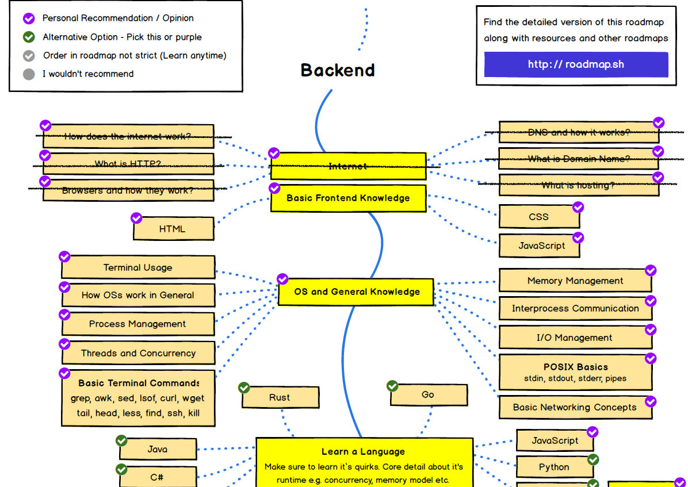

Este es el cuarto capítulo de esta serie que he titulado "El camino del backend developer".

Revisemos cuánto hemos avanzado en esta ruta propuesta por sitio [roadmap.sh](https://roadmap.sh/).

En la siguiente figura he tachado todos aquellos conceptos cubiertos hasta ahora:

¡Es bastante!

Primero vimos [cómo funciona internet](/blog/2020/07/05/el-camino-de-un-backend-developer-en-2020/). Luego revisamos algunos conceptos de protocolos de redes y [repasamos cómo opera HTTP](/blog/2020/07/31/el-camino-del-backend-developer-http/). En la tercera parte revisamos [cómo funcionan los navegadores o browsers](/blog/2020/08/19/el-camino-del-backend-developer-browsers/) y por último revisamos los fundamentos sobre los nombres de dominio y el funcionamiento de DNS, en dos partes ([parte 1](/blog/2020/09/05/el-camino-del-backend-developer-dns/) y [parte 2](/blog/2020/09/06/el-camino-del-backend-developer-dns-segunda-parte/)).

Puede parecer poco, pero la verdad es una gran cantidad de conceptos. Y con eso se cubre todo lo básico que se debe saber sobre internet en general.

Ahora vamos a empezar un segundo hito importante, que tiene que ver con adquirir un conocimiento básico de desarrollo frontend. Este artículo es más bien introductorio, y lo más contundente lo veremos en el siguiente artículo en que hablaremos sobre HTML, Javascript y CSS, a través de un ejercicio de programación.

Antes de continuar te recuerdo que estos artículos pueden ser apoyados a través de [Kofi](https://ko-fi.com/), si te interesa lo que estoy escribiendo, puedes invitarme a un café, o cerveza, a través de este link: https://ko-fi.com/lnds. He establecido una meta en ese sitio para poder publicar esta serie de artículos como un libro, así que si quieres apoyar ese proyecto haz click acá:



## Aplicaciones Web Modernas

Esta serie parte asumiendo que todos sabemos qué es un desarrollador backend, pero la verdad es que vale la pena reflexionar que es todo esto de front y back end, de donde surgió y por que hemos hecho esta división.

El desarrollo web y por extensión el desarrollo móvil, se ha convertido en una labor cada vez más compleja. Construir un pequeño sitio web con [Django](https://www.djangoproject.com/), [Laravel](https://laravel.com/) o [Ruby On Rails](https://rubyonrails.org/) es algo que aún se puede hacer, pero la verdad es que cuando tu producto o servicio comienza a escalar y tienes millones de visitas, millones de usuarios y transacciones, las cosas se hacen muy complicadas. 

Por otro lado una aplicación web (o móvil) moderna se ejecuta mediante la interacción de varias componentes establecedidas en dos extremos claramente definidos.

Por un lado está lo que ve el usuario, la interfaz web, que se ejecuta en su computadora, tablet o teléfono móvil. Esto es lo que llamamos el front end de la aplicación. Por otro lado está todo el soporte en los servidores que apoyan a estas páginas web o aplicaciones móviles. Esto es lo que ocurre en el extremo posterior de la aplicación o back end.

Esto no es nuevo, las aplicaciones Cliente-Servidor de los ochenta y noventa hacían precisamente esto. Pero vamos a hacer una distinción adicional. 

A las aplicaciones web más tradicionales escritas en PHP o Python, con algunos de los frameworks nombrados recién, las consideramos full stack, en el sentido que normalmente son abordadas por desarrolladores que cubren ambos aspectos usando una misma base de código. Esto tiene ciertas limitaciones, pues hay un acoplamiento total entre front y backend, el despliegue (deploy) de estas aplicaciones incluye ambas partes (front y back). Es lo que llamamos aplicaciones monolíticas.

La flexibilidad que no da la separación entre front y back es que podemos poner a equipos diferentes a trabajar en paralelos en ambos aspectos de la aplicación. Pero además podemos especializar nuestros distintos fronts. Podemos tener un front Web, otro especializado en móviles, e incluso en distintos dispositivos.

Una vez que hemos desacoplado el front de nuestra aplicación, en el backend podemos romper nuestro monolito. Podemos construir una serie de servicios o micro servicios que atiendan a distintas parte de nuestro front, o incluso construir micro servicios que son usados internamente por otros micro servicios, permitiendo distintos tipos y niveles de composición.

Esta flexibilidad trae aparejada una complejidad mayor.

## La Maniobra de Conway Inversa

Lo que hemos hecho, al separar nuestro desarrollo en dos partes, front y back, es abrazar [la Ley de Conway](https://lnds.net/blog/lnds/2017/06/26/paseando-con-dromedarios/):

> “Las organizaciones que diseñan sistemas (en el amplio sentido usado aquí) están obligados a producir diseños que son copias de las estructuras de comunicación de estas organizaciones”.

[Malvin Conway](https://en.wikipedia.org/wiki/Melvin_Conway) expone en su ensayo de 1968 una observación sobre estructura organizacional[^1]. Conway dice que el diseño de un sistema es reflejo de cómo se comunica el grupo de personas que lo va a diseñar.

Pues bien, hoy en día para desarrollar aplicaciones complejas usamos lo que hemos llamado la [maniobra de Conway inversa](https://www.thoughtworks.com/radar/techniques/inverse-conway-maneuver): organizamos a nuestros equipos y la estructura de nuestra organización de acuerdo a la arquitectura que queremos promover.

Es por esto que hoy hablamos de ingenerios front, backend, DevOps, SRE y todas esas especialidades. Hemos aprendido a aprovechar la astuta observación de Conway a nuestro favor.

Es por eso que cada vez tiene menos sentido hablar de un desarrollador full stack. Ese es un término que irá desapareciendo. Y no me extrañaría que tanto el desarrollador backend como el desarrollador front end se especialicen aún más en un cercano futuro.

## ¿Qué debe saber un desarrollador front end en la actualidad?

Hay personas que son muy arrogantes con respecto a estos roles. Basicamente por ignorancia. Es cierto que se todos hemos hecho bromas pesadas al respecto, pero no se debe minimizar el trabajo de un desarrollador front end. No se trata de un diseñador gráfico o una persona que simplemente se dedica a colocar botones y colorear páginas web. 

El desarrollo front actual es muy complejo, y requiere el dominio de una serie de competencias.

Así como existe el roadmap para el desarrollador backend, el sitio rodmap.sh publica también este plano con las competencias que debería tener un desarrollador front en la actualidad:

Como pueden apreciar es una amplia cantidad de competencias que se deben dominar hoy en día.

En el próximo artículo vamos a explorar algo sobre HTML (semántico), CSS y Javascript, apenas un pincelazo de todo lo que un desarrollador front debe dominar hoy en día.

[^1]: El artículo original de Conway se llama "How do comittees invent" y está disponible online: http://www.melconway.com/Home/Committees_Paper.html
