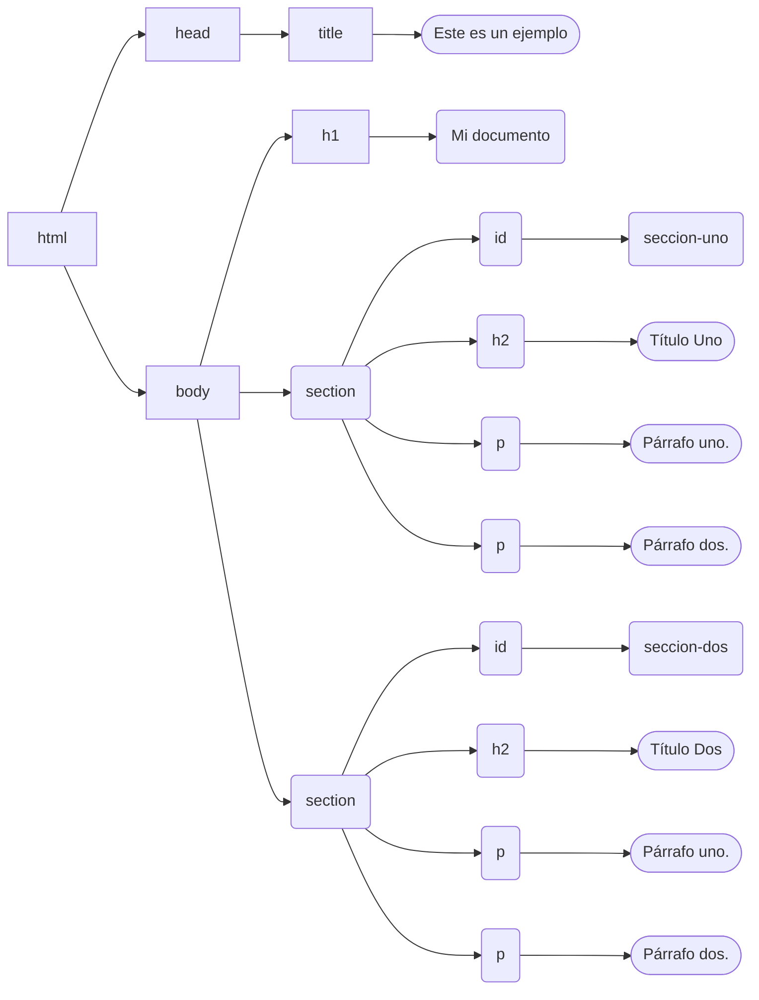

Continuamos nuestra exploración del mundo del [desarrollo front](/blog/2020/09/26/el-camino-del-backend-developer-front-end/) desde la perspectiva del camino sugerido por el sitio [roadmap.sh](https://roadmap.sh/).

No es la idea de este post enseñar estos lenguajes, sólo mostrar una perspectiva de lo que debemos considerar como desarrolladores backend.

Lo primero que vamos a aclarar es que HTML y CSS son lenguajes formales, pero no se les considera lenguajes de programación como tal, porque no tienen todo el poder y expresividad necesaria para implementar algoritmos.

HTML es un lenguaje de marcado, igual que XML, y como tal sirve para describir la estructura de un documento[^1]. Desciende de [SGML](https://es.wikipedia.org/wiki/SGML) y fue propuesto por Tim Berners Lee en 1991.

Sabemos que un documento es HTML porque empieza con la declaración SGML siguiente:

```html
<!DOCTYPE HTML>
```

Y luego el elemento raiz HTML:

```html
<!DOCTYPE HTML>
<html>
</html>
```

La versión inicial de HTML contenía dieciocho elementos. La versión actual de HTML es la 5 y la orgranización responsable de su especificación es el consorcio WHATG, que mantiene su especificación viva en esta url: https://html.spec.whatwg.org/multipage/.
WHATG viene de Web Hypertext Application Technology Working Group y es un grupo de trabajo formado principalmente por gente de Mozilla, Apple y Opera en 2004, después de un workshop del consorcio W3C (El [World Wide Web Consortium](https://www.w3.org/)). Ante la preocupación del desarrollo preferente de XHTML por parte de W3C, estas empresas se preocuparon de que HTML perdiera dedicación, y se asociaron para continuar el desarrollo de HTML por su cuenta. A este esfuerzo se sumaron después Google y Microsoft, pues son los principales desarrolladores de browsers y el desarrollo del estándar es algo que les preocupa de sobre manera. En 2007 la W3C se unió a WHATG para involucrarse nuevamente en el desarrollo del estándar HTML5.


Hoy HTML-5 es el estándar que todos promueven y es el que nos debería preocupar hoy en día.

## Server side rendering

Los programadores backend más antiguos están acostumbrados al concepto de Server Side Rendering, que significa que nos encargamos de producir el código HTML en el servidor y enviarlo a los browsers. Este fue el primer medio usado para generar páginas web "dinámicas".

Esta es la técnica que se usaba originalmente en lenguajes como PHP. 

Veamos un ejemplo:


```php
<?php
$servername = "localhost";
$username = "username";
$password = "password";
$dbname = "myDB";
?>
<html>
<head>
<title>Guests</title>
</head>
<body>
<?php
// Create connection
$conn = new mysqli($servername, $username, $password, $dbname);
// Check connection
if ($conn->connect_error) {
  die("Connection failed: " . $conn->connect_error);
}

$sql = "SELECT id, firstname, lastname FROM MyGuests";
$result = $conn->query($sql);


if ($result->num_rows > 0) {
  echo "<table>";
  echo "<tr><th>Nombre</th><th>Apellido</th></tr>";
  while($row = $result->fetch_assoc()) {
    echo "<tr><td>" . $row["firstname"]. "</td><td>" . $row["lastname"]. "</td></tr>";
  }
  echo "</table>"
} else {
  echo "<h1>No hay datos</h1>";
}
$conn->close();
?>
</body>
</html>
```

Acá vemos como un script PHP se conecta a una base de datos y si encuentra datos en una tabla de usuarios
se encarga de desplegar una tabla con los datos.
Noten como se mezcla el marcado HTML con el código propio del lenguaje.

Para resolver esto se construyeron conceptos como las plantillas (templates), que permitieron hacer una separación entre HTML y la lógica de negocios.

## El DOM

Supongamos que tenemos el siguiente documento HTML:

```html
<!docttype html>
<html>
   <head>
       <title>Este es un ejemplo</title>
  </head>
  <body>
    <h1>Mi documento</h1>
    <section id="seccion-uno">
        <h2>Título Uno</h2>
        <p>Párrafo uno.</p>
        <p>Párrafo dos.
    </section>
    <section id="seccion-dos">
        <h2>Titulo Dos</h2>
        <p>Párrafo uno.</p>
        <p>Párrafo dos.
    </section>
  </body>
</html>
```

Esto se modela internamente en un browser en una estructura que se llama DOM ([Document Object Model](https://es.wikipedia.org/wiki/Document_Object_Model)).

El modelo del documento de arriba sería este:



Este modelo estándar, el DOM, permite manipularlo en el lado del cliente y es la clave del desarrollo de los frameworks front end, como veremos en el próximo artículo de esta serie, donde exploraremos el uso de javascript.

### HTML Semántico

Fíjense en el uso del elemento `section`. Seguramente han visto que se usa (y abusa) del elemento div.
Antes de HTML5 (y aún hoy es permitido), la página ejemplo se habría descrito del siguiente modo:


```html
<!docttype html>
<html>
   <head>
       <title>Este es un ejemplo</title>
  </head>
  <body>
    <h1>Mi documento</h1>
    <div id="seccion-uno">
        <h2>Título Uno</h2>
        <p>Párrafo uno.</p>
        <p>Párrafo dos.
    </div>
    <div id="seccion-dos">
        <h2>Titulo Dos</h2>
        <p>Párrafo uno.</p>
        <p>Párrafo dos.
    </div>
  </body>
</html>
```

El problema es que la etiqueta `div` no proporciona información semántica, como sí la puede proporcionar `section`, y esa es una gran diferencia que introduce HTML-5, el concepto de HTML Semántico.

El objetivo del HTML Semántico es ayudar a navegadores y otros agentes a "entender" el contenido de los documentos web. En HTML histórico existían elementos que se preocupaban de la sintáxis y otros de la presentación (layout).

Por ejemplo, la etiqueta `<center>` era usada para mostrar texto centrado en pantalla. O la etiqueta `<i>` para representar texto en itálica. Hoy se prefiere usar la etiqueta `<em>` para dar énfasis a un texto y su representación se deja la hoja de estilo CSS.

Tanto `<center>` como `<i>` se consideran deprecadas.


## Hojas de estilo en cascada

La creación de las hojas de estilo en cascada, o Cascade Style Sheet (de ahí la sigla CSS), vino a resolver el problema de separar la presentación del contenido que se daba en las primeras especificaciones de HTML.

Por ejemplo, antes de CSS para darle una característica gráfica a un elemento se usaban etiqueta de presentación que contenían el atributo `style`.

```
<h1><span style="color: red;">Hola</span></h1>
````

Hoy esa responsabilidad se deja a las hojas de estilo, que contendrían algo así:

```
h1 { color: red; }
````

Y de este modo cada vez que usamos el elemento h1 en una página que incluya esta definición de estilo se mostrará el texto en rojo.

CSS se ha vuelto un lenguaje muy complejo hoy en día y da más de un dolor de cabeza a desarrolladores web, pero es muy poderoso y ha permitido dar más riqueza a nuestras aplicaciones.

En el próximo capítulo de esta serie combinaremos el concepto de DOM con CSS y Javascript para darle dinamismo a nuestras páginas.


Si te gustó este artículo y quieres seguir apoyando este proyecto, y la futura publicación de un libro donde estarán estos artículos, te invito a patrocinar este blog en mi Ko-Fi:



[^1]: Hay un lenguaje que comparte el estilo de marcado de XML, es Turing Completo, se trata de XSLT, lo que tiende a confundir a mucha gente. Por otro lado ¿Excel es un lenguaje de programación? considerando que se le considera Turing Completo. 
