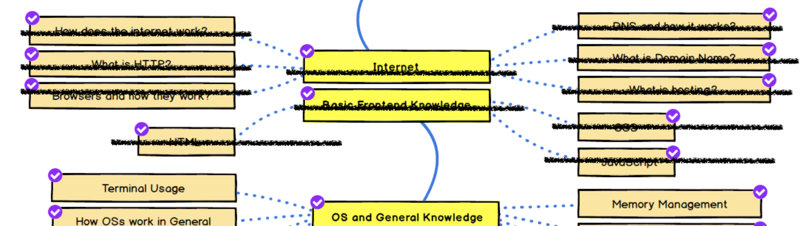

Con este artículo completamos el ciclo dedicado a conocer parte de los fundamentos de la programación front-end.

Tal como [expliqué antes](/blog/2020/09/26/el-camino-del-backend-developer-front-end/), el desarrollo front es un campo muy amplio y desafiante hoy en día.

Así que no corresponde establecer distinciones odiosas que menoscaben la labor de los desarrolladores front. El simple hecho de que le dediquemos una mínima cobertura a tres aspectos del front (HTML, CSS, JavaScript) no nos da la libertad para menospreciar o asumir que el desarrollo front es algo simple o aburrido.

Al contrario, el desarrollo front es muy desafiante porque plantea el problema de comunicar e interactuar directamente con el usuario. Esta es una labor muy compleja. Evitar ambigüedades, pensar en términos sencillos de modo de no sobrecargar cognitivamente la experiencia del usuario, y una gran cantidad de detalles de usabilidad suelen ser claves en el éxito o fracaso de un producto. La labor del desarrollador front actual afecta a la experiencia del usuario (UX)[^1].

[^1]: Es tan importante este aspecto que puede llegar a costar mucho dinero, tal como explico en este artículo en La Naturaleza del Software: https://lnds.net/blog/lnds/2017/07/23/el-boton-de-los-300-millones-de-dolares/

# JavaScript

JavaScript fue creado por Brendan Eich en 1995 aproximadamente.

La idea original de Eich era incorporar el lenguaje Scheme en el navegador Netscape.

Hay que enteder que los [Browsers](/blog/2020/08/19/el-camino-del-backend-developer-browsers/) en esa época aún estaban en una fase de desarrollo temprano, abriendo su espacio en internet, pero todos teníamos claro que serían el medio principal a través del cual experimentaríamos la Web.

En ese tiempo apareció Java, un producto de Sun que cuadraba con su visión de controlar la red (["The Network is the computer"](https://blog.cloudflare.com/john-gage/). Se trataba de un lenguaje de programación junto con un entorno de máquina virtual que podía correr en cualquier plataforma. El eslogan que usaba la compañía era: write once, write everywhere.

Y ese "run everywhere" incluía la capacidad de ejecutar programas escritos en Java en un browser. Netscape había alcanzado un acuerdo con Sun Microsystem para incluir soporte para Java en su browser (Navigator). Este acuerdo era importante, porque Netscape soportaba sus servidores web sobre Solaris[^2].


[^2]: En 1997 el 75% de los servidores usaban Sun Solaris y nadie lo sabía (fuente: https://kickstartall.com/documents/KS_Articles/Sun.html).


Tal como expliqué la idea original era migrar [Scheme](https://es.wikipedia.org/wiki/Scheme), un gran lenguaje de la familia LISP al browser, pero al parecer los ejecutivos de Sun prefirieron sumarse al momemtum que generaba la campaña de marketing de Sun[^3] y decidieron nombrar al lenguaje como JavaScript. Junto con esto se realizó un cambio de sintaxis para hacerla más parecida a Java.

[^3]: En un momento Sun llegó a comprometer inversiones por 500 millones de dólares en marketing para promover el uso de Java (https://www.theregister.com/2003/06/09/sun_preps_500m_java_brand/).

En su corazón JavaScript tenía los principios funcionales de Scheme, pero adoptó el paradigma basado en prototipos, que es una forma más pura de orientación a objetos, que el paradigma basado en clases. 

Esta mezcla, y quizás la presión para salir rápido con este producto, generó ciertas decisiones extrañas que afectan aún la sintaxis y sobre todo la semántica de los programas escritos en JavaScript, y que  ha sido fuente de dolores de cabeza, memes y graciosas charlas: https://www.destroyallsoftware.com/talks/wat

De todas maneras, JavaScript se ha convertido en un importante lenguaje, tanto en front como en backend (este aspecto lo veremos más adelante cuando estudiemos Node.js). Si uno es suficientemente disciplinado y sigue consejos de gente con experiencia, como por ejemplo, las guias que plantea Douglas Crockford en su libro ["JavaScript: The Good Parts"](https://amzn.to/346dLF4).

# Cómo Ajax lo cambió todo

Cuando JavaScript surgía, Microsoft planeaba migrar su popular lenguaje Visual Basic a los browsers, el fruto de eso fue VB Script.

Microsoft promovía un concepto que llamó DHTML, basado en el uso de ActiveX dentro del browser, todo eso funcionaba muy bien sólo si usabas Internet Explorer y Windows.

Pero el gran aporte de Microsoft a la tecnología front fue [XMLHttpRequest](https://en.wikipedia.org/wiki/XMLHttpRequest). Este tecnología fue desarrollada para apoyar Outlook Web Access para Microsoft Exchange Server 2000[^4].


[^4]: La historia de XMLHttpRequest contada por uno de sus autores se conserva acá: https://web.archive.org/web/20090130092236/http://www.alexhopmann.com/xmlhttp.htm

Esta componente fue extendida e incoporada en Internet Explorer. Junto a DHTML, estaban todos los elementos para constuir lo que después se llamó AjaX.

Hacia el 2020 Mozilla ya había incorporado el soporte para la interfaz de este componente en un objeto javascript llamado XMLHttpRequest. Otros browser imitaron esta misma interfaz y fue incorporada en Safari y Opera por ejemplo. En 2006 se convirtió en un estándar del W3C.


Ajax fue un término acuñado por Jesse James Garret en 2005[^5] para referirse al uso de JavaScript Asíncrono más XML (Asynchronous JavaScript and XML).

[^5]: Tengo el vago recuerdo de haber leido sobre Ajax mucho antes de 2005, pero no he encontrado las fuentes.


Según la definición de Garret, Ajax[^6] se compone de la interacción de las siguientes tecnologías:

- HTML y CSS para la presentación
- El Document Object Model (DOM) para desplegar información de manera dinámica
- JSON o XML para el intercambio de datos, y XSLT para transformación de XML.
- El objeto XMLHttpRequest para realizar comunicaciones asíncronas
- JavaScript como lenguaje que permite integrar todas estas tecnologías

[^6]: https://immagic.com/eLibrary/ARCHIVES/GENERAL/ADTVPATH/A050218G.pdf


## Usando Ajax

Vamos a crear un ejemplo sencillo para demostrar todo esto, usando una API pública llamada Cat as a Service (https://cataas.com/cat/cute).

Primero crearemos una función JavaScript que nos permita realizar una llamada usando XMLHttpRequest para cargar una imagen:

```js
function ajax_get_blob(url, callback) {
  var req = new XMLHttpRequest();
  req.onload = function() {
      try {
          var buffer = new Uint8Array(req.response);
          var blob = new Blob([buffer], {type: "image/png"});
          var url = URL.createObjectURL(blob);
      } catch (err) {
          console.log(err.message + " in " + xmlhttp.responseText);
          return;
      }
      callback(url);
  };
  req.open("GET", url, true);
  req.responseType = "arraybuffer";
  req.send();
}
```

Lo esencial es la creación del objeto XMLHttpRequest y luego la invocación de las primitivas `open()` y `send()`. Otro aspecto importante es que definimos un "event handler" `onload` que es invocado de forma asíncrona cuando se obtiene una respuesta desde el servidor.

La primitiva `open` tiene esta firma:

    open( Method, URL, Asynchronous, UserName, Password )

En este caso estamos usando el método GET, luego pasamos la url que queremos invocar y por supuesto queremos que la respuesta nos llegue en forma asíncrona.
Este método lo que hace es preparar el request.

La llamada se realiza con la primitiva `send` que tiene la siguiente firma:

    send( Data )

Esto permite enviar datos adicionales usando el mismo request. En nuestro caso no enviaremos nada.

El objeto XMLHttpRequest no sólo permite cargar datos en formato XML, se ha ampliado para usar JSON e incluso datos binarios, en este caso vamos a descargar una imagen. Es por eso que cambiamos el tipo de respuesta a "arraybuffer":

    req.responseType = "arraybuffer";

El "event listener" `onload` se invoca cuando la data está disponible, en este caso construimos un objeto en memoria (un BLOB) que contendrá la imagen (que se recibe como un arreglo de bytes). A este blob le asignamos una URL que puede ser usada para colocar la imagen en nuestro documento HTML.


Usaremos la función `ajax_get_blob` para obtener la imagen aleatoria de un gato que desplegaremos en nuestro documento:

```js
function load_kitten() {
    ajax_get_blob('https://cataas.com/cat/cute', function(url) {
        var html = '';
        document.getElementById("image").innerHTML = html;
        document.getElementById("frase").innerHTML = "<h2>¡Es cierto! ¡Es cierto! ¡He visto un lindo gatito!";
    });
}
```

Fíjense cómo manipulamos el DOM usando el objeto `document` que nos permite obtener un elemento del documento web y luego alteramos su contenido modificando la propiedad `innerHTML`.

Todo esto lo colocamos en nuestro documento HTML, que queda así:

```html
<html>
    <head>
        <meta charset="utf-8">
        <title>Demo Ajax con Gatos</title>
        <script>
            function ajax_get_blob(url, callback) {
                var req = new XMLHttpRequest();
                req.onload = function() {
                    try {
                        var buffer = new Uint8Array(req.response);
                        var blob = new Blob([buffer], {type: "image/png"});
                        var url = URL.createObjectURL(blob);
                    } catch (err) {
                        console.log(err.message + " in " + xmlhttp.responseText);
                        return;
                    }
                    callback(url);
                };
                req.open("GET", url, true);
                req.responseType = "arraybuffer";
                req.send();
            }
        </script>
        <style>
        img {
          border-radius: 50%;
        }
        </style>
    </head>
    <body>
        <h1>Me pareció haber visto un lindo gatito</h1>
        <button onclick="load_kitten()">Buscar un gato</button>
        <div id="cat">
            <div id="image"></div>
            <div id="frase"></div>
        </div>
        <script>
            function load_kitten() {
                ajax_get_blob('https://cataas.com/cat/cute', function(url) {
                    var html = '';
                    document.getElementById("image").innerHTML = html;
                    document.getElementById("frase").innerHTML = "<h2>¡Es cierto! ¡Es cierto! ¡He visto un lindo gatito!";
                });
            }
        </script>
    </body>
</html>
```

Noten como hemos agregado algo de estilo modificando las propiedades básicas del elemento `img` generando un borde redonreado de la imagen.

Además hemos conectado la llamada a la función `load_kitten()` en un botón.

El código completo se encuentra en este repo en GitHub: https://github.com/lnds/desafios-programando.org/tree/master/2020-12-12/gatos

Este simple ejemplo muestra las características más básicas del desarrollo front usando JavaScript y Ajax. 

# Frontend en nuestros días


Con esto hemos avanzado en nuestra jornada explorando los conocimientos básicos sobre front que todo desarrollador backend debe dominar. Es momento de tachar en nuestro roadmap:




Antes de terminar tengo que aclarar algo, no es la intención de este post hablar de desarrollo moderno front.

Ajax es una tecnología relativamente antigua y superada en gran parte por los frameworks y bibliotecas actuales.

El desarrollo front actual se basa en bibliotecas como React, y componentes nuevas que reemplazan a XMLHttpRequest. Incluso hay una plétora de nuevos lenguajes que se usan en front como ELM y TypeScript.

También se ha propuesto nuevos motores como Web Assembly, que recuerdan un poco a los applets de java. 

No consideren esta serie de tres post como una guía definitiva de cómo se hace front. Tal como dije para aprender front moderno hay un [roadmap distinto](https://roadmap.sh/frontend), y probablemente ya desactualizado.

Si te gusta esta serie te invito a compartirla y a apoyarla a través de [Kofi](https://ko-fi.ccom/).

Si te interesa lo que estoy escribiendo, puedes invitarme a un café, o cerveza, a través de este link: https://ko-fi.com/lnds. He establecido una meta en ese sitio para poder publicar esta serie de artículos como un libro, así que si quieres apoyar ese proyecto haz click acá:




