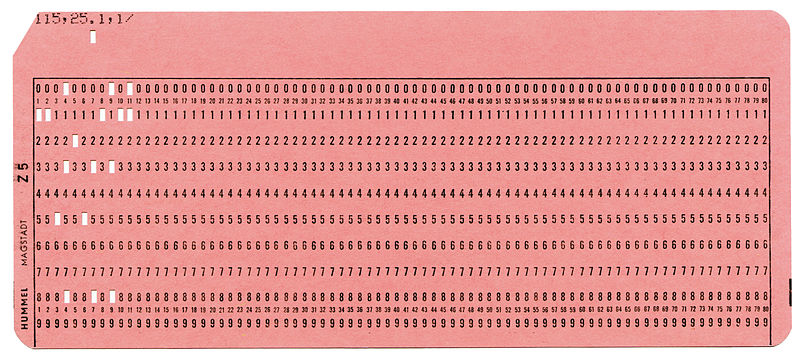
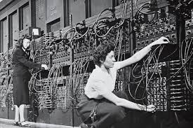
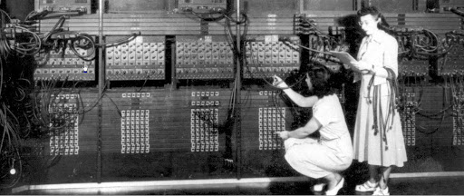
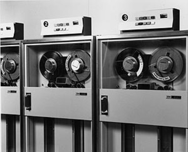
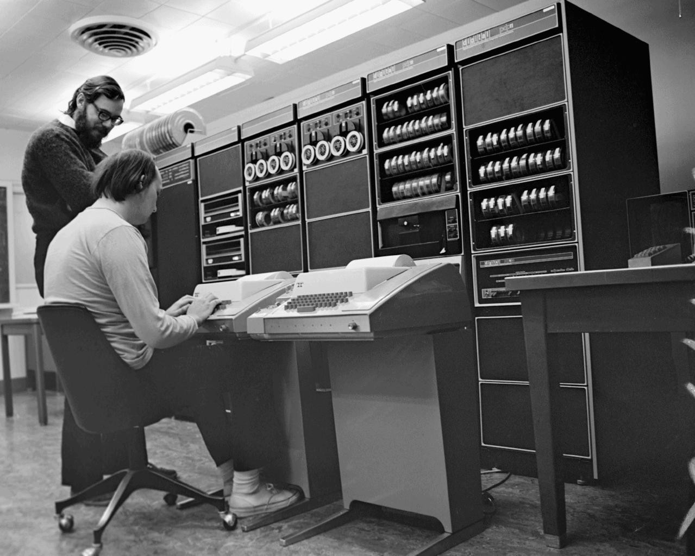
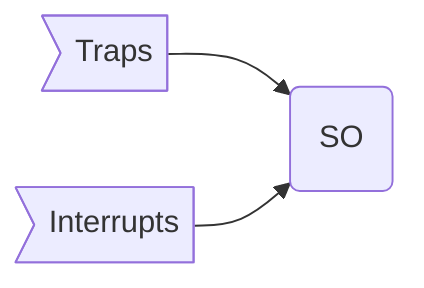

Ya entramos en la segunda parte de nuestro camino para formarnos con lo básico que debe conocer un desarrollador front end moderno. Esta vez, siguiendo la guía de [roadmap.sh](https://roadmap.sh/backend), partiremos con sistemas operativos. 

Antes de continuar te recuerdo que esta serie de  artículos pueden ser apoyados a través de [Kofi](https://ko-fi.com/), si te interesa lo que estoy escribiendo, puedes invitarme a un café, o cerveza, a través de este link: https://ko-fi.com/lnds. He establecido una meta en ese sitio para poder publicar esta serie de artículos como un libro, así que si quieres apoyar la idea haz click acá:



# Algo de historia

Cuando tenía catorce o quince años, en la década de los 1980's, leía sobre los micro computadores que aparecían en esos años, como los Armstrad o Sinclair, que eran equipos baratos y accequibles, lo que permitión que mi padre me regalara un Sinclair ZX-81.

El equipo venía con un manual, pero claro, no lo leí. Impacientemente encendí el televisor conecté el pequeño ordenador y esperé. Apareció un cuadrado que pulsaba y escribí alguna orden y por supuesto no pasó nada. Tenía que leer el manual para aprender a usar esa cosa. Poco tiempo después me inscribí en un taller de computación en mi colegio y empecé a aprender.

Ese computador tenía un sistema operativo muy primitivo, en esencia el sistema operativo era un interprete de BASIC, que se cargaba desde la ROM del equipo. Había un comando load (no recuerdo muy bien la sintáxis) que permitía cargar programas desde una cassette de audio. Lo otro que podías hacer era escribir comandos o programas en BASIC. 


## Programas 

En esencia una computadora no es mucho más que una calculadora. Lo que ocurre es que son capaces de ejecutar millones de operaciones aritméticas por segundo. Programar consiste en crear una secuencia de operaciones que ejecutará la computadora, usando lo que llamamos un lenguaje de programación. Por ejemplo, si queremos calcular el promedio de notas de un curso, un posible algoritmo sería:


1. Reserva una sección de la memoria que llamaremos ACUMULADOR
2. Cargar la nota de un alumno en una variable que llamaremos NOTA
3. Suma el valor de NOTA en ACUMULADOR
4. Incrementa un contador N en 1
5. Repite los pasos 2 al 3 hasta que no queden más notas que leer
6. Divide ACUMULADOR en N y almacenalo en PROMEDIO
7. Imprime el valor PROMEDIO.


Esto para que pueda ser entendido por el computador debería ser traducido a lenguaje de máquina. Pero este lenguaje consiste en ceros y unos alineados uno tras otro en memoria.

Uno de los primeros avances en computación fue la creación de lenguajes que permitieran traducir instrucciones de forma más directa con la máquina, estos fueron los primeros lenguajes assembly, en estos el algoritmo anterior sería algo así:


```
  dword acum
      dword nota
      dword n
      set acum 0
      set nota 0
      set n 0
  loop:
      load nota
      jz end
      add acum nota
      store acum
      inc n
      jmp loop
  end:
      div acum n
      print
```

En los primeros computadores esto se transcribía a tarjetas perforadas como la de la figura:




En general cada tarjeta contenía una linea de código. Los datos también se almacenaban en estas tarjetas las que se agrupaban después de las tarjetas con el programa.

Siguiendo con nuestro ejemplo, si hay 100 alumnos, habrá una tarjeta por cada nota, es decir, cien tarjetas. 

En aquella época, y ya estamos hablado de una era más avanzada, estas tarjetas se entregaban a un operador que cargaba tanto el programa como los datos en un lector de tarjetas, esta máquina se encargaba de leer las tarjetas y almacenarlas en la memoria del computador. Después el operador ejecutaba el programa, y el resultado normalmente quedaba impreso en papel. Después de un tiempo el programador pasaba a retirar el resultado solicitándoselo al operador. 

Antes de eso programar computadores requería cablear el computador tal como podemos apreciar en estas fotografías del ENIAC:





El operador cargando las tarjetas ya parecía un avance notable, y permitió que más personas pudieran tener acceso a los computadores. Esta forma de trabajar se llama "batch processing", es decir, trabajo por lotes.

Cuando automatizamos la labor de estos operadores humanos obtenemos un software que llamamos Sistema Operativo.

## Sistemas Operativos

En 1964 ya existía un sistema operativo llamado CTSS: [“Compatible Time Sharing System”](https://es.wikipedia.org/wiki/Compatible_Time-Sharing_System), desarrollado en el MIT.

En este sistema no era necesario usar tarjetas perforadas. Los programadores podían tipear sus programas en terminales que estaban conectados directamente, o por líneas telefónicas a un gran computador, el IBM 7094.

El sistema operativo dividía su atención entre los usuarios conectados, cambiando rápidamente de un usuario activo al otro, dando a cada usuario la ilusión de que tenía el computador a su entera disposición. Esto se denominó “time sharing” (tiempo compartido), y era percibido en esa época como mucho más agradable y productivo que el batch processing.

Desde el punto de vista del usuario funcionaban de forma similar a mi viejo Sinclair,  el programador escribía el programa y después podía almacenarlo en un medio persistente (como una cinta), o ejecutarlo directamente (en realidad, antes de ejecutarlo debía traducirlo a código de máquina usando un programa que se llama compilador). Otra posibilidad era cargar un programa escrito anteriormente, pero estorequería que estas cintas fueran montadas en un lector apropiado, como el de la figura:



CTSS fue tan exitoso e impactó tanto en la productividad que en 1965 el MIT decidió crear una versión mejorada, que llamaron Multics, por Multiplexed Information and Computing Service.

Este era un proyecto demasiado ambicioso y cayó en una trampa conocida como “efecto del segundo sistema”, situación que ocurre cuando se pretende arreglar todos los problemas del primer sistema, pero además incorporar las características favoritas de cada uno de los usuarios. El resultado es a menudo un enterno demasiado complicado y mucha sobre ingeniería.

En su libro ["Unix: A history and a memoir"](https://amzn.to/2WM44ZT), Brian Kernighan cuenta los humildes orígenes del sistema operativo más exitoso de la actualidad. 

Media docena de investigadores de Bell Labs trabajaron en Multics, incluyendo a Doug McIlroy, Dennis Ritchie, Ken Thompson y Peter Neumann.

McIlroy estaba involucrado en el desarrollo del lenguaje PL/I que se usó para programar el sistema operativo. Ritchie, que era un estudiante recién egresado de Harvard, trabajó en los laboratorios en los subsistemas de entrada y salida, al igual que Thompson.Thompson describió su trabajo en Multic como “una muesca en una enorme rueda y estaba produciendo algo que yo no quería usar”[^1].

En 1969 Bell Labs decide retirar su apoyo al proyecto. Multics fue finalizado eventualmente. De acuerdo a Kernighan[^1] fue usado y soportado hasta el año 2000. De todas maneras fue la fuente de varias ideas y una influencia, aunque sea por reacción, en la creación de Unix.


Después de la salida de Bell Labs del proyecto Multics, varios de los investigadores aún ansiaban desarrollar un sistema operativo. Pero la administración no quería saber más de un proyecto de este tipo y no tenía interés en comprar hardware especial para una aventura como esta.
Uno de los más entusiasmados en continuar era Ken Thompson, quien compartía con otros colegas ideas en papel de posibles implementaciones.

Eventualmente Ken encontró un computador con poco uso, se trataba de un DEC PDP-7. Este era un computador construido en 1964 y en esa época ya se consideraba obsoleto, razón por la cual Thompson pudo disponer varias horas del mismo. Era una máquina con poca potencia, poseía una memoria de 16K bytes actuales (estaba organizada como 8K words de 18 bits).

El computador tenía una buena pantalla gráfica, y Thompson escribió un [juego de viaje espacial](https://en.wikipedia.org/wiki/Space_Travel_%28video_game%29) para esta máquina.

El PDP-7 tenía un periférico que representaba un desafío interesante. Se trataba de un disco cuya velocidad de rotación era demasiado rápida para el computador. Así que Ken Thompson desarrolló un algoritmo que maximizara el througput de cualquier disco, incluyendo este en particular.

Pero para probar el algoritmo tenía que desarrollar un programa que llenara el disco con una gran cantidad de datos. Fue entonces que Thompson se dio cuenta que estaba a tres semanas de completar un sistema operativo. El necesitaba crear tres programas, uno por semana: un editor, de modo que pudiera crear código, un ensamblador que pudiera convertir el código en lenguaje de máquina que corriera en el PDP-7, y un kernel, es decir un sistema operativo.

Justo en esa época la esposa de Thompson se tomó unas vacaciones de tres semanas, llevando al hijo de ambos a visitar a sus abuelos paternos en California. Así que Ken tuvo tres semanas para dedicarlas para trabajar ininterrumpidamente en este proyecto.

Esta historia se puede ver en una entrevista que Kernighan le hizo a Thomposon en mayo de 2019:



A partir del trabajo de Thompson se forma un pequeño grupo de usuarios dentro de Bell Labs de este proto sistema operativo. Se dice que el nombre UNICS surgió de estas conversaciones, y se suele atribuir el nombre a Kernighan, y sería una suerte de juego de palabras y parodia a MULTICS.

Mientras MULTICS sería “Mucho de Algo”, UNICS significa a lo más “uno de algo”, es decir, usar uni, en vez de multi. Otro rumor es que a los abogados de AT&T no les gustó la palabra UNICS por ser fonéticamente similar a Eunucs (eunucos) en inglés. Así que eventualmente se volvió UNIX. Como sea el nombre era una parodia a Multics, como apuntó Dennis Ritchie.



Unix fue creciendo poco a poco mediante la colaboración de varios investigadores de Bell Labs. Durante sus primeros años apoyó el proceso editorial del área de patentes de Bell Labs, de hecho fue gracias a esto que obtuvo financiamiento. Es por esto que en Unix existen tantos comandos de procesamiento de texto, desde wc (word count) hasta formateadores cono troff.

Vamos a detener nuestro relato acá, porque usaremos a estas primeras versiones de Unix como modelo para entender como podría funcionar un sistema operativo simple. 

# Un sistema operativo simple

Desde este punto usaremos un modelo propuesto en el libro ["Operating Systems in Depth"](https://amzn.to/2MVKoQx), de Thomas W. Doeppner, basado como dije en el Unix de los años setenta.

En ese tiempo el sistema operativo debía ser cargado en apenas 64 Kb de memoria. Así que lo razonable es que todas las partes del sistema operativo debían ensamblarse en un sólo archivo que era cargado a memoria en el momento de arrancar el computador (una secuencia conocida como bootstrapping o simplemente booting).

Esta forma de estructurar el sistema operativo se conoce como la _aproximación monolítica_, es decir, todo lo necesario para operar el sistema está en único ejecutable.

En este modelo poder invocar funcionalidades del sistema operativo los programas usaremos `traps`. Mientras que los dispositivos externos, como el disco, el reloj u otros usan `interrupts`. Así que la estructura de nuestro sistema operativo queda así:



En general los computadores tienen dos modos de ejecución. El _user mode_, que tiene menos privilegios y el _privileged mode_ que puede acceder a casi todos los recursos del sistema sin limitaciones. Para evitar que los programas interfieran entre sí el único código privilegiado es el que es parte del sistema operativo. En un sistema tan simple como el que estamos analizando todo el núcleo del sistema operativo corre en modo privilegiado. En otros sistemas, como Windows, por ejemplo, algunos subsistemas del sistema operativo también corren en modo usuario. Llamaremos _kernel_ a aquella parte del sistema operativo que corre en modo privilegiado. Pero también se usa este término para indicar una parte más pequeña del modo privilegiado del sistema operativo.

## Traps

Las traps son medios generales para invocar al kernel desde user mode. Seguramente has escuchado este término aplicado a llamadas no intencionales a servicios del kernel, como por ejemplo cuando se produce un error de división por cero, o acceso a una dirección incorrecta de memoria. 

Las traps siempre generan algún tipo de acción por parte del kernel. En el caso de errores del programa la acción puede ser configurada previamente por el programa. En C tenemos la primitiva `signal` que nos permite establecer un control ante esta excepción.

En C si queremos manejar el error de una división por cero podemos escribir esto:

```c
#include <stdio.h>
#include <unistd.h>
#include <stdlib.h>
#include <signal.h>

void sighandler(int);

int main () {
   double x = 10.0;
   double y = 0.0;
   
   signal(SIGFPE, sighandler);
   printf("x / y = %f", x/y);
   printf("este código no se ejecutará")
   return(0);
}

void sighandler(int signum) {
   printf("Error, signal %d, deteniendo el programa...\n", signum);
   exit(1);
}
```

Las signals permiten que el kernel invoque código que es parte del programa del usuario. En este caso lo que hacemos es registrar un tipo especial de signal SIGFPE (Signal Floating-Point Exception), de modo que si se produce un error aritmético (como una división por cero), se invoque la función `sighandler` que hemos pasado como parámetro.

Si revisas el cuerpo de la función `sighandler()` notarás que recibe el número de la señal que se ha producido, lo que es útil para manejar este tipo de errores. El comportamiento de `signal` ha variado en el tiempo entre distintas versiones de Unix, de hecho se le considera hoy obsoleto (lo recomendado en Linux es usar [sigaction](https://man7.org/linux/man-pages/man2/sigaction.2.html)), lo colocamos acá sólo como ejemplo ilustrativo.

Otra cosa que notarás es que al final hay una llamada a la función `exit()`, esta es lo que llamamos una llamada a sistema, o _system call_. 

Las llamadas a sistema son también un tipo especial de _trap_,  una en la que tenemos más control. En este caso `exit()` le dice al sistema operativo que detenga el programa en ejecución y que retorne el valor 1 (ya veremos como se usa esto más adelante).


Invocar funcionalidad del kernel es algo delicado, y es por esto que el kernel expone un número acotado de llamadas de sistemas, así se tiene más control sobre lo que es permitido en puntos bien establecidos.

El código anterior nos muestra cómo podemos manejar un error y solicitarle al kernel que detenga nuestro programa, pero ¿cómo se ejecuta?

Para responder a esto vamos a volver a nuestro ejemplo del programa que calcula el promedio de notas de un curso, escribiendo una versión simple del programa en lenguaje C:


```c
/* version 0 de nuestro programa en C */
const int nalumnos = 30;
double notas[nalumnos];

int main() {
  int i;
  double acum = 0.0;
  double promedio = 0.0;
  for (i = 0; i < nalumnos; i++) {
      acum += notas[i];
  }
  promedio = acum / nalumnos;
  return 0;
}
```

Esta es una versión distinta a la que mostramos al principio de este post. Notaras que no escribe el resultado, la razón es que iremos iterando sobre este programa para poder hacer que se comunique con el mundo exterior, por ahora asumiremos que la cantidad de alumnos es fija (30).

Este programa se puede almacenar en un archivo, por ejemplo, `promedios.c` y se puede compilar y ejecutar en un sistema operativo tipo Unix haciendo:

    % cc promedios.c -o promedios_0
    % ./promedios_0

Por supuesto como usuarios no veremos nada, pero lo que nos interesa ahora es ver que ocurre en el sistema operativo cuando se ejecuta este programa.


El símbolo % que he puesto representa el prompt del shell, una componente clásica de los sistemas operativo y  que veremos en detalle un futuro artículo, por ahora hay que considerar que este es un programa que nos permite comunicarnos con el sistema operativo. 

Cuando hacemos `cc promedios.c -o promedios` ejecutamos un comando disponible en nuestro sistema que corresponde al compilador de C. `cc` traduce el código en C en un archivo binario que contiene el código de máquina. La opción `-o promedios` indica que queremos que este código de máquina se guarde en el archivo `promedios_0`. Al hacer `./promedios_0` ejecutamos el programa.

Lo que ocurre en ese momento es que el shell le solicita al kernel que cargue en memoria el contenido de `promedios_0` y luego lo ejecute. Para hacer esto el kernel crea un *proceso*.

El proceso es la abstracción más útil que el sistema operativo nos proporciona a nosotros como programadores. Esta abstracción es a la vez una abstracción de la memoria (que lamaremos "address space" o espacio de direcciones), y la abtracción de los ejecutores o procesadores que llamaremos "threads of control" o hilos de control. Un proceso puede tener varios de estos hilos, pero para no complicarnos la vida y porque esto lo veremos en más detalle más adelante, consideraremos que por ahora cada proceso tiene uno y sólo un hilo de control (en todo caso, esta era la norma de la mayoría de los sistemas operativos hafa la década de los 1990's).


Pero el proceso tiene más elementos, para entenderlos sigamos analizando nuestro programa. Un programa tiene código y data (datos). El código en este caso una vez que es cargado no se modifica nunca más. Pero los datos sí pueden alterarse. Dado esto el sistema operativo segrega el _address space_ reservando una sección para el código que queda protegida de futuros cambios. Mientras que la data queda en otra región que puede ser leida y escrita por el programa. 

Unix organiza el _address space_ de la siguiente manera:

```
    +---------+
    |  Stack  |
    +----|----+
    |    v    |
    |         |
    |         |
    |    ^    |
    +----|----+
    | Dynamic |
    +---------+
    |   BSS   |
    +---------+
    |   Data  |
    +---------+
    |   Text  |
    +---------+
```

El código ejecutable queda en la zona denominada _Text_ la que ocupa las regiones más bajas del espacio de direcciones. La data inicializada se deja inmediatamente sobre _Text_ y se le conoce simplemente como _Data_. Luego viene un área de data sin inicializar que se denomina BSS (Block Started by Symbol). A continuación empieza el área dinámica que se reserva para porciones obtenidas de forma dinámica en los programas (esto lo veremos más adelante), esto se conoce también como _heap_. Por último encima de todo se deja el Stack que se va ocupando desde arriba hacia abajo en las direcciones de memoria.

Fíjense por otro lado que para el caso de los datos de nuestro programa tenemos dos variables globales: `nalumnos` y `notas`, y tres variables locales a la función `main()`: `i`, `acum` y `promedio`. Cuando cargamos el programa en memoria se deja un área permanente para las variables globales.

Las variables locales se almacenan de forma más eficiente en un `runtime stack`, que es un área de trabajo que se crea cada vez que nuestro hilo de control entra en un bloque de código (como la función `main()`).

En este diagrama se observa donde va cada elemento de nuestro programa:


```
    +---------+
    |  Stack  | i, acum, promedio
    +----|----+
    |    v    |
    |         |
    |         |
    |    ^    |
    +----|----+
    | Dynamic |
    +---------+
    |   BSS   |
    +---------+
    |   Data  | nalumnos, notas
    +---------+
    |   Text  | int main() {...}
    +---------+
```

Modifiquemos nuestro programa para que reciba la cantidad de alumnos como parámetro:

```c
/* version 1 de nuestro programa en C */
#include <stdlib.h>

int nalumnos;
double* notas;

int main(int argc, char* argv[]) {
  int i;
  double acum = 0.0;
  double promedio = 0.0;

  nalumnos = atoi(argv[1]);
  notas = (double *) malloc(nalumnos * sizeof(double));
  for (i = 0; i < nalumnos; i++) {
      acum += notas[i];
  }
  promedio = acum / nalumnos;
  return 0;
}
```

Compilamos y ejecutamos nuestro programa así:

    % cc promedios_v1.c -o promedios_v1
    % ./promedios_v1

En este caso la data queda de este modo:
```
    +---------+
    |  Stack  | i, acum, promedio
    +----|----+
    |    v    |
    |         |
    |         |
    |    ^    |
    +----|----+
    | Dynamic | *notas
    +---------+ 
    |   BSS   | nalumnos, argc, argv, notas
    +---------+
    |   Data  | 
    +---------+
    |   Text  | int main(...) {...}
    +---------+
```


En este caso usamos la función `malloc()` que se encarga de administrar ese espacio denominado Dynamic. Esta función a su vez termina invocandoa [`sbrk()`](https://man7.org/linux/man-pages/man2/brk.2.html) que es una system call que administra el segmento de datos reservado para el proceso. Existe una marca que se llama el _program break_ que define  el final del segmento de datos del proceso. 


```
    +---------+
    |  Stack  |
    +----|----+
    |    v    |
    |         |<-- PROGRAM BREAK SE DESPLAZA A LO LARGO DE ESTA ZONA
    |         |
    |    ^    |
    +----|----+
    | Dynamic |<-- PROGRAM BREAK INICIAL
    +---------+ 
    |   BSS   |
    +---------+
    |   Data  |
    +---------+
    |   Text  |
    +---------+
```

Incrementar este valor tiene el efecto de agregar memorai al procesos, y al decrementar este valor liberamos esa memoria. `sbrk()` incrementa el espacio en una cantidad de bytes que recibe como argumento al ser llamado. Esta función retorna el valor anterior el program break. De este modo los procesos pueden con ayuda del kernel obtener más memoria para ejecutar sus tareas.

La implementación de una función como `malloc()` excede el foco de estos artículos, pero lo que me interesa es que se queden con el concepto de que esta primitiva es un envoltorio (_wrapper_) hacia llamadas de sistemas relacionadas con la gestión de la memoria del proceso (como `sbrk()`). 

Con esto hemos visto cómo el sistema operativo carga nuestro programa en memoria y organiza el espacio de direcciones del proceso, pero ¿cómo se ejecuta el proceso? Y ¿cómo podemos crear nuevos procesos?, de seguro existe alguna _system call_ para eso, la hay y es lo que veremos en el siguiente artículo de esta parte. Así que atentos porque en los próximos días continuamos con este tópico cuando aprendamos a jugar con los procesos de Unix.

El código fuente para este artículo está en ete repositorio en GitHub: https://github.com/lnds/desafios-programando.org/tree/master/2021-02-10


## Ejercicios

1. Si intentas ejecutar el programa `promedio_v1` sin pasar parámetros se producirá un error del tipo `segmentation fault` ¿puedes tratar explicar por qué pasa esto?

2. ¿Qué pasa si cambias esta linea:

```c
  for (i = 0; i < nalumnos; i++) {
````

por esto:

```c
  for (i = 0; i <= nalumnos; i++) {
````

¿Puedes dibujar un diagrama como los mostrados en el artículo indicando que zonas de la memoria se ven afectadas, y de qué modo?

[^1]: [“UNIX: A History and a Memoir”](https://amzn.to/2WM44ZT), capítulo 2.

