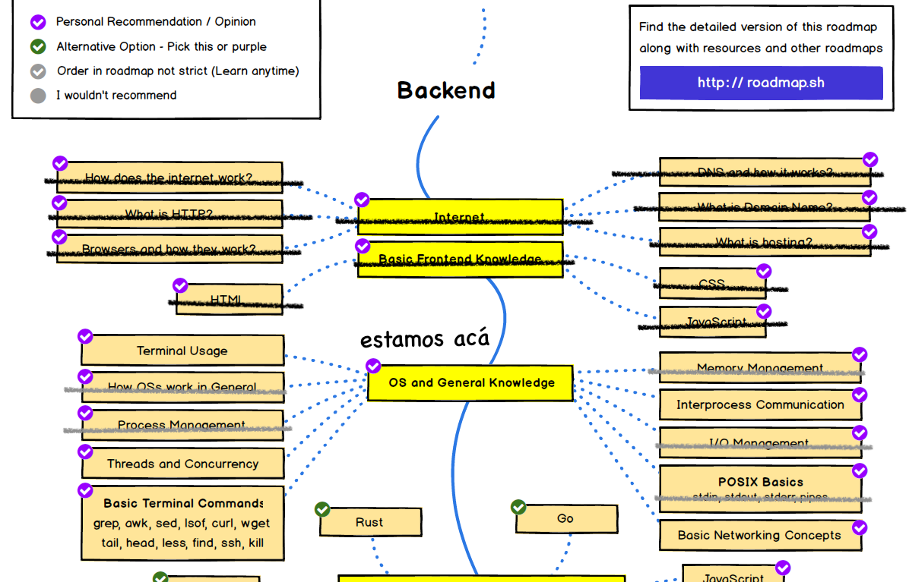

Seguimos avanzando en la segunda parte de nuestro [_roadmap_](https://roadmap.sh/backend) para convertirnos en desarrolladores backend modernos. Revisemos un poco nuestro recorrido hasta ahora:



¡Hemos avanzado bastante! Sin embargo es sólo el primer trecho del largo camino propuesto por [roadmap.sh](https://roadmap.sh/backend), así que mejor empecemos a acelerar el paso.

En la imágen he tachado en gris todo aquello que tendremos cubierto al final de este artículo. Por supuesto en tan reducido espacio no es posible cubrir todo con detalle. La idea de estos textos es introducir el concepto con un poco de código de modo que si están interesados en profundizar investiguen por su cuenta. Para facilitarles la tarea al final dejaré una bibliografía que les permitirán conocer más detalles sobre estos conceptos de sistemas operativos.

Como siempre te recuerdo que esta serie de  artículos pueden ser apoyados a través de [Kofi](https://ko-fi.com/), si te interesa lo que estoy escribiendo, puedes invitarme a un café, o cerveza, a través de este link: https://ko-fi.com/lnds. 




# Procesos

Tal como establecimos en el [artículo previo](/blog/2021/02/09/el-camino-del-backend-developer-sistemas-operativos/) un proceso es una abstracción que nos proporciona el sistema operativo, que comprende el "address space (espcio de direciones) y los ejecutores o "threads of control" (hilos de control). Dijimos que por ahora y para no complicar nuestro modelo todavía, consideraremos que cada proceso tiene sólo un hilo de control.

También vimos como se administra el espacio de direcciones en un modelo específico de sistema operativos, que tomamos del libro  ["Operating Systems in Depth"](https://amzn.to/2MVKoQx), y que a su vez está basado en el Unix de los años setenta.

Para explorar todo esto usamos un simple programa que calcula promedios de notas de un curso: 

```c
/* version 1 de nuestro programa en C */
#include <stdlib.h>

int nalumnos;
double* notas;

int main(int argc, char* argv[]) {
  int i;
  double acum = 0.0;
  double promedio = 0.0;

  nalumnos = atoi(argv[1]);
  notas = (double *) malloc(nalumnos * sizeof(double));
  for (i = 0; i < nalumnos; i++) {
      acum += notas[i];
  }
  promedio = acum / nalumnos;
  return 0;
}
```


Para cerrar todos los conceptos descritos antes vamos a apoyarnos de este diagrama:

```
     +--------------+
0000 | kernel text  |
...  | kernel data  |
105F | kernel stack |
     +--------------+
1060 | proces text  | <- IP
.... | proces data  |
20BF | proces stack |
     +--------------+
```

Este diagrama asume que estamos usando un sistema operativo muy básico,  donde los address spaces se organizan más o menos como [describimos antes](/blog/2021/02/09/el-camino-del-backend-developer-sistemas-operativos/). 

Hemos dibujado un kernel que ocupa 4 kb de memoria (incluyendo datos). Cuando cargamos un proceso, que llamamos `proces` en el diagrama, lo dejamos en el área inmediatamente posterior al address space del kernel. 

Lo que hace el kenel es reservar el área a partir de la dirección 1060 hexadecimal y copiar allí el código de máquina del programa. Además reserva 4 kb para ese proceso y finalmente "salta" a la primera dirección del código del programa que es la dirección 1060. 

En un modelo idealizado de CPU existe un registro especial que se llama Instruction Pointer (IP), que he representado en el diagrama para indicar cómo el kernel pasa el control al proceso después de que lo ha cargado en memoria. 

Todo esto lo podemos hacer también nosotros, usando una system call que se llama `fork()`.

## Padres e hijos

`fork()` es una primitiva muy antigua, se le atribuye a Melvin Conway[^1] quien la presentó en un paper de 1962[^2]. En nuestro modelo[^3] lo que hace fork es crear una copia del proceso en otro _address space_.


```
.... +--------------+
1060 | parent text  | <- esto no se copia
     | parent data  |
     | parent stack |
     +--------------+
.... |     ....     |
XXXX +--------------+
     | child data   |
     | child stack  |
     +--------------+
```

Sin embargo, como el código es el mismo no es necesario copiarlo. 

La llamada a `fork()` tiene el efecto de crear un nuevo _thread_. El comportamiento de `fork()` es un tanto extraño, pero  tiene sentido. La llamada a `fork()` retorna dos veces, una en el proceso inicial (o *padre*) y otra en el proceso nuevo (que llamaremos *proceso hijo*).

Pueden pensar que el hilo de control se encarga de manipular el IP que definimos recién, manejando su movimiento de forma distinta en cada caso, esto es lo que he intentado ilustrar en este diagrama:

```
.... +---------------+
1060 |     text      |   
     | fork return p | <- PARENT THREAD
     |               |
     |     ...       |
     |               |
     | fork return 0 | <- CHILD THREAD
     |               |
     |     ...       |
     |               |
     +---------------+
     | parent data   |
     | parent stack  |
     +---------------+
.... |     ....      |
XXXX +---------------+
     | child data    |
     | child stack   |
     +---------------+
```

Veamos un poco de código para que probemos como funciona esto:

```c
#include <stdio.h>
#include <stdlib.h>
#include <sys/types.h>
#include <unistd.h>


int main(int argc, char* argv[]) {
    int pid;
    if ((pid = fork()) == 0) {
        printf("soy el proceso hijo\n");
    } else {
        printf("soy el proceso padre, el pid del hijo es: %d \n", pid);
    }
    return 0;
}
````

Este programa en c ejecuta la llamada a `fork()`, esta primitiva retorna 0 en el proceso hijo, y para el proceso padre retorna un identificador numérico (_process id_).

Si ejecuto este código en mi máquina obtengo lo siguiente:

```sh
    % cc p1.c -o p1
    % ./p1
    soy el proceso padre, el pid del hijo es: 72885
    soy el proceso hijo
```

Cuando un proceso termina debe retornar un valor numérico. Esto se hace usando la función `exit()`, en C si se omite esto se usará el valor retornado por la función `main()`, en nuestro caso 0.


El _process id_, junto con el _return code_ y otra información del proceso es administrada por el sistema operativo en una estructura llamada _Process Control Block_ (PCB).

El _return code_ puede ser usado para comunicar a padre e hijo, del siguiente modo:

```c
#include <stdio.h>
#include <stdlib.h>
#include <sys/wait.h>
#include <unistd.h>


int main(int argc, char *argv[]) {
    int pid;
    if ((pid = fork()) == 0) {
        int n = rand() & 0xff;
        printf("soy el proceso hijo y retornaré %d\n", n);
        exit(n);
    } else {
        int return_code;
        printf("soy el proceso padre, el pid del hijo es: %d \n", pid);
        while (pid != wait(&return_code))
            ;
        printf("el proceso hijo retornó el valor: %d\n", WEXITSTATUS(return_code));
    }
}
```

La función `wait()` espera a que un proceso termine. Esta retorna el _process id_ de cualquier proceso hijo que haya sido creado por el proceso padre usando `fork()`. Es por esto que tenemos un `while` esperando por el proceso `pid` que creamos en el fork inicial, esto es útil en un contexto en que tenmos varios programas funcionando.

Además `wait()` recibe un puntero a una variable entera donde deja el valor de retorno enviado por `exit()`. 

Mientras un proceso está esperando que termine un proceso hijo se dice que está en un estado _sleeping_ (durmiendo).

La convención en Unix es que los procesos retornan un valor entre 0 y 255, es por eso que en nuestro proceso hijo generamos un número aleatorio y lo reducimos a ese rango mediante la operación `& 0xff`.

Noten que para mostrar el valor retornado en el proceso padre usamos la macro `WEXITSTATUS()`. Esto se hace así porque en cada sistema operativo el código puede ser almacenado de forma distinta dentro del argumento pasado a `wait()`, esta macro nos permite mantener coherente los valores para nuestro ejercicio[^4].

## Procesos Zombi

Hay algunas consideraciones adicionales. Por ejemplo, los _process id_ son administrados por el sistema operativo, y puede ocurrir que los números asignados pueden ser re utilizados. Podría ocurrir que antes de llamar a wait() el process id haya sido reasignado a otro proceso, así que puede haber cierto grado de ambigüedad. El valor retornado está almacenado en el address space del proceso hijo, y se este espacio es liberado antes de ser procesado también pueden haber problemas.

Para evitar estos problemas cuando un proceso llama a `exit()` se coloca en lo que se llama `estado zombie`, su _address space_ puede ser reutilizado, pero su process id y su return code se mantiene reservados en el PCB. Cuando el proceso padre finalmente llama a `wait()` estos valores son liberados y toda traza del proceso desaparece.

¿Qué ocurre si el proceso padre termina y desaparece antes que el proceso hijo? En ese caso el `wait()` ya no es invocado. En ese caso los procesos quedan huerfanos en estado zombi. Pero el sistema operativo cuenta con un proceso inicial, el proceso 1. Este proceso hereda a todos estos proceso zombi como hijos.

Esto lo podemos probar con el siguiente programa:

```c
/* zombi.c */
#include <stdio.h>
#include <stdlib.h>
#include <sys/types.h>
#include <unistd.h>


int main(int argc, char* argv[]) {
    int pid;
    if ((pid = fork()) == 0) {
        printf("soy el proceso hijo\n");
        sleep(5000);
        printf("ahora soy un proceso zombi\n");
    } else {
        printf("soy el proceso padre, el pid del hijo es: %d y terminé antes\n", pid);
    }
    return 0;
}
```

En unix el comando `ps` nos permite consultar por los procesos, veamos que pasa con nuestro programa zombi:

```bash
% cc zombi.c -o zombi
% ./zombi
soy el proceso padre, el pid del hijo es: 81873 y terminé antes
soy el proceso hijo
% ps -f
  UID   PID  PPID   C STIME   TTY           TIME CMD
  501  2121  2117   0 Fri10AM ttys000    0:00.13 -zsh
  501 81873     1   0  1:42PM ttys004    0:00.00 ./zombi
```

La opción -f nos permite ver entre otras cosas el PID del proceso padre (PPID).

Más adelante veremos como detener esos procesos zombi.

## Cargando programas en procesos

Ahora vamos revisar cómo se puede cargar un programa en un proceso, para esto después de realizar el `fork()` cargaremos nuestro programa que calcula promedios.

```c
/* loader.c */
int main(int argc, char *argv[]) {
    int pid;
    if ((pid = fork()) == 0) {
        execl("./promedios", "promedios", 30, 0);
        exit(1);
    }

    int return_code;
    while (pid != wait(&return_code));
    printf("el proceso hijo retornó el valor: %d\n", WEXITSTATUS(return_code));
}
```

La función `execl()` reemplaza completamente el address space de este proceso con el nuevo programa. Esta función recibe en primer lugar el nombre del archivo donde se encuentra el código. El segundo argumento es el nombre del proceso, esto puede parecer redundante, pero se usa para poder modificar el comportamiento del programa dependiendo del nombre, este argumento es el valor que viene en `argv[0]`.

Luego vienen los argumentos del programa, en nuestro caso 30 es la cantidad de notas. Para indicar que no hay más argumentos se coloca un 0.

En este caso nuestro modelo de sistema operativo hace lo siguiente:

```
.... +---------------+
1060 | parent text   |   
     | fork return p | <- PARENT THREAD
     |               |
     |               | 
     |               |
     +---------------+
     | parent data   |
     | parent stack  |
     +---------------+
.... |     ....      |
XXXX +---------------+
     | child text    |
     | main() { ...  |  <- CHILD THREAD
     |               | 
     |               |
     +---------------+
     | child data    |
     | child stack   |
     +---------------+
```

Ha creado un nuevo address space donde copia el código del programa.

## Archivos

Nuestro programa que calcula promedios no es muy útil tal como está, recordemos su código:


De alguna manera tenemos que pasarle los datos con las notas. 

Los sistemas operativos tiene un mecanismo para almacenar datos en forma persistente que por lo general se conoce como sistema de archivos (file system). La data se guarda en un espacio especial que organiza la información en un simil a carpetas y archivos como las tendríamos en una oficina o biblioteca. Normalmente este sistema está organizado jerárquicamente en una estructura de árbol.

No ahondaré mucho más por ahora sobre los sistemas de archivos porque como buen usuario de computadora tienes una idea clara de este concepto. Lo que nos preocupa ahora es cómo podemos manipular estos archivos en nuestros programas usando llamadas a sistemas que operen sobre los archivos.

El sistema de archivos reside fuera del proceso. Así que lo que hacemos es que le entregamos al sistema operativo el nombre completo del archivo que queremos manipular y este nos entrega un _handle_ que corresponde a un número temporal con el cual podemos manipular el archivo a través del kernel.

Este _handle_ no sólo es una referencia al objeto que queremos manipular (en este caso un archivo), sino que permite al kernel restringir los derechos sobre este objeto que el proceso tiene en un determinado momento.

La forma general de obtener un _handle_ es usando la llamada a sistema `open()`. Este código muestra como podríamos obtener un handle para un archivo:

```c
int fd;
char buffer[1024];
int count;

if ((fd = open("./notas.txt", O_RDONLY)) == -1) {
    /* no se pudo abrir el archivo */
    perror("./notas.txt);
    exit(1);
}
```

Al valor devuelto por `open()` se le llama también _file descriptor_. Fíjense que el primer argumento de `open()` es el nombre del archivo, y el segundo argumento es un atributo que indica la forma en que queremos manipular un archivo. En este caso el argumento `O_RDONLY` indica que queremos sólo leer del archivo, por lo tanto si el archivo no existe esta llamada fallará.

Noten también que usamos `perror()`, esta llamada escribe un mensaje de error, pero ¿donde?.

Todo programa en nuestro modelo de sistema operativo recibe tres file descriptors. El file descriptor 0 es conocido como `stdin` o entrada estándar. El file descriptor 1 se conoce como `stdout` o salida estándar. Y el file descriptor 2 es `stderr` o salida errores.

Así que `perror()` siempre escribe un mensaje en `stderr`.

Por lo tanto, en nuestro modelo, la variable `fd` del código anterior retornará el valor 3 (anda prúebalo).

Esto ocurre también en cualquier programa en un sistema operativo basado en Unix o que soporte el estándar POSIX[^5].

La función `printf()`, que es parte de la especificación de ISO C, también es parte del estándar POSIX y siempre escribe un _string_ formateado en la salida estándar.

Lo mismo ocurre con la función `scanf()` que se puede usar para leer data formateada desde la entrada estándar.

Con estos antecedentes modificaremos nuestro programa promedio del siguiente modo:

```c
/* promedios_v2.c */
#include <stdlib.h>
#include <stdio.h>

int main(int argc, char *argv[]) {
    int nalumnos = 0;
    double acum = 0.0;
    double promedio = 0.0;
    double nota;

    while (scanf("%lf", &nota) != EOF) {
        nalumnos++;
        acum += nota;
    }
    promedio = acum / nalumnos;
    printf("alumnos: %d\n", nalumnos);
    printf("promedio: %f\n", promedio);

    return 0;
}

```

Supongamos que tenemos un archivo `notas.txt` con nuestras notas, puede ser algo así:

```c
2.5
3.0
4.7
6.3
7.0
6.5
```

Entonces podemos usar nuestro programa para calcular el promedio de este archivo del siguiente modo:

```sh
% cc -o promedios promedios_v2.c
% ./promedios < notas.txt
alumnos: 6
promedio: 5.000000
```

La convención es que cuando queremos pasar un archivo a través de `stdin` desde la shell usamos `<` como operador de redirección. Del mismo modo podemos redirigir la salida estándar con el operador `>`

```sh
% ./promedios < notas.txt > result.txt
% cat result.txt
alumnos: 6
promedio: 5.000000
```

Acá usamos el comando `cat` que muestra el contenido de un archivo para ver lo que depositamos en `result.txt`.


Ahora modificaremos `loader` para invocar esta nueva versión de `promedios` del siguiente modo:

```c
/** loader2.c */
#include <stdio.h>
#include <stdlib.h>
#include <sys/wait.h>
#include <sys/errno.h>
#include <unistd.h>
#include <fcntl.h>


int main(int argc, char *argv[]) {
    int pid;
    if ((pid = fork()) == 0) {
        printf("forked");
        int fd_stdin;
        int fd_stdout;
        close(0);
        close(1);
        close(2);
        if ((fd_stdin = open("./notas.txt", O_RDONLY)) == -1) {
            exit(errno);
        }
        if ((fd_stdout = open("./result.txt", O_CREAT|O_WRONLY, S_IRUSR|S_IRGRP|S_IROTH)) == -1) {
            exit(errno);
        }
        dup(fd_stdout);
        execl("./promedios", "promedios", 0);
        exit(0);
    }

    int return_code;
    while (pid != wait(&return_code))
        ;
    printf("el proceso hijo retornó el valor: %d\n", WEXITSTATUS(return_code));
}
```

Fíjense como en el proceso hijo cerramos todos los descriptores estándares. La razón de esto es que cada llamada a open incrementa el descriptor, con esto podemos sobre escribir los descriptores 0, 1 y 2 para nuestro propósito.

Luego abrimos `stdin` usando el archivo "./notas.txt". Después cambiamos la salida estándar para que apunte a nuestro archivo "./result.txt". Noten que la llamada a open contiene dos argumentos después del nombre del archivo. `O_CREAT|O_WRONLY` combina dos flags de modo que si el archivo no existe sea creado (`O_CREAT`) y para que abra el archivo en modo de escritura (`O_WRONLY`). Cuando se usa `O_CREAT` en Unix se debe especificar los permisos con que quedará el archivo, en este caso lo definimos como `S_IRUSR|S_IRGRP|S_IROTH` con esto dejamos el archivo con permiso de lectura para todo el mundo[^6].

Finalmente fíjense como invoco `dup(fd_stdout)`, de este modo hemos duplicado el handle 1  con el handle 2, de este modo ambos apuntan al mismo lugar.

Si invocamos este programa podemos ver lo que ocurre:

```sh
% cc -o loader loader2.c
% ./loader
el proceso hijo retornó el valor: 0
% cat result.txt
alumnos: 6
promedio: 5.000000
%
```

Dado que `stdout` y `stderr`son lo mismo los errores irán al mismo archivo.

Modifiquemos promedios para manejar errores y ver que pasa con esto:

```c
/* version 3 de nuestro programa en C */
#include <stdlib.h>
#include <stdio.h>

int main(int argc, char *argv[]) {
    int nalumnos = 0;
    double acum = 0.0;
    double promedio = 0.0;
    double nota;

    while (scanf("%lf", &nota) != EOF) {
        if (nota < 1.0 || nota > 7.0) {
          dprintf(2, "error la nota %lf es inválida", nota);
        } else {
          nalumnos++;
          acum += nota;
        }
    }
    if (nalumnos == 0) {
        dprintf(2, "error, no ha ingresado alumnos"); // <- así puedes escribir en stderr
        exit(1);
    }
    promedio = acum / nalumnos;
    printf("alumnos: %d\n", nalumnos);
    printf("promedio: %f\n", promedio);

    return 0;
}
```

Fíjense que acá usamos la función `dprintf()` que nos permite escribir en un file descriptor directamente.

Con este cambio, si dejamos notas.txt como un archivo vacio podemos ver el efecto:

```sh
% cc -o promedios promedios_v3.c
% ./loader
% cat result.txt
el proceso hijo retornó el valor: 1
%
```

Y si modificamos nuestro archivo de notas a esto:

```c
2.5
3.0
7.4
6.3
7.0
6.5
```

Tendremos lo siguiente:

```sh
% ./loader
el proceso hijo retornó el valor: 0
% cat result.txt
error la nota 7.400000 es inválida
alumnos: 5
promedio: 5.060000
```

## Pipes

Hay una mecanismo interesante que podemos usar para comunicar un proceso padre con un proceso hijo, se trata de los _pipes_.

Este concepto fue propuesto por Doug McIlroy en 1964, quien planteó la idea de que se deberían conectar programas tal como se enganchan las mangueras de jardin. Cómo en Unix ya estaba estandarizada la entrada y salida mediante el mecanismo de file descriptors que mostramos recién, a Thompson se le ocurrió agregar una system call adicional que resultó fácil de implementar.

Esta es la system call `pipe()`.

La forma de usarlo es más o menos así:

```c
int p[2];  // acá guardaremos los file descriptors
pipe(p);   // creamos un pipe, asumimos que no hay error
   /* p[0] es la salida del pipe */
   /* p[1] es la entrada del pipe */
if (fork() == 0) {
   char buf[80];
   close(p[1]);     // el hijo no lo necesita
   while (read(p[0], buf, 80) > 0) {
      ...
   }
} else {
     char buf[80];
     close(p[0]);    // no necesitado por el padre
     for (;;) {
       ...
       write(p[1], buf, 80);
     }
}
```

Para probar esto vamos a modificar `loader` nuevamente, esta vez haremos que loader genere 30 notas aleatorias que se las pasaremos a través de un pipe al programa hijo, veamos como sería esto:

```c
/** loader3.c */
#include <stdio.h>
#include <stdlib.h>
#include <sys/wait.h>
#include <sys/errno.h>
#include <unistd.h>
#include <fcntl.h>
#include <time.h>

int main(int argc, char *argv[]) {
    int p[2];

    close(0);
    close(1);
    close(2);
    pipe(p);

    if (fork() == 0) {
        close(p[1]);
        int fd_stdout;
        if ((fd_stdout = open("./result.txt", O_CREAT|O_WRONLY, S_IRUSR|S_IWUSR|S_IRGRP|S_IROTH)) == -1) {
            exit(errno);
        }
        dup(fd_stdout);
        execl("./promedios", "promedios", 0);
        exit(0);
    } else {
        int i;
        close(p[0]);
        srand((unsigned int)time(NULL));
        for (i = 0; i < 30; i++) {
            float nota = 1.0 +  ((float) rand() / (float) (RAND_MAX))*6.0;
            dprintf(p[1], "%f\n", nota);
        }
        close(p[1]);
    }
}
```

Como pueden ver antes de partir cerramos los descriptores estándares. Luego creamos el pipe, que nos entrega 2 descriptores.

Fíjense que en el caso del hijo cerramos el descriptor `p[1]` que es el extremo de salida del pipe, porque no lo usaremos. Abrimos un descriptor para la salida que seguirá siendo el archivo `result.txt`. Y `stderr` cerá un duplicado de `stdout` igual que antes.

En el caso del padre cerramos el extremos de entrada y escribiremos en `p[1]`.
La llamada a `srand()` es para iniciar la semilla del generador de números seudoaleatorios. 
Como el proceso hijo lee mientras hayan datos en la entrada estándar no tenemos que esperar que termine en el proceso padre, basta con llamar a `close()`. 

Con esto hemos cubierto algunos aspectos muy generales de cómo funcionan los procesos. Estos los vamos a usar en el próximo capítulo para construir un shell y profundizaremos después sobre el sistema de archivos.

Te dejo una bibliografía y algunos ejercicios.
El código fuente de este artículo se encuentra en este repo en github: https://github.com/lnds/desafios-programando.org/tree/master/2021-02-13.


## Bibliografía:

- ["Operating Systems - Three Easy Pieces"](https://amzn.to/2LQwaQD), Remzi H Arpaci-Dusseau (Author), Andrea C Arpaci-Dusseau, muy didactico.

- ["Operating Systems in Depth"](https://amzn.to/2MVKoQx), de Thomas W. Doeppner, el libro en el que nos hemos basado para estos artículos.

- ["Operating Systems: Design and Implementation (Second Edition)"](https://amzn.to/37e7IAd), Andrew Tannenbaum, el clásico libro que introduce Minix, este es el libro con el que yo aprendí y también Linus Torvalds.

- [“UNIX: A History and a Memoir”](https://amzn.to/2WM44ZT), de Brian Kernighan para saber sobre la historia de Unix.

### Ejercicios

1. Modifica el programa `loader` para que los mensajes a stderr vayan en el archivo `errores.txt`.
2. ¿Qué pasa los procesos padre e hijo escriben o leen en un file descriptor creado antes de la llamada a `fork()`? 
3. Averigua que hace el programa `size` en linux y macos y aplicalo sobre los programas que hemos creado, ¿puedes interpretar su resultado?.
4. Investiga cómo podrías obtener en tiempo de ejecución las direcciones de BSS, DATA y TEXT en tu programa, puedes intentar ver qué es lo que pasa realmente en tu sistema operativo con estas direcciones cuando haces `fork()`.
5. Crea un programa padre que cree 2 procesos hijos. Un hijo será un generador de datos y el otro será un consumidor de datos. Generador genera números aleatorios. Consumidor lee los números y calcula la suma, el valor máximo y el valor mínimo. Cada 1000 números el consumidor escribe en la salida estándar del proceso padre los valores calculados hasta ese momento. El programa generador se debe después de generar un millón de números.


### Notas


[^1]: Famoso por acuñar la Ley que lleva su nombre de la que hablo en extenso en este artículo: https://lnds.net/blog/lnds/2017/06/26/paseando-con-dromedarios/

[^2]: La historia de fork está disponible online: https://ieeexplore.ieee.org/stamp/stamp.jsp?tp=&arnumber=7548985

[^3]: Recordemos que estamos viendo un modelo idealizado y simplificado de un sistema operativo, en el mundo real las cosas son más complicadas, y no necesariamente se realiza una copia de data en este punto.

[^4]: Puedes probar no usar la macro `WEXITSTATUS()`. En MacOs por ejemplo, el valor retornado queda almacenado en los bits más significativos y eso da resultados confusos. Esta macro es parte del estándar POSIX que revisaremos más adelante.

[^5]: POSIX es el acrónimo para Portable Operating System Interface. La X final hace referencia a Unix/ Este nombre fue propuesto por Richard Stallman cuando la IEEE propuso un estándar para las llamadas a sistemas que deberían proveer los sistemas operativos que adhirieran a estes estándar. De este modo se buscaba facilitar la portabilidad de programas entre sistemas. El sitio web oficial de este estándar es: https://pubs.opengroup.org/onlinepubs/9699919799/. Sobre los file descriptors puedes leer esta entrada en WikiPedia: https://es.wikipedia.org/wiki/Descriptor_de_archivo.

[^6]: Para más detalles puedes investigar las funciones `open()` y `chmod()`. En cualquier sistema operativo basado en unix esto se logra ejecutando: `man 2 open` y `man 2 chmod` en la shell.