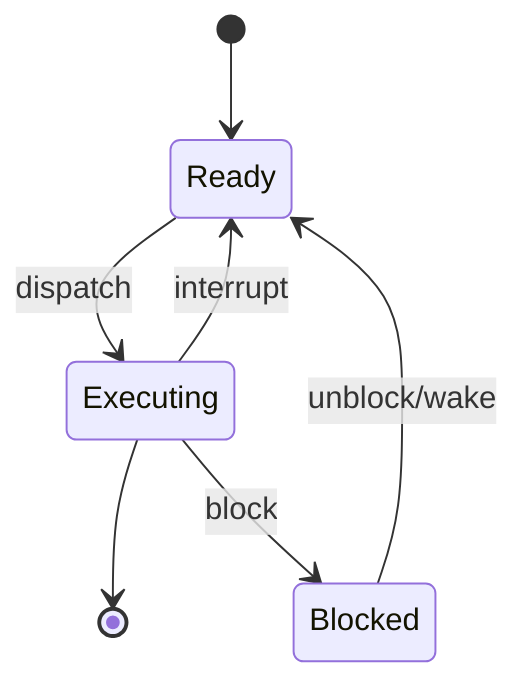

Ha llegado el momento de entrar en uno de los aspectos que considero más cruciales e importantes dentro de esta guía que hemos seguido hasta ahora. Es el momento de hablar de concurrencia. Muchos programadores tienen problemas en manejar este aspecto y sé que les produce dolores de cabeza, lo digo por experiencia propia. Recuerdo un proyecto en que estuve seis semanas en terreno minero tratando de corregir correctamente condiciones de carrera que se daban por procesos concurrentes con los que implementé mis algoritmos. 

Encontrar literatura apropiada para este tema no es fácil, pero tenemos la fortuna de que hace unos pocos años atrás Ricardo Galli escribió un excelente libro que usaremos como base para todo lo que discutiremos en este capítulo. Se trata del texto: ["Principios y Algoritmos de Concurrencia"](https://amzn.to/2MaeCix), si quieren profundizar sobre este tema les recomiendo leerlo, no sólo está bien escrito, es muy práctico y fácil de seguir. Por supuesto acá sólo daremos un barniz inicial sobre el tema, tal como hemos estado haciendo, así que como dicen en España, "vamos a por ello".


Antes te recuerdo que esta serie de  artículos pueden ser apoyados a través de [Kofi](https://ko-fi.com/), si te gusta el contenido o lo encuentras útil puedes invitarme a un café, o cerveza, a través de este link: https://ko-fi.com/lnds. 




# Estado de procesos

Los procesos, cuyo modelo abstracto ya intodujimos en el [artículo previo](/blog/2021/02/13/el-camino-del-backend-developer-procesos/), pasan por tres procesos básicos:

- Executing (ejecutando): el proceso está siendo ejecutado por la CPU. Asumiremos por ahora que sólo tenemos una CPU y por lo tanto hay un proceso ejeccutándose a la vez.
- Ready (listo para ejecutar): el proceso no se está ejecutando pero puede hacerlo de inmediato. 
- Blocked (bloqueado, o suspendido): el proceso en este estado no puede pasar a ejecución, tiene que esperar que ocura un evento que lo deje en estado listo.



El Kernel mantiene una serie de colas para los distintos tipos de eventos. También tiene una cola de prioridad para los eventos listos para decidir cuál ejecutar a continuación.

Un proceso pasa a bloqueado cuando ejecuta una _system call_ y se queda esperando a que la llamada a sistema termine. Cuando esto ocurre el kernel mueve el proceso a la cola de listos para ejecutar.

Quien decide la transición de _Ready_ a _Executing_ es un módulo conocido como _scheduler_, o planificador, que es parte del _kernel_. Este planificador se ejecuta cada vez que un proceso se bloquea.

Para evitar que un proceso se tome el control de la CPU indefinidamente cada cierto tiempo (unos pocos milisegundos) un reloj "interrumpe" al proceso y ejecuta al _scheduler_. El _scheduler coloca al proceso en la cola de bloqueados y decide que proceso ejecutar a continuación. De este modo se pueden bloquear procesos aunque no hagan llamadas a sistemas. Este tipo de planificador se conoce como _preemptive scheduler_ (planificador apropiativo).

Cuando el kernel decide bloquear a un proceso y dejar en ejecución a otro se produce lo que se conoce como "cambio de contexto". Este es un mecanismo costoso que se ejecuta a través de una colaboración entre el sistema operativo y la CPU.

Con el surgimiento de sistemas operativos modernos con interfaces de usuario más ricas (como Windows o MacOs en los ochenta), se requirió de un modelo de programación que permitiera responder a los distintos eventos generados por el usuario. Esto llevó al surgimiento del paradigma de programación dirigida por eventos (Event Driven Programming). El manejo de eventos se realiza usando una cola y se atienden través de un _"loop"_. Todo esto hace la programación más compleja y dificil de estructurar. Esto empujó al desarrollo de la programación asíncrona, que incorporó el concepto de _thread_ o proceso ligero (_light weight process_). Este concepto de hilo tiene relación con el que hemos usado hasta ahora, pero se le incorporan algunos elementos que iremos revisando.

En los hilos en vez de copiar toda la imagen de memoria del proceso como vimos anteriorimenteo, se mantiene la misma copia para todos los hilos. Lo que ocurre es que cada hilo maneja su propio contexto de ejecución. Así que acá viene un elemento crucial, los hilos comparte el código (TEXT), las variables estáticas (BSS y DATA) y la memoria asignada dinámicamente (Dynamic). El _scheduler_ ve a estos hilos como proceso independientes.

El desarrollo de los chips multi core y las técnicas [SMP](https://es.wikipedia.org/wiki/Multiprocesamiento_simétrico) (_symmetric multi processing_) potenciaron el desarrollo de la *programación concurrente*, los hilos no sólo eran livianos, sino que muy rápidos.

Los POSIX Threads (o Pthreads) son el estándar usado para crear hilos en entornos Unix. La función que usamos para crear un thead es `pthread_create()`, veamos un ejemplo:


```c
/* pthread1.c */
#include <pthread.h>
#include <stdio.h>
#include <stdlib.h>
#include <sys/types.h>

const int num_threads =  4;

void* thread_func(void *data) {
    int tid = *((int*) data);
    printf("Hola, soy el thread %d\n", tid);
    return NULL;
}

int main(int argc, char *argv[]) {
    pthread_t threads[num_threads];
    int rc, i;
    int tids[num_threads];

    printf("lanzando threads...\n");
    for (i = 0; i < num_threads; i++) {
        tids[i] = i;
        rc = pthread_create(&threads[i], NULL, thread_func, (void*) &tids[i]);
    }
    printf("esperando threads...\n");
    for (i = 0; i < num_threads; i++) {
        pthread_join(threads[i], NULL);
    }
}
```

Podemos ejecutar este código así:

    % cc -o p1 pthread1.c
    % ./p1
    lanzando threads...
    esperando threads...
    Hola, soy el thread 0
    Hola, soy el thread 3
    Hola, soy el thread 2
    Hola, soy el thread 1
    % ./p1
    lanzando threads...
    Hola, soy el thread 0
    Hola, soy el thread 1
    esperando threads...
    Hola, soy el thread 2
    Hola, soy el thread 3
  

En este ejemplo he ejecutado 2 veces el programa, pueden notar que el orden de ejecución de los threads es indeterminado. Esta es la principal característica de la programación concurrente: "cada thread se ejecuta de forma independiente, asincrónicamente y de manera no determinista".

Veamos el poder de la programación concurrente, con el iguiente programa:

```c
/* pthread2.c */
#include <pthread.h>
#include <stdio.h>
#include <stdlib.h>
#include <string.h>
#include <sys/types.h>
#include <math.h>

const int num_threads = 4;

void tarea(int id)
{
    printf("Tarea %d iniciada\n", id);
    int i;
    double result = 0.0;
    for (i = 0; i < 10000000; i++)
    {
        result = result + sin(i) * tan(i);
    }
    printf("Tarea %d completada, resultado es %e\n", id, result);
}

void secuencial(int tareas)
{
    int i;
    for (i = 0; i < tareas; i++)
    {
        tarea(i);
    }
}

void *tarea_concurrente(void *t)
{
    long id = (long)t;
    printf("Hilo %ld iniciado\n", id);
    tarea(id);
    printf("Hilo %ld terminado\n", id);
    pthread_exit(0);
}

void paralelo(int tareas)
{
    int num_threads = tareas;
    pthread_t thread[num_threads];
    int rc;
    long t;
    for (t = 0; t < num_threads; t++)
    {
        printf("Creando hilo %ld\n", t);
        rc = pthread_create(&thread[t], NULL, tarea_concurrente, (void *)t);
        if (rc)
        {
            printf("ERROR: codigo retornado por pthread_create() es %d\n", rc);
            exit(-1);
        }
    }
}

void uso(int argc, char *argv[])
{
    printf("Uso: %s secuencial|paralelo num_tareas\n", argv[0]);
    exit(1);
}

int main(int argc, char *argv[])
{
    if (argc != 3)
    {
        uso(argc, argv);
    }

    int num_tasks = atoi(argv[2]);

    if (!strcmp(argv[1], "secuencial"))
    {
        secuencial(num_tasks);
    }
    else if (!strcmp(argv[1], "paralelo"))
    {
        paralelo(num_tasks);
    }
    else
    {
        uso(argc, argv);
    }

    printf("Proceso terminado\n");
    pthread_exit(NULL);
}
```


Este programa ejecuta una tarea no muy interesante aplicando algunas operaciones trigonométricas e imprime los resultados a la salida estándar. Esta rutina está pensada sólo para gastar un poco de CPU y poder apreciar las diferencias.

El programa se puede ejecutar con dos parámetros: modo y cantidad de tareas. El modo puede ser `secuencial` o `paralelo`. 

La función `paralelo` crea un _thread_ por cada tarea. 


Si ejecutamos este programa tenemos estos resultados en mi máquina:

    %  cc -O2 -pthread pthread2.c -o pthread2
    % time ./pthread2 secuencial 4
    Tarea 0 iniciada
    Tarea 0 completada, resultado es 3.135632e+06
    Tarea 1 iniciada
    Tarea 1 completada, resultado es 3.135632e+06
    Tarea 2 iniciada
    Tarea 2 completada, resultado es 3.135632e+06
    Tarea 3 iniciada
    Tarea 3 completada, resultado es 3.135632e+06
    Proceso terminado
    ./pthread2 secuencial 4  1.27s user 0.00s system 99% cpu 1.276 total
  
Si lo ejecutamos en modo paralelo tenemos este resultado:

    % time ./pthread2 paralelo 4
    Creando hilo 0
    Creando hilo 1
    Creando hilo 2
    Creando hilo 3
    Proceso terminado
    Hilo 0 iniciado
    Tarea 0 iniciada
    Hilo 2 iniciado
    Tarea 2 iniciada
    Hilo 3 iniciado
    Tarea 3 iniciada
    Hilo 1 iniciado
    Tarea 1 iniciada
    Tarea 0 completada, resultado es 3.135632e+06
    Hilo 0 terminado
    Tarea 1 completada, resultado es 3.135632e+06
    Hilo 1 terminado
    Tarea 2 completada, resultado es 3.135632e+06
    Hilo 2 terminado
    Tarea 3 completada, resultado es 3.135632e+06
    Hilo 3 terminado
    ./pthread2 paralelo 4  1.43s user 0.00s system 395% cpu 0.363 total

Ejecutando en paralelo corre 3.5 veces más rápido. Esta relación se conoce como speedup y depende de la cantidad de cores que tenga nuestra cpu.

Hay varios factores que considerar cuando programamos de manera concurrente. Uno de los aspectos más importantes es que la arquitectura de nuestro procesador impacta en el resultado. Si la tarea que queremos paralelizar es "cpu bounded", es decir, depende sólo de cálculos en la CPU no nos beneficiaremos demasiado de los cálculos en una arquitectura de procesadores modernos, que tienen funcionalidades como la ejecución fuera de orden, o cachés de RAM interna. Para entender estos aspectos los remito a la bibliografía que les dejo más abajo.

Para cerrar este capítulo vamos revisar los problemas de exclusión mutua, que es donde cometen muchos errores los programadores novatos.

Vamos ver esto con un ejemplo muy simple:

```c
/* pthread3.c */
#include <pthread.h>
#include <stdio.h>
#include <stdlib.h>
#include <string.h>
#include <sys/types.h>
#include <math.h>
#include <unistd.h>

long counter = 0;

void* tarea(void* id)
{
    int tid = (int) ((int*) id);
    printf("Hilo %d, Contador al entrar %ld \n", tid, counter);
    double result;
    for (int i = 0; i < 100000; i++)
        result += tan(i)*sin(i);
    for (int i = 0; i < 1000; i++)
        counter++;
    printf("Hilo %d, Contador al salir %ld \n", tid, counter);
    pthread_exit(0);
}

void paralelo(int tareas)
{
    int num_threads = tareas;
    pthread_t thread[num_threads];
    int rc;
    long t;
    for (t = 0; t < num_threads; t++)
    {
        printf("Creando hilo %ld\n", t);
        rc = pthread_create(&thread[t], NULL, tarea, (void *)t);
        if (rc)
        {
            printf("ERROR: codigo retornado por pthread_create() es %d\n", rc);
            exit(-1);
        }
    }
    for (t = 0; t < num_threads; t++) {
        pthread_join(thread[t], NULL);
    }

}


int main(int argc, char *argv[])
{
    int num_tasks = atoi(argv[1]);
    counter = 0;

    paralelo(num_tasks);

    printf("Proceso terminado, counter = %ld\n", counter);
    pthread_exit(NULL);
}
```

Este programa corre en paralelo y es similar a la tarea anterior, pero además incrementa un contador global `counter` en 1.000 en cada llamada.

Veamos que pasa cuando corro este programa un par de veces en mi pc:

    % cc  -pthread -o pthread3 pthread3.c
    % ./pthread3 4
    Creando hilo 0
    Creando hilo 1
    Creando hilo 2
    Creando hilo 3
    Hilo 0, Contador al entrar 0
    Hilo 1, Contador al entrar 0
    Hilo 3, Contador al entrar 0
    Hilo 2, Contador al entrar 0
    Hilo 3, Contador al salir 1044
    Hilo 0, Contador al salir 3000
    Hilo 1, Contador al salir 1000
    Hilo 2, Contador al salir 2000
    Proceso terminado, counter = 3000


Bueno, eso no es lo que esperamos, el resultado final debería ser 4.000. Pero fíjense que al entrar al hilo 3 el valor es 1044, además al entrar a cada hilo el valor es distinto.

Ese es un problema clásico al tratar de acceder a una variable compartida, en este caso counter. Se trata de un [_race condition_](https://es.wikipedia.org/wiki/Condición_de_carrera) (condición de carrera). Esto se puede dar por ejemplo en un sistema de reserva de tickets, podriamos terminar vendiendo más tickets de los que hay disponibles.

Lo que haremos es usar una solución propuesta por Dijkstra en 1965, mediante el modelo de sección crítica o exclusión mutua. 

En este caso a definir nuestra sección crítica como el momento en que modificamos el contador. Lo que haremos es que al momento de entrar a nuestra sección crítica adquiriremos un `lock`, que nos permitirá alterar el valor de la variable, una forma de implementar este mecanismos es usando un `mutex`.

Así que modificaremos nuestro programa del siguiente modo:

```c
/* pthread4.c */
...

long counter = 0;
pthread_mutex_t lock;


void* tarea(void* id)
{
    int tid = (int) ((int*) id);
    pthread_mutex_lock(&lock); 
    printf("Hilo %d, Contador al entrar %ld \n", tid, counter);
    pthread_mutex_unlock(&lock); 
    double result;
    for (int i = 0; i < 100000; i++)
        result += tan(i)*sin(i);
    for (int i = 0; i < 1000; i++) {
        pthread_mutex_lock(&lock); 
        counter++;
        pthread_mutex_unlock(&lock);
    } 
    pthread_mutex_lock(&lock); 
    printf("Hilo %d, Contador al salir %ld \n", tid, counter);
    pthread_mutex_unlock(&lock); 
    pthread_exit(0);
}

....


int main(int argc, char *argv[])
{
    if (argc != 2) {
        printf("uso: %s num_threads", argv[0]);
        exit(1);
    }
    if (pthread_mutex_init(&lock, NULL) != 0) { 
        printf("no pudo inicializar el mutex\n"); 
        exit(1); 
    } 
  
    
    int num_tasks = atoi(argv[1]);
    counter = 0;
    paralelo(num_tasks);

    printf("Proceso terminado, counter = %ld\n", counter);
    pthread_mutex_destroy(&lock); 
    pthread_exit(NULL);
}
```

Las modificaciones las hemos hecho en `main()`, deonde creamos el mutex `lock`, que hemos declarado debajo de `counter`. Luego usamos el mutex en diversas partes de nuestra tarea, por ejemplo antes de imprimir su valor, o cuando lo vamos a incrementar.

Esto asegura que el valor final será el esperado:

    % cc  -pthread -o pthread4 pthread4.c
    % ./pthread4 4
    Creando hilo 0
    Creando hilo 1
    Creando hilo 2
    Creando hilo 3
    Hilo 1, Contador al entrar 0
    Hilo 3, Contador al entrar 0
    Hilo 0, Contador al entrar 0
    Hilo 2, Contador al entrar 0
    Hilo 3, Contador al salir 2693
    Hilo 0, Contador al salir 3136
    Hilo 2, Contador al salir 3893
    Hilo 1, Contador al salir 4000
    Proceso terminado, counter = 4000


Fíjense que al entrar y salir de cada hilo los valores no parecen ser secuenciales, pero lo que importa es que el resultado final es el correcto: 4000.

Con esto hemos completado este capítulo con un pequeño barniz sobre hilos y concurrencia. Más adelante, cuando veamos lenguajes de programación aprenderemos a usar otros mecanismos para programar concurrentemente más modernos. Si quieres profundizar te dejo una bibliografía, junto con algunos ejercicios.

El código fuente de este artículo se encuentra en este repo en GitHub: https://github.com/lnds/desafios-programando.org/tree/master/2021-02-20

# Bibliografía

- ["Principios y Algoritmos de Concurrencia"](https://amzn.to/2MaeCix), de Ricardo Galli, muy  recomendable es un gran libro sobre este asunto.

- ["Operating Systems in Depth"](https://amzn.to/2MVKoQx), de Thomas W. Doeppner, el libro en el que nos hemos basado para estos artículos.

- ["PThreads Programming - A POSIX Standard for Better Multiprocessing"](https://amzn.to/3pG9jF0), de Dick Buttlar,  Jacqueline Farrell y Bradford Nichols, una buena guía introductoria sobre este estándar.

# Ejercicios

1. Hay una manera de lograr esta salida:
   ```
      % ./pthread4 4
      Creando hilo 0
      Creando hilo 1
      Creando hilo 2
      Creando hilo 3
      Hilo 0, Contador al entrar 0
      Hilo 0, Contador al salir 1000
      Hilo 2, Contador al entrar 1000
      Hilo 2, Contador al salir 2000
      Hilo 1, Contador al entrar 2000
      Hilo 1, Contador al salir 3000
      Hilo 3, Contador al entrar 3000
      Hilo 3, Contador al salir 4000
    Proceso terminado, counter = 4000
    ```
    Es decir, que el contador tenga un valor "coherente" (incrementado en 1000) al entrar y salir de cada hilo, modifica el programa `pthread4.c` para lograr este efecto.

2. El siguiente programa produce un error grave, conocido como _deadlock_, ¿puedes tratar de explicar lo que pasa en este caso?[^1]

```c
#include <pthread.h>
#include <stdio.h>
#include <stdlib.h>
#include <string.h>
#include <sys/types.h>
#include <math.h>
#include <unistd.h>

pthread_mutex_t lock1, lock2;

void *resource1(){

    pthread_mutex_lock(&lock1);

    printf("Job started in resource1..\n");
    sleep(2);

    printf("Trying to get resource2\n");
    pthread_mutex_lock(&lock2); 
    printf("Aquired resourc2\n");
    pthread_mutex_unlock(&lock2);

    printf("Job finished in resource1..\n");

    pthread_mutex_unlock(&lock1);

    pthread_exit(NULL);

}

void *resource2(){

    pthread_mutex_lock(&lock2);

    printf("Job started in resource2..\n");
    sleep(2);

    printf("Trying to get resourc1\n");
    pthread_mutex_lock(&lock1); 
    printf("Aquired resourc1\n");
    pthread_mutex_unlock(&lock1);

    printf("Job finished in resource2..\n");

    pthread_mutex_unlock(&lock2);

    pthread_exit(NULL);

}


int main() {

    pthread_mutex_init(&lock1,NULL);
    pthread_mutex_init(&lock2,NULL);

    pthread_t t1,t2;

    pthread_create(&t1,NULL,resource1,NULL);
    pthread_create(&t2,NULL,resource2,NULL);

    pthread_join(t1,NULL);
    pthread_join(t2,NULL);

    return 0;

}
```

[^1]: tomado de esta pregunta en StackOverflow: https://stackoverflow.com/questions/27480125/simple-deadlock-example-using-pthread/50111909