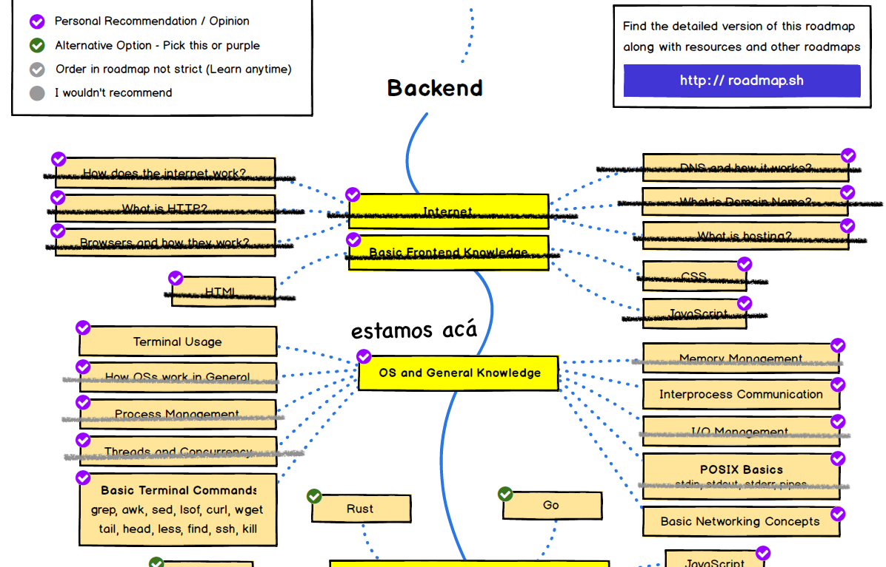

Continuamos nuestra exploración de sistemas operativos, de acuerdo a lo establecido por Roadmap.sh.

Revisemos nuestro recorrido:



En esta oportunidad tomaremos un desvío de esta ruta para revisar los sistemas de archivos. Esta es una materia que me parece interesante y muy útil para un desarrollador backend. Como veremos hay aspectos de diseño muy ingeniosos que se resolvieron para poder manejar archivos en Unix, y puede ser útil en nuestros propios diseños de sistemas. 

Como ya es usual en estos artículos de este blog, te recuerdo que esta serie puede ser apoyada a través de [Kofi](https://ko-fi.com/), si te gusta el contenido o lo encuentras útil puedes invitarme a un café, o cerveza, a través de este link: https://ko-fi.com/lnds. 



# Gestión de archivos en procesos 

En nuestros primeros ejemplos hablamos de los archivos. Aprendimos que, si usamos el estándar POSIX. entonces podemos acceder a archivos a través de un _file descriptor- dentro de nuestro programa.

Por ejemplo usando las siguientes instrucciones en C:

```c
    int fd = open("./notas.txt", O_RDONLY);
    if (fd < 0) {
      perror("./notas.txt");
    }
```

Lo que ocurre es que el kernel mantiene la tabla de descriptores de archivos de cada proceso. Esto es por seguridad, esta tabla a su vez son punteros a una estructura de datos que contiene entre otras cosas el modo de acceso al archivo (por ejemplo, si es de lectura o escritura). Esto permite validar si el proceso tiene los permisos necesarios para leer o escribir el archivo. Esta validación se hace al ejecutar la llamada a sistemas `open()`. Después se almacena ese access mode en esta estructura de datos por motivos de eficiencia. Si el FDT estuviera en el proceso entonces el programa podría manipular los accesos. De este modo, el kernel se protege de que un proceso haga acciones no autorizadas con los archivos. 

El siguiente diagrama ilustra estas estructuras:


```
+--------+       +------------------------- KERNEL ---------------------+
| DATA   |       |    File descriptor                                   |
|        |       |    table                                             |
|        |       |    +--------+                                        |
| stdin  |------>|-> 0|        |                                        |
| stdout |------>|-> 1|        |                                        |
| stderr |------>|-> 2|        |                                        |
|        |       |    |        |                                        |
| STACK  |       |    |        |      +-----+------+--------+-------+   |
|  fd    |------>|   i|        |----> |ref  |access|file    |inode  |   |
|        |       |    |        |      |count|mode  |location|pointer|   |
|        |       |    |        |      +-----+------+--------+-------+   |
|        |       |    |        |                                        |
|        |       |    +--------+                                        |
+--------+       +------------------------- KERNEL ---------------------+

```

Si recuerdan los primeros articulos de esta parte, vimos una extraña llamada de sistema que llamamos `dup()` con el fin de que salida estándar y la salida de error se reflejaran en el mismo archivo:

```c
        /** fragmento del programa loader2.c **/
        close(0);
        close(1);
        close(2);
        if ((fd_stdin = open("./notas.txt", O_RDONLY)) == -1) {
            exit(errno);
        }
        if ((fd_stdout = open("./result.txt", O_CREAT|O_WRONLY, S_IRUSR|S_IRGRP|S_IROTH)) == -1) {
            exit(errno);
        }
        dup(fd_stdout);
```

¿Qué pasaría si hubieramos hecho esto?:


```c
        /** fragmento del programa loader2.c **/
        close(0);
        close(1);
        close(2);
        if ((fd_stdin = open("./notas.txt", O_RDONLY)) == -1) {
            exit(errno);
        }
        if ((fd_stdout = open("./result.txt", O_CREAT|O_WRONLY, S_IRUSR|S_IRGRP|S_IROTH)) == -1) {
            exit(errno);
        }
        if ((fd_stderr = open("./result.txt", O_WRONLY, S_IRUSR|S_IRGRP|S_IROTH)) == -1) {
            exit(errno);
        }
        
```

Veamos graficamente como quedaría esto:

```
+--------+       +------------------------- KERNEL ---------------------+
| DATA   |       |    File descriptor                                   |
|        |       |    table                                             |
|        |       |    +--------+                                        |
|        |       |    |        |      +-----+--------+----+---------+   |
| stdout |------>|-> 1|        |----->|  1  | WRONLY | 0  |inode ptr|   |
|        |       |    |        |      +-----+--------+----+---------+   |
| stderr |------>|-> 2|        |----->|  1  | WRONLY | 0  |inode ptr|   |
|        |       |    |        |      +-----+--------+----+---------+   |
|        |       |    +--------+                                        |
+--------+       +------------------------- KERNEL ---------------------+
```

Acá cada file descriptor tiene un _ref count_ de 1, y parten con el file location en 0, que es la próxima posición donde se escribirá.

Si escribimos 100 bytes sobre el _file descriptor_ 1 tendremos que file location avanza en 100, pero el file location del _file descriptor_ 2 sigue en 0, lo que significa que cuando escribamos usando el _file descriptor_ 2 sobre escribiremos lo que se haya escrito usando el _file descriptor_ 1.


    write(1, buff, 100) 
    +--------+       +------------------------- KERNEL ---------------------+
    | DATA   |       |    File descriptor                                   |
    |        |       |    table                                             |
    |        |       |    +--------+                                        |
    |        |       |    |        |      +-----+--------+----+---------+   |
    | stdout |------>|-> 1|        |----->|  1  | WRONLY | 100|inode ptr|   |
    |        |       |    |        |      +-----+--------+----+---------+   |
    | stderr |------>|-> 2|        |----->|  1  | WRONLY | 0  |inode ptr|   |
    |        |       |    |        |      +-----+--------+----+---------+   |
    |        |       |    +--------+                                        |
    +--------+       +------------------------- KERNEL ---------------------+


En cambio al usar `dup()` lo que ocurre es que ambos descriptores apuntan a la misma estructura de datos:


    dup(1) 
    write(1, buff, 100) 
    +--------+       +------------------------- KERNEL ---------------------+
    | DATA   |       |    File descriptor                                   |
    |        |       |    table                                             |
    |        |       |    +--------+                                        |
    |        |       |    |        |      +-----+--------+----+---------+   |
    | stdout |------>|-> 1|        |--+-->|  2  | WRONLY | 100|inode ptr|   |
    |        |------>|    |        |  |   +-----+--------+----+---------+   |
    | stderr |------>|-> 2|        |--/                                     |
    |        |       |    |        |                                        |      
    |        |       |    |        |                                        |
    |        |       |    |        |                                        |
    |        |       |    +--------+                                        |
    +--------+       +------------------------- KERNEL ---------------------+

Como pueden apreciar, _ref count_ vale 2 porque hay 2 _file descriptors_ apuntando al archivo.

Hay que notar que cuando hacemos un `fork()` la file descriptor table se comparte entre proceso padre sy sus procesos hijos. Con lo que los refcount se incrementan respectivamente.

## Random access

¿Hay alguna llamada a sistema que permita manipular el valor del campo `file location`?

Por supuesto, esto nos permite leer o escribir en cualquier posición de nuestro archivo. La función en cuestión es `lseek()`.

Este ejemplo muestra como mostrar el contenido de un archivo al revés:

```c
fd = open("archivo.txt", O_RDONLY);
/* posicionarse en el último caracter del archivoe */
fptr = lseek(fd, (off_t)-1, SEEK_END);
while (fptr !=−1) {
   read(fd, buf, 1);
   write(1, buf, 1);
   fptr = lseek(fd, (off_t)-2, SEEK_CUR);
}
```

`lseek()` recibe el _file descriptor_ en primer lugar, luego un _offset_ o desplazamiento, que puede ser un número positivo o negativo. Este valor se toma en base a una referencia, que puede ser `SEEK_END` que indica desde el final del archivo, `SEEK_SET` que corresponde al inicio del archivo, y `SEEK_CUR` que es a partir de la posición actual. Hay otros valores y extensiones dependiendo del sistema operativo, pero eso te los dejo para que los investigues.

Ahora entendemos casi todos los elementos de la _file descriptor table_, pero ¿qué es ese enigmático `inode pointer`? Para entender esto debemos estudiar los sistemas de archivos o _file systems_.

# File systems en Unix


Lo primero es que debemos considerar que un sistema de archivos nos da acceso a los sistemas de almacenamiento externo, tradicionalmente estos son los discos duros de nuestros computadores. Antiguamente los discos eran unidades enormes y costosas, hoy cada vez es más usual usar sistemas de estado sólido, sin partes mecánicas, conocidos como SSD. Independiente de si tu almacenamiento externo es un disco tradicional, una memoria flash, un pendrive, o un SSD de alta gama, el sistema operativo debe "mapear" los bytes en ese almacenamiento de alguna forma. Este mapeo es el sistema de archivos.

Un sistema de archivos nos permite acceder a los bytes de nuestr almacenamiento externo mediante una serie de estructuras de datos y un conjunto limitado de primitivas o llamadas a sistema. 

Los requisitos mínimos de un sistema de archivos son los siguientes: 

- Facilidad de acceso: esto quiere decir que la abstracciones que usemos deben ser fáciles de entender, simples y útiles.
- Alto desempeño: el acceso a los archivos debe ser rápido y económico. Se debería explotar al máximo las capacidades del hardware subyacente, además de evitar el desperdicio del espacio.
- Permanencia: lo que almacenemos en el sistema de archivos debe persistir un largo tiempo y estar accesible para cuando lo necesitemos. Una caida en el sistema no debería causar pérdida de datos.
- Seguridad: la data que almacenemos en el sistema de archivos debe estar sujeta a estrictos controles de acceso.

Vamos a estudiar un modelo basado en los sistemas de archivos de Unix, hay otros posibles, pero ciertos principios son compartidos en casi todos los sistemas operativos populares hoy en día.

Vamos a imaginar que tenemos sólo un medio de almacenamiento externo en nuestro computador (puede ser un SSD, por ejemplo). Este medio contiene toda la información de nuestro sistema operativo y nuestros datos. Además supondremos que este medio es simplemente un arreglo plano de bytes. En el siguiente diagrama mosramos cómo estará organizado nuestro medio:

      +-------------+
      |             |
      |             |
      | Data Region |
      |             |
      |             |
      |             |
      +-------------+
      |             |
      |    i-list   |
      |             |
      +-------------+
      | superblock  |
      +-------------+
      |  bootblock  |
      +-------------+ 0


La parte más baja de este arregglo es el `bootblock`, y contiene todo el código de máquina del programa inicial que carga el sistema operativo en el computador, durante la fase de arranque o booting.

Luego viene el `superblock` que describe la estructura del resto del sistema de archivos, y contiene las cabeceras de las `free-lists` que revisaremos más adelante.
Luego viene la `i-list` que es un arreglo de nodos llamados `i-nodes`, cada uno de los cuales, si es que están en uso, representan un archivo. Y luego viene la región de datos (`Data Region`) que contiene los bloques con la información contenida en los archivos.

En nuestro modelo un `i-node` tiene esta estructura:


      +--------------+
      |    Device    |
      +--------------+
      | Inode number |
      +--------------+
      |     Mode     |
      +--------------+
      | Link Count   |
      +--------------+
      | Owner, Group |
      +--------------+
      |     Size     |
      +--------------+
      |              |
      |   Disk Map   |
      |              |
      +--------------+


Concentrémonos en el `Disk Map`. Este contiene un mapa de bloques lógico del archivo desde el inicio de este, con bloques físicos ubicados en la `Data Region`. Los archivos se dividen físicamente en bloques, que en nuestro modelo tienen el largo de 1 Kilo Byte (1024 bytes). Nuestro `disk map` es un arreglo, las primeras 10 entradas de este arreglo (numeradas de 0 a 9)  son punteros a los los primeros 10 bloques físicos del archivo. Si el tamaño del archivo es mayor a 10 Kb entonces la entrada 10 del arreglo apunta a un bloque en disco llamado `indirect block`. Este es un bloque adicional que contiene 256 punteros a bloques adicionales. Si el archivo tiene un tamaño mayor a 266 Kb, entonces la entrada 11 del disk map apunta a un `double indirect block`, que contiene 256 punteros a `indiret blocks`. Esto nos da 64 Mb adicionales de direcciones. Si esto es insuficiente, el puntero 12 del `Disk Map` contiene 256 punteros adicionales a un `triple indirect block` que corresponden a 256 punteros `double indirect blocks` los que a su vez apuntan a `indirect blocks`, lo que nos da un potencial de 16 Gb para un archivo. 

```
      Disk Map
      +----+ 
      |  0 | ---> block 0
      +----+  
      |  1 | ---> block 1
      +----+ 
      .....
      +----+ 
      |  9 |
      +----+ 
      | 10 | ----> indirect block -> |0|1|...|256|
      +----+ 
      | 11 | ----> double indirect block -> |256 indirect blocks|
      +----+ 
      | 12 | ---> tripe indirect block -> |256 double indirect blocks|
      +----+ 
```

En las primeras versiones de Unix estos punteros se almacenaban como números enteros de 32 bits con signo, así que en la práctica el límite era de 2Gb. Suficiente para los setenta u ochenta, pero no para nuestra época. Afortunadamente se ha evolucionado en los file systems y hoy podemos manejar archivos enormes en nuestros dipositivos de formas bastantes eficientes. 

Los bloques libres en el almacenamiento se guardan en una estructura en el `super block` llamada la `free-list`.

La `free-list` es una lista enlazada con 100 entradas, en que cada nodo apunta a un bloque libre en la `Data Region`. El bloque 100 contiene 100 punteros adicionales a bloques libres. El último puntero a su vez contiene un bloque adicional con n punteros a bloques libres y así hasta cubrir todos los bloques libres del almacenamiento (recuerden que los bloques son 1024 bytes contiguos en el almacenamiento).

Cuando se consume un bloque se extrae del `free-list`, cuando se acaban se deben hacer acceso adicionales al almacenamiento para leer los otros bloques libres. Sin embargo, cuando se libera un bloque este se agrega en la `free-list` si es posible.

Los `i-nodes` no se gestionan en una lista. En este caso estos son marcados como libres u ocupados en el mismo almacenamiento. Para optimizar las cosas el `super block` contiene un caché de `i-nodes` libres.

Si se dan cuenta este esquema es simple, pero no muy eficiente. Con el tiempo se crearon nuevos sistemas de almacenamiento que trataron de optimizar las operaciones.
Los sistemas FFS y Ext2 de Linux, innovaron en varios aspectos, uno de los primeros es el tamaño de los bloques. Con un bloque de 8 Kb, por ejemplo, los accesos a disco se pueden reducir pues tendremos los datos más cerca unos de otros, y reduciremos las lecturas, sobretodo en discos duros que no son tan rápidos como la memoria RAM.

Sin embargo al aumentar el tamaño del bloque aumenta la posibilidad de fragmentación. Si una archivo tiene un tamaño menor a 8Kb hay mucho espacio que queda sin usar, lo mismo si el tamaño del disco no es un múltiplo exacto de 8Kb.

Si en promedio se pierde medio bloque de espacio por archivo, y tenemos 20.000 archivos, en un sistema con bloques de 1Kb se pirden 10 Mb, pero en un sistema con bloques de 8Kb la pérdida es de 80 Mb.

Para evitar esto FFS divido los bloques en fragmentos e implementa una complicada estrategia  para reclamar los fragmentos no usados de un bloque.

Hay otras estrategias adicionales de optimización que implementan los sistemas de archivos, pero algunas están ligadas a las arquitectura de discos mecánicos, como el tratar de optimizar el acceso a ciertas áreas del disco o reducir la latencia debida a la rotación de los mismos. Estas estrategias probablemente serán sólo de interés histórico, dado que nuestros almacenamientos externos son cada vez más rápidos y ya no están basados en sistemas mecánicos.

Los sistemas de archivos modernos como HFS+ de Apple, o Btrfs en Linux pueden manejar archivos enormes, del rango de los ExaBytes (2 elevado a 60).

Una nota curiosa, los fabricantes de disco usan potencias de 10 para expresar el tamaño de sus discos, mientras que los sistemas operativos usan potencias de 2, esto lleva confusiones y ha generado demandas millonarias[^1].

# Journaling

Si estamos permanentemente escribiendo en nuestro medio de almacenamiento y estas operaciones no fallan, entonces no nos deberíamos preocupar de que se interrumpa la energía o nuestro sistema se detenga inesperadamente, lo que se conoce como un _crash_.

Pero las cosas no son así de ideales. Para optimizar lecturas y escrituras muchos sistemas de archivos implementan técnicas de _caching_, es decir, guardan en memoria principal (RAM), estructuras y bloques de archivos de reciente uso, y demoran la escritura de esta información al almacenamiento externo. Esto puede provocar que ante un _crash_ la data quede inconsistente al recuperarnos. 

Pero hay otras situaciones donde las cosas pueden fallar, por ejemplo, al renombrar un archivo. Como veremos más adelante, los nombres y directorios se almacenan también en archivos, y esta escritura puede fallar ante un crash.

Para lidiar con todo esto los sistemas operativos implementan técnicas de _journaling_, que en esencia consiste en escribir algunas operaciones en un área especial (el jorunal), antes de traspasarlas al file system. Esto asume que escribir al journal es una operación más eficiente, y si llega a fallar o perderse el `file system` no se daña. Esto se maneja con un modelo similar a las transacciones en bases de datos, como vermos como operan las transacciones más adelante, no entraremos en detalles acá. 

Cuando el sistema se recupera de un crash puede usar el journal para recuperar el estado de un file system dañado.

Toda la tecnología detrás de un file system es fascinante y llena de detalles. Yo recomiendo estudiar sus mecanismos. Una buena guía está en el capítulo 6 del libro de cabecera de esta sección: ["Operating Systems in Depth"](https://amzn.to/2MVKoQx), de Thomas W. Doeppner, y les recomiendo leerlo.

# Directorios

Si observan en su sistema operativo verán que su sistema de archivos organiza los archivo de una manera jerárquica. Tenemos carpetas y dentro de las carpetas tenemos archivos. Esa es una metáfora que nos permite entender y manipular nuestros archivos de forma sencilla y útil.

Tecnicamente esas carpetas se llaman directorios, y son simples archivos.

Los directorios son tablas en que se tienen duplas (componente, i-node). Todo directorio tiene dos entradas especiales `.` y `..`.

Supongamos que tenemos un sistema Unix simple en cuya raiz tenemos las carpetas `root`, `etc`, `home`, `opt`, `usr` y `tmp`, entonces el directorio `/` o raiz tendría este contenido:

    +----------+-----+
    |componente|inode|
    +----------+-----+
    |     .    |   1 |
    |     ..   |   1 |
    |  root    | 117 |
    |  etc     |   4 |
    |  home    |  18 |
    |  opt     |  36 |
    |  usr     |  93 |
    |  tmp     |   8 |
    +----------+-----+

Acá . y .. apuntan a si mismo porque es el directorio raiz

Supongamos que vemos el directorio /home, que tiene dos carpetas `ediaz` y `guest`:

    +----------+-----+
    |componente|inode|
    +----------+-----+
    |     .    |  18 |
    |     ..   |   1 |
    |  ediaz   | 267 |
    |  guest   | 266 |
    +----------+-----+


¿Cómo podemos leer un directorio desde nuestros programas?

El siguiente programa nos permite ver el contenido del directorio actual:


```c
/* dir.c */
#include <stdlib.h>
#include <stdio.h>
#include <dirent.h>
#include <limits.h>
#include <unistd.h>

long get_path_max() {
    long path_max = pathconf(".", _PC_PATH_MAX);
    if (path_max == -1) {
        return 1024;
    }
    return path_max;
}

int main(int argc, char* argv[]) {
    char* cwd;
    DIR* dir;
    struct dirent *dp;
    long max_path = get_path_max();
    char* buff = (char*) malloc(max_path);

    cwd = getcwd(buff, max_path);
    printf("directorio: %s\n", cwd);
    dir = opendir(cwd);
    while ((dp = readdir(dir)) != NULL) {
        if (dp->d_name[0] == '.')
            continue;
        printf("%s, inode: %llu\n", dp->d_name, dp->d_ino);
    }
    closedir(dir);
    return 0;
}
```

La función `get_path_max()` es una manera de obtener el valor máximo en bytes que ocupa un path en el sistema operativo. Esto usa la función POSIX `pathconf` y es necesaria porque cada sistema operativo define un largo máximo para los nombres de una ruta de archivos. 

Este valor es usado porque la función `getcwd()` requiere un buffer de caracteres donde dejar el resultado. Esta función retorna la ruta en el sistema de archivos donde estamos situados en el momento de ejecutar esta llamada, en este caso corresponde al path desde el cual ejecutamos el programa.

La función `opendir()` es similar a `open()` pero sirve para leer la estructura de un directorio, por lo que el argumento que recibe debe ser una ruta de un directorio. Piensen en esta como una función especializada que interpreta el archivo de directorios. Si es así esta nos debería mostrar los inodes y los nombres del archivo. Todo eso se encapsula en la estructura `dirent` que es lo que retorna la función `readdir()`, que invocamos en nuestro loop principal. Pueden ver que podemos acceder al nombre del archivo con el campo `d_name` y al inode con el campo `d_ino`.


Si ejecuto esto en mi PC obtengo el siguiente resultado:

```sh
    % make dir.c
    cc     dir.c   -o dir
    % ./dir
    directorio: /Users/ediaz/work/src/github/lnds/desafios-programando.org/2021-03-06
    dir.c, inode: 12307765
    dir, inode: 12310017
```

Hay varias primitivas más en POSIX para trabajar con directorios, como `chdir()` que permite cambiar el directorio de trabajo. Otra función interesante es `fstat()` que nos permite obtener información sobre el archivo. Vamos a aplicar esto para obtener el tamaño de los archivos:


```c
/* dir2.c */
#include <stdlib.h>
#include <stdio.h>
#include <dirent.h>
#include <fcntl.h>
#include <stdint.h>
#include <limits.h>
#include <unistd.h>
#include <sys/stat.h>

long get_path_max() {
    long path_max = pathconf(".", _PC_PATH_MAX);
    if (path_max == -1) {
        return 1024;
    }
    return path_max;
}

int main(int argc, char* argv[]) {
    char* cwd;
    DIR* dir;
    struct dirent *dp;
    long max_path = get_path_max();
    char* buff = (char*) malloc(max_path);
    int dfd, ffd;
    struct stat statbuf;

    cwd = getcwd(buff, max_path);
    printf("directorio: %s\n", cwd);
    dfd = open(cwd, O_RDONLY);
    if ((dir = fdopendir(dfd)) == NULL) {
        fprintf(stderr, "Cannot open ./tmp directory\n");
        exit(1);
    }
    while ((dp = readdir(dir)) != NULL) {
        if (dp->d_name[0] == '.')
            continue;
        if ((ffd = openat(dfd, dp->d_name, O_RDONLY)) == -1) {
            perror(dp->d_name);
            continue;
        }
        if (fstat(ffd, &statbuf) == 0) {
            printf("%s, inode: %llu, bytes: %lld\n", dp->d_name, dp->d_ino, statbuf.st_size);
        }
        close(ffd);
    }
    closedir(dir);
    return 0;
}
```

Fíjense que en este caso abrimos el directorios usando `open()` confirmando que se trata de un archivo más. La función `fdopendir()` abre el directorio a partir de un _file descriptor_. Esto lo hacemos para poder usar la función `openat()`, que abre un archivo pero en una posición relativa, en este caso relativa al directorio actual (retornado por `getcwd()`).

La función `fstat()` retorna información sobre un archivo identificado por su file descriptor.

La estructura stat se define en `<sys/stat.h>`, y contiene información como el dispositivo donde se encuentra el arcivo (`st_dev`), el inode (`st_ino`), el modo del archivo (`st_mode`, algo que veremos luego), el usuario dueño del archivo (`st_uid`) y el grupo (`st_gid`). Hay más información como la cantidad de enlaces al archivo, tamaño, la fecha hora de la última modificación del archivo, etc. POSIX define un conjunto de datos para esta estructura, pero cada sistema operativo puede extender esta estructura con información adicional.

Si ejecuto dir2 obtengo lo siguiente:

```sh
    % make dir2
    cc     dir2.c   -o dir2
    % ./dir2
    directorio: /Users/ediaz/work/src/github/lnds/desafios-programando.org/2021-03-06
    dir2, inode: 12326103, bytes: 50160
    dir.c, inode: 12307765, bytes: 720
    dir2.c, inode: 12311410, bytes: 1187
    dir, inode: 12325942, bytes: 49784
```


## Modos de un archivo

Una de las propiedades que definimos que debería proveer un sistema archivos es el control de acceso a los mismos. Para esto cada archivo tiene un modo, que corresponde a un conjunto de bits que se ponen en 1 para asignar un permiso especial.

En POSIX y en Unix tenemos tres niveles de acceso, un acceso propio para el usuario dueño o creador del archivo (owner), un acceso de grupo (group) y un acceso para todo el mundo (others).

En Unix cada usuario puede pertenecer uno o más grupos. A cada usuario se le da un número de usuario(_user id_) y un número de grupo (_group id_). Así cada archivo tiene un valor asignado para estos dos valores.

Los permisos son esencialmente 3:

    - Lectura (read)
    - Escritura (write)
    - Ejecución/Búsqueda (execute/search)


Estos se reflejan con una máscara de bits de este modo:
    
        +---+---+---+
        | R | W | X |
        +---+---+---+
        | 1 | 0 | 0 | <- permiso sólo de lectura
        | 1 | 1 | 0 | <- permiso de lectura y escritura
        | 1 | 1 | 1 | <- todos los permidos habilitados
        +---+---+---+

En este diagrama he reflejeado como se marca cada permiso en esta máscara de bits. Hay un cuarto bit que está reservado como veremos a continuación. De este modo el valor de la máscara puede ser 100b o 4 para lectura, 10b ó 2 para escritura y 1 para ejecución, o una combinación de estos valores, lo que da 7 posibles valores: 4 sería sólo lectura, 7 si todos los valores están habilitados, 6 si es lectura y escritura, etc.

Para reflejar los permisos por grupo, usuario y para todo el mundo se usan 10 bits de este modo:

        +---+---+---+---+---+---+---+---+---+---+
        |   | OWNER MASK|GROUP MASK |OTHER MASK |
        +---+---+---+---+---+---+---+---+---+---+
        | D | R | W | X | R | W | X | R | W | X |
        +---+---+---+---+---+---+---+---+---+---+
        |   | 0 | 0 | 1 | 0 | 0 | 1 | 0 | 0 | 1 | 
        |   | 0 | 1 | 1 | 0 | 1 | 1 | 0 | 1 | 1 | 
        |   | 1 | 1 | 1 | 1 | 1 | 1 | 1 | 1 | 1 | 
        +---+---+---+---+---+---+---+---+---+---+


Estas máscaras son las que se ven cuando hacemos `ls -l` en un directorio, por ejemplo:

```sh
    % ls -l
    % total 224
        -rwxr-xr-x  1 ediaz  staff  49736 Mar  6 12:43 dir
        -rw-r--r--  1 ediaz  staff    720 Mar  6 13:01 dir.c
        -rwxr-xr-x  1 ediaz  staff  50160 Mar  6 13:33 dir2
        -rw-r--r--  1 ediaz  staff   1187 Mar  6 13:39 dir2.c
```

La propiedad de un archivo se puede cambiar usando la función `chown()` y el comando del mismo nombre en Unix. El modo se cambia usando `chmod()`.

Vamos a escribir una tercera versión de nuestro programa dir para poder mostrar el `uid`, `gid` y el modo de cada archivo:

El programa es similar al anterior, pero cambia en el cuerpo del loop:

```c
while ((dp = readdir(dir)) != NULL) {
        if (dp->d_name[0] == '.')
            continue;
        if ((ffd = openat(dfd, dp->d_name, O_RDONLY)) == -1) {
            perror(dp->d_name);
            continue;
        }
        if (fstat(ffd, &statbuf) == 0) {
            printf("%s, inode: %llu, bytes: %lld, owner: %d, group: %d, mode: %d|%d|%d\n", 
            dp->d_name, dp->d_ino, statbuf.st_size, statbuf.st_uid, statbuf.st_gid, 
            (statbuf.st_mode >>  6) & 0x07,
            (statbuf.st_mode >> 3) & 0x07,
            statbuf.st_mode & 0x07
            
            );
        }
        close(ffd);
    }
```

Fíjese como uso las operaciones shift (>>) y and (&) para obtener la máscara de los 9 bits usados para mostrar los permisos.

Si ejecuto esto sobre el directorio de trabajo obtengo este resultado:

```sh
    % make dir3
    cc     dir3.c   -o dir
    % ./dir3
    directorio: /Users/ediaz/work/src/github/lnds/desafios-programando.org/2021-03-06
    dir2, inode: 12313303, bytes: 50160, owner: 501, group: 20, mode: 7|5|5
    dir3, inode: 12325927, bytes: 50160, owner: 501, group: 20, mode: 7|5|5
    dir3.c, inode: 12319305, bytes: 1420, owner: 501, group: 20, mode: 6|4|4
    dir.c, inode: 12307765, bytes: 720, owner: 501, group: 20, mode: 6|4|4
    dir2.c, inode: 12311410, bytes: 1187, owner: 501, group: 20, mode: 6|4|4
    dir, inode: 12325942, bytes: 49784, owner: 501, group: 20, mode: 7|5|5
    %
```


Y dejaremos nuestra exploración de los sistemas de archivos hasta acá. Nos vemos en el próximo capítulo donde hablaremos de Interprocess Communication.

Los programas mostrados están disponibles en este repo en GitHub: https://github.com/lnds/desafios-programando.org/tree/master/2021-03-06


# Ejercicios

- Usa la función `chmod()` para quitar el permiso de escritura al resto de los usuarios (others), para los archivos que tengan habilitado ese permiso. 
- Has un programa como dir pero que reciba la ruta a visualizar como su primer argumento. Si no viene ese argumento usa `getcwd`. Además recorres recursivamente los subdirectorios que se encuentren.
- Escribe un programa que muestre el tamaño total de un directorio (en bytes), que corresponde a la suma del tamaño de todos archivos en el directorio.


[^1]: En este artículo discuto esto: https://lnds.net/blog/lnds/2007/09/11/giga-o-gibi-bytes/
