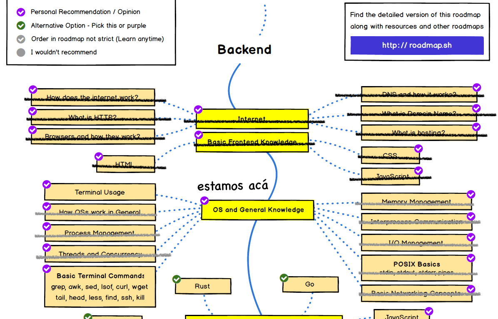

Hasta ahora hemos aprendido como [crear procesos y threads nativos](/blog/2021/02/20/el-camino-del-backend-developer-hilos-y-concurrencia/) en un sistema operativo. También hemos visto algo sobre programacion concurrente y revisamos cómo  funciona [el sistema de archivos](/blog/2021/03/06/el-camino-del-backend-developer-sistemas-de-archivos/). Para terminar con estos tópicos, que son parte de nuestro roadmap, veremos cómo podemos lograr que los procesos se comuniquen entre sí.

## Pipes

En el [capítulo en que describimos los procesos](/blog/2021/02/13/el-camino-del-backend-developer-procesos/) aprendimos sobre un mecanismo de comunicación muy común: `pipes`.

Un `pipe` (tubería) es un archivo compartido al que podemos acceder usando las _system calls_ estándar como `read()` y `write()`.

Una variante son los `named pipes`. 

Para entender como funcionan vamos a usar un ejemplo. Supongamos que queremos contar cuantos archivos tenemos en nuestra cuenta en un sistema unix. Una forma de hacerlo sería:

```sh
% ls -l . | wc -l
    939
```

En el próximo capítulo veremos en detalle más sobre comandos ejecutados en la consola, pero este ejemplo es fácilo de explicar.

Primero, el comando `ls -lR .` se encarga de mostrar todos los archivos, uno por linea, en la carpeta actual ('.').

La barra crea un pipe hacia el comando `wc -l`. Este comando se usa para contar caracteres, palabras y lineas desde la entrada estándar. Pero cuando usamos el argumento `-l` restringimos el comando para que nos muestre sólo las lineas.

En el caso que mostré arriba el resultado de esto es 939, lo que quiere decir que el comando `ls -l .` arroja 939 lineas.

Pero otra forma de hacer esto es de este modo:

```sh
% mkfifo pipe
% ls -lR . > pipe
```

Cuando haces esto la consola se bloquea, porque no hay ningún proceso que consuma el pipe.

En otra consola hacemos lo siguiente:

```sh
% wc -l < pipe
    940
```

Notarán que el resultado es distinto, 940 en vez de 939.

Lo que ocurre es que se crea un archivo para `pipe` en el directorio en que estás ejecutando estos comandos. Puedes verificar esto haciendo:

```sh
% mkfifo pipe
% ls -l pipe
prw-r--r--  1 ediaz  staff  0 Apr  3 11:31 pipe
```

Este es un archivo, que puedes eliminar usando el comando `rm`.

Hay una system call para crear named pipes: `mkfifo()`.

Para ahorrarnos el tener que escribir demasiado código, en esta oportunidad vamos a usar Python en vez de C.

Para mostrar el uso de named pipes, voy a crear un programa servidor que lee un string desde un named pipe y responde con el string invertido. Si recibe la palabra "end" el servidor se detiene. 

Este es el código del server:

```python
# server_np.py
import os
import os.path
import time 

def server():
    fifo = "/tmp/fifo_twoway"

    if os.path.exists(fifo):
        os.remove(fifo)

    max_line = 80
    mode = 0o640

    os.mkfifo(fifo, mode)

    print('server')
    pipe = os.open(fifo, os.O_RDWR)
    while True:
        s = os.read(pipe, max_line)
        print('recibido:', s)
        if s == b'end':
            os.close(pipe)
            return
        else:
            rev = s[::-1]
            os.write(pipe, rev)
            time.sleep(2)

if __name__ == "__main__":
    server()

```

Nuestro canal de comunicación es el named pipe.

Veamos el cliente. Este es un programa que le pide al usuario que ingrese una palabra, la envía al proceso servidor y después escribe la palabra invertida (enviada por el servidor), que es lo que se espera:

```python
# cliente_np
import os
import time

def client():
    fifo = "/tmp/fifo_twoway"

    print('cliente')
    pipe = os.open(fifo, os.O_RDWR)
    while True:
        s = input('Ingrese un string: ')
        if s == "end":
            os.write(pipe, b'end')
            os.close(pipe)
            return
        else:
            os.write(pipe, bytearray(s, 'utf-8'))
            rev = os.read(pipe, len(s))
            print('Reverse:', rev.decode('utf-8'))


if __name__ == "__main__":
    client()

```

Este sería un ejemplo de una sesión (he dibujado unas lineas horizontales para tratar de indicar los dos procesos):

```sh
-------------- consola 1 --------------
% python3 server_np.py
server
recibido: b'abracadabra'
recibido: b'end'
%
-------------- consola 2 --------------
% python3 client_np.py
cliente
Ingrese un string: abracadabra
Reverse: arbadacarba
Ingrese un string: end
%
---------------------------------------
```

Fíjense que en el código del servidor, después de escribir la respuesta, colocamos una pausa de 2 segundos para evitar que el servidor lea del pipe el resultado que acaba de enviar. Este es un mecanismo primitivo y poco eficiente de sincronía. ¿Se les ocurre alguna manera de hacer esto de mejor forma?

## Memoria compartida

Otra forma de compartir información entre procesos es usando memoria compartida.

Hay varias llamadas a sistemas que permiten este mecanismo. Siendo las más usadas `mmap()` y `shmget()`, que son parte de POSIX. Pero su uso puede ser algo complicado.

Por fortuna los lenguajes de alto nivel tienen bibliotecas con abstracciones adecuadas para esto fines.

Vamos a volver a nuestro problema del cálculo de promedio para mostrar como podemos usar multi proceso y memoria compartida de una forma sencilla usando Python

Supondremos que tenemos 4 cursos y queremos calcular el promedio de cada uno en un proceso dedicado, dejaremos los resultados en memoria compartida.

El programa para hacer esto es el siguiente:

```python
import random
from multiprocessing import shared_memory, Process
from multiprocessing.managers import SharedMemoryManager

def calc_promedio(notas, pos, curso):
    n = len(curso)
    s = sum(curso)
    notas[pos] = s / n 

def promedios():
    curso1 = [random.randint(1,7) for _ in range(30)]
    curso2 = [random.randint(1,7) for _ in range(30)]
    curso3 = [random.randint(1,7) for _ in range(30)]
    curso4 = [random.randint(1,7) for _ in range(30)]

    with SharedMemoryManager() as smm:
        notas = smm.ShareableList([0, 0, 0, 0])
        process = []
        process.append(Process(target=calc_promedio, args=(notas, 0, curso1)))
        process.append(Process(target=calc_promedio, args=(notas, 1, curso2)))
        process.append(Process(target=calc_promedio, args=(notas, 2, curso3)))
        process.append(Process(target=calc_promedio, args=(notas, 3, curso4)))
        for p in process:
            p.start()
        for p in process:
            p.join()
        for i, n in enumerate(notas):
            print(f"promedio curso {i+1} es {n:.2f}")

if __name__ == "__main__":
    promedios()

```

La función `promedio()`  crea 4 arreglos con las notas por cada curso.
Luego usamos el objeto `smm` que es una instancia de la clase `SharedMemoryManager`, con el fin de administrar la memoria compartida.

Creamos el arreglo `notas` usando `smm`. 

Luego vemos cómo podemos crear procesos en Python:

```python
Process(target=calc_promedio, args=(notas, 0, curso1))
```

Internamente Python se encarga de toda la lógica de administrar las llamadas a sistemas necesarias para poder interactuar con el proceso.

Fíjense que le pasamos en `target` la función que se ejecutará en el proceso. En `args` van los argumentos para esa función, que es muy simple:

```python
def calc_promedio(notas, pos, curso):
    n = len(curso)
    s = sum(curso)
    notas[pos] = s / n 
```

Acá  aprovechamos el hecho de que el argumento `notas` puede ser mutado dentro de la función.

Este algoritmo está pensado para no tener que lidiar con mecanismos de sincronía, gracias a que cada proceso sólo altera una posición de memoria distinta a las que alteran los otros procesos (gracias al argumento `pos`).

Internamente la clase `SharedMemoryManager()` usa la API POSIX para manejo de memoria compartida.


## Otros mecanismos para comunicarse entre procesos

Pipes y Shared Memory son dos mecanismos que permiten la comunicación entre procesos.

Otro mecanismo popular son los sockets,  sobre estos [ya hemos hablado antes](/blog/2020/07/05/el-camino-de-un-backend-developer-en-2020/), pero en el contexto de IPC se usan los denominados _local sockets_ o _unix domain sockets_.

La interfaz de uso (API) es idéntica a los sockets de red. La diferencia es que estos sockets se inicializan de forma distinta. 

Primero la dirección es un archivo local, en lugar de una dirección ip. Segundo se usa un argumento especial al crear el socket.

La creación de estos sockets sería así (nuevamente en Python):

```python
import socket

server_address = '/tmp/uds_socket'

sock = socket.socket(socket.AF_UNIX, sock.SOCK_STREAM)
sock.bind(server_address)

```

Sabiendo esto puedes resolver el ejercicio 1 que dejo propuesto más abajo.

Otro mecanismo de comunicación entre procesos es el paso de mensajes. Acá hay múltiples tecnologías y veremos algunas más adelante. POSIX proporciona un mecanismo de colas de mensajes, usando las primitivas `mq_open()`, `mq_send()`, `mq_receive()` y `mq_close()`, entre otras.

En Python las colas POSIX están integradas en la biblioteca `multiprocessing`.

Este ejemplo, tomado de la documentación oficial de Python, muestra cómo podrías usar una cola para comunicarse con un proceso:

```python
import multiprocessing as mp

def foo(q):
    q.put('hello')

if __name__ == '__main__':
    ctx = mp.get_context('spawn')
    q = ctx.Queue()
    p = ctx.Process(target=foo, args=(q,))
    p.start()
    print(q.get())
    p.join()
```

## Ejercicios:

1. Reescribe el servidor que devuelve los string invertidos usando unix domain sockets. ¿Qué ventajas le vez a esta solución?
2. Igual que el ejericio 1, pero usando `Queue`. 
3. ¿Cuál te parece que es la mejor implementación para el servidor, Pipes, Unix Domain Sockets o Queues? ¿Por qué?

## Cierre

Con esto finalizamos todos los aspectos de programación a nivel de sistema operativo que incluye nuestro roadmap. Así que vamos a tachar los elementos ya cubiertos:



En el próximo capítulo cerraremos la sección dedicada a conocimiento general de sistemas operativos revisando los comandos básicos en la consola.

Si te han gustado estos posts y quieres apoyar una futura publicación de este material como libro, agradeceré tu aporte en mi cuenta de Ko-Fi:



El código fuente de los ejemplos de este capítulo se encuentran en este repo en GitHub: https://github.com/lnds/desafios-programando.org/tree/master/2021-04-04

