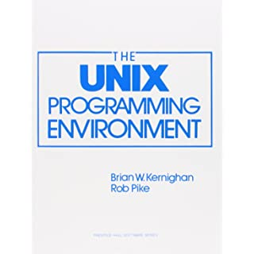
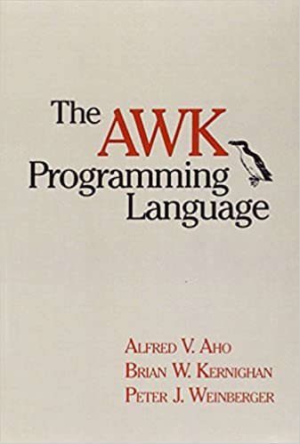
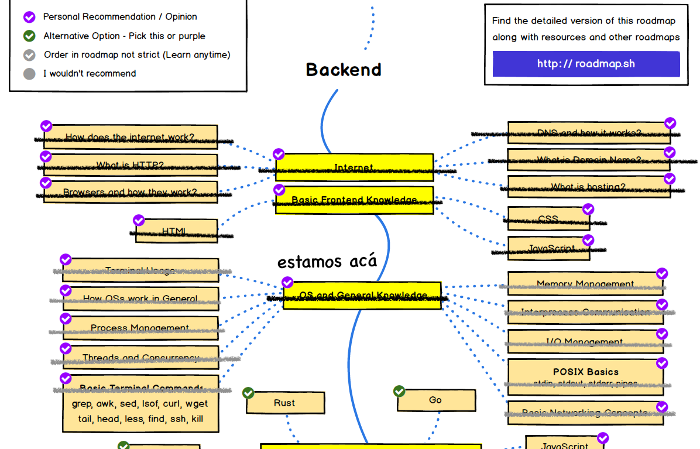

Ha llegado el momento de terminar esta etapa de nuestro [roadmap](/blog/2020/07/05/el-camino-de-un-backend-developer-en-2020/), con este artículo habremos completado la sección sobre conocimiento general de sistemas operativos. 

La guía provista por [roadmap.sh](https://roadmap.sh/backend) nos dice que deberíamos tener un conocimiento del uso del terminal y de los comandos más básicos del terminal. Entonces ese será el foco de este artículo.

Pero antes, te recuerdo que si te gusta esta [serie de artículos](/category/backend-developer/) puedes patrocinarla a través de la plataforma [Ko-fi](ko-fi.com/lnds). Parte de los aportes se usarán para editar y publicar un libro que contenga el material de esta serie, más algo más.



## Terminal o Consola

Cuando Unix se inventó el teletipo era una forma en que los usuarios se conectaban a los computadores. Estos al principio eran dispositivos similares a máquinas de escribir con una cinta de papel en la parte posterior. El operador escribía un comando que aparecía en la cinta de papel y luego solicitaba su ejecución al sistema operativo. La respuesta se imprimía en esta misma cinta de papel. En la foto que aparece de encabezado en este artículo vemos a Thompson y Ritchie, los creadores de Unix, interactuando con un computador PDP-11 usando un terminal de este tipo.

Posteriormente surgieron terminales que usaban un tubo de rayos catódicos, son los primeros terminales de tipo video, como el VT-100, que vemos en esta figura:


Si bien los primeros terminales eran entidades físicas, pronto en el sistema operativo se decidió crear una abstracción para estos, de modo que fueran intercambiables, pero lo más importante, dada la naturaleza multitarea de Unix, proveer un mecanismo de interacción con los procesos.

Como los primeros terminales operaban linea a linea (recuerden el terminal tipo teletipo con el rollo de papel), los terminales mantenían este principio de recibir los comandos linea por linea. A este se le conoce ténicamente como `line discipline`.

Este diagrama muestra un diseño típico de las primeras versiones de Unix[^1]:


Los terminales se conectaban por cable y usando un dispositivo llamado  UART (Universal Asynchronous Receiver and Transmitter).

Como pueden ver, el sistema operativo provee el driver UART, la `line discipline` y el `TTY Driver`. Este último es el que ven los procesos. Para los procesos el TTY es una entrada más que permite leer caracteres, el modelo o tipo de terminal es irrelevante.


Cuando usamos computadores personales nuestra consola está incluida en un todo así que el diseño es un poco diferente, este diagrama muestra como se veía esto en las primeras versiones de Linux:


Acá aparece el emulador de terminales, que cumple la función de simular un dispositivo real (como un VT-100, por ejemplo).

No entraré en más detalles de cómo funcionan los `TTY Devices`, pero les dejo este link http://www.linusakesson.net/programming/tty/ a un artículo que profundiza en esto.

Finalmente para aclarar algunos conceptos, en Unix la diferencia entre terminal y consola es la siguiente:

- Terminal = TTY = ambiente que proporciona entrada salida interactiva de texto
- Consola = es el terminal físico, que tiene un teclado y una pantalla (o una cinta de papel)

## Shell

En Unix existe una interfaz de usuario por defecto que corresponde a la `shell`. Es una interfaz que emula la entrada de comandos usando un terminal. En esencia una `shell` es un interprete de comandos.

Esto es lo que hemos usado y que seguramente usas todos los días para escribir comandos en tu ambiente de trabajo. En estos artículos lo hemo simulado escribiendo la interacción de este modo

    % echo "este es un shell"
    este es un shell

Hay varios tipos de shells. El primer shell de Unix fue el [Thompson Shell](https://en.wikipedia.org/wiki/Thompson_shell) y era un interprete de comandos muy sencillo. Luego aparecieron shells con capacidad de scripting, es decir, los comandos se pueden escribir en un archivo (script) y son ejecutados por el shell. De este modo, el shell puede ser usado de un modo interactivo o como un interprete de comandos.

Por ejemplo, si escribimos este archivo:

```bash
#!/usr/bin/env bash
# este es el archivo hello.sh
echo "Hola $1"
echo "Este es un shell script"
```

lo podemos ejecutar de este modo:

```sh
    % chmod +x hello.sh
    % ./hello Eduardo
    Hola Eduardo
    Este es un shell script
    %
```

Noten que para poder ejecutar el script le cambiamos el atributo de ejecución[^2] usando el comando `chmod +x hello.sh`.

Notarán que la primera linea del script es esta:

```bash
#!/usr/bin/env bash
```

El operador `#!` conocido como _shebang_, o _hashbang_, es usado en Unix para indicar que el script será interpretado por lo que viene a continuación del signo !. En este caso la expresión `/usr/bin/env bash` nos indica que se debe buscar el intérprete `bash` y ese shell es el que será usado para interpretar este script.

Cuando en unix invocas `sh` estás usando el "Shell de Bourne", escrito por Stephen Bourne, que fue el que reemplazó al Shell de Thompson. Normalmente este shell se encuentra en `/bin/sh` en cualquier sistema Unix. 

`bash` escrito por Brian Fox para el proyecto GNU, y el nombre viene de "Bourne Again Shell".

Hay otros shells populares. Por ejemplo, en mi Mac tengo disponible por defecto, a partir de la versión Catalina, el "Z Shell" (zsh). Otro shell histórico es Korn Shell (ksh) que es un predecesor de Z Shell.

## Comandos básicos y útiles

Veamos algunos comandos útiles para nosotros como desarrolladores.

### GREP

`grep` es quizás uno de los comandos más útiles que podrás ocupar. El nombre viene de "**g**lobally search for a **r**egular **e**xpression and **p**rint matching lines". Es un comando que recibe una expresión regular y la busca en los archivos que recibe como argumentos.

Se usa así:

```bash
% grep Bourne *
Bash es un shell bien popular escrito para reemplazar al shell de Bourne (`sh`).
Cuando en unix invocas `sh` estás usando el "Shell de Bourne", que fue el que reemplazó al Shell de Thompson. Normalmente este shell se encuentra en `/bin/sh` en cualquier sistema Unix. Bash fue escrito por Brian Fox para el proyecto GNU, y el nombre viene de "Bourne Again Shell".
Acá muestro lo que ocurre si busco la palabra Bourne en el archivo que contiene este artículo.
...
```

Acá muestro lo que ocurre si busco la palabra Bourne en el archivo que contiene este artículo.

Lo que hace `grep` es buscar cada instancia de la expresión regular y mostrar la linea que encuentra.

Si sólo queremos ver los archivos que contienen la expresión colocamos el parámetro -l, de este modo:

```sh
% grep Bourne *
index.md
```

Acá nos muestra que la palabra buscada sólo se encuentra en el archivo index.md.

Otro parámetro útil es `-v` que muestra las líneas que **no contienen** la expresión buscada. Hay varios parámetros adicionales que puedes agregar al ejecutar este comando. Pero puedes aprenderlo por ti mismo. ¿Cómo? Esto nos lleva al segundo comando de esta serie: `man`.

### MAN

`man` viene de manual. Es un comando que muestra cómo usar otro comando. 
Por ejemplo si hacemos `man grep` tendremos esto:

```bash
% man grep

GREP(1)                   BSD General Commands Manual                  GREP(1)

NAME
     grep, egrep, fgrep, zgrep, zegrep, zfgrep -- file pattern searcher

SYNOPSIS
     grep [-abcdDEFGHhIiJLlmnOopqRSsUVvwxZ] [-A num] [-B num] [-C[num]] [-e pattern] [-f file]
          [--binary-files=value] [--color[=when]] [--colour[=when]] [--context[=num]] [--label]
          [--line-buffered] [--null] [pattern] [file ...]

DESCRIPTION
     The grep utility searches any given input files, selecting lines that match one or more pat-
     terns.  By default, a pattern matches an input line if the regular expression (RE) in the
     pattern matches the input line without its trailing newline.  An empty expression matches
     every line.  Each input line that matches at least one of the patterns is written to the
     standard output.
...
```

En general casi todos los programas tienen su página en man. Muchas veces verás que se hace referencia a un comando o una primitiva de sistema con un número, por ejemplo, `write(2)`. Esto quiere decir que debemos consultar la sección 2 del manual.

Prueba tu mismo que sucede con estos dos comandos:

```sh
% man write
% man 2 write
```

Si antecedes con un numero al comando indicas que quieres leer la sección respectiva. Así `man 2 write` lee la sección 2 del manual. Para saber cuáles son las secciones del manual ejecutas `man man`.

Veamos comandos para revisar el contenido de archivos.

### CAT, MORE, LESS, HEAD y TAIL 

`cat` permite leer secuencialmente archivos y emitirlos por la salida estándar (viene de con**cat**enar). De este modo si hacemos `cat archivo_1 archivo_2`, el comando desplegará el contenido del archivo_2 a continuación del archivo_2.

Los comandos normalmente emiten su resultado a través de la salida estándar[^2]. Para redirigir la salida estándar los shells nos proporcionan el operador '>'.

Así para concatenar dos archivos y dejar el resultado en un tercero hacemos:

```bash
% cat archivo_1 archivo_2 > archivo_3
```

Esto dejará un archivo llamado `archivo_3` con el contenido de ambos archivos.

Ahora bien, si sólo pasamos un archivo como argumento entonces el archivo será copiado a la salida estándar, si el archivo es muy grande no tendremos la posibilidad de leerlo.

El comando `more` ayuda en esto, una forma de usarlo es la siguiente:

```bash
% cat archivo_3 | more
```

como hemos visto antes el operador `|` crea un pipe, es decir, mientras haya salida del comando a la izquierda esta será redirigida a la entrada estándar del comando de la derecha, en este caso `more`.

`more` despliega parcialmente el contenido del archivo que recibe por la entrada estándar y produce una pausa, esperando que presiones la tecla espaciadora para continuar. Este es un comando que son conocidos como _pagers_. En muchos sistemas hoy en día `more`es un alias al comando `less`, que es más completo y tiene más funcionalidades que el original.


`more` puede recibir los archivo como argumentos, por ejemplo:

```bash
% more archivo*
```

Cuando estás usando `more` puedes presionar la tecla `h` y obtener una ayuda de cómo usar este comando. Para salir del pager debes presionar la tecla `q`.

El comando `head`, por otro lado, despliega las primeras lineas de un archivo. Las formas de usarlo es la siguiente

```bash
% head < archivo
% head archivo
```

La primera forma muestra las primeras lineas desde la entrada estándar, la segunda forma usa el nombre del archivo directamente.

El comando `tail` muestra las últimas lineas de un archivo. Este comando es muy útil gracias al parámetro `-f`.

```bash
% tail -f archivo.log
```

La opción `-f` se queda esperando si hay más lineas que mostrar, esto es muy utilizado para visualizar los últimos cambios en un archivo de bitácora de aplicaciones (logs). La opción `-F` es similar a la opción `-f` pero además en este caso el comando vigila si hay cambios en el nombre del archivo o el archivo es rotado.

### WC

El comando `wc` (**w**ord **c**ounter) cuenta cuantas lineas, palabras y caracteres tiene un archivo. Por ejemplo:

```bash
% wc index.md
280    2217   14357 index.md
```

Si sólo quiero contar las lineas de un archivo usamos el parámetro `-l`

```bash
% wc -l index.md
280
```


### LS, DF, DU y LSOF

`ls` es un comando usado para **l**i**s**tar los archivos que están en la carpeta que recibe como argumento. El parámetro `-l` muestra la información en un formato con más detalles. Si agregamos `a` podemos ver todos los archivos, incluidos los que están ocultos (empiezan con un `.`). La opción `-h` muestra el tamaño de los archivos en kilobytes, megabytes, etc. Si no se usa `-h` el tamaño estará expresado en bloques[^2].
La opción `-A` omite los archivos especiales `.` y `..`.

Este comando nos permite contar cuantos archivos tenemos en una carpeta:

```bash
% ls -lA | wc -l
```

`df` es un comando que nos muestra el espacio libre en un disco (**d**isk **f**ree). El parámetro `-h` es igual que en `ls`, muestra el tamaño en kilobytes, megabytes, etc.

`du` muestra el uso en disco de los archivos que recibe como parámetro. También tiene el parámetro -h. El parámetro `-s` realiza un resumen (summary) con el total de la suma del uso de los archivos en el disco.

`lsof` muestra en la salida estándar información sobre los archivos abiertos en el sistema.

Te sugiero ejecutar este comando en tu consola:

```bash
% lsof | head
```

Ahí podrás ver toda la información que entrega este comando, como el PID del proceso que tiene abierto el archivo.

Normalmente este comando es más util si lo ejecutamos con privilegios de administrador (usando el comando `sudo`). Por ejemplo:

```bash
% sudo lsof index.md
COMMAND  PID  USER   FD   TYPE DEVICE SIZE/OFF     NODE NAME
hugo    1903 ediaz  211r   REG    1,5    15496 15666851 index.md
```

Nos muestra que en mi computador el archivo `index.md` se encuentra abierto por el comando `hugo`, cuyo PID de ejecución es 1903, el usuario que lo está ejecutando es `ediaz`. El `file descriptor` es el 211 abierto en modo lectura. El tipo es `REG` que corresponde a un archivo regular, luego viene los dispositivos, el tamaño y el inode, terminando con el nombre del archivo.

Para listar todos los archivos abiertos por un comando dado usamos el parámetro `-c`:

```bash
% lsof -c vi
```

Si queremos ver los archivos abiertos por un usuario usamos el parámetro `-u`:

```bash
% sudo lsof -u ediaz
```

La opción `-i` es muy útil pues nos muestra las conexiones abiertas a la red. El parámtero `-a` muestra todas las conexiones. Combinando esto con `-c` podemos ver todos los sockets abiertos por el comando hugo en mi máquina, por ejemplo:

```bash
% sudo lsof -i -a -c hugo
COMMAND  PID  USER   FD   TYPE             DEVICE SIZE/OFF NODE NAME
hugo    1903 ediaz  545u  IPv4 0x306ab      0t0  TCP localhost:bmc_patroldb (LISTEN)
hugo    1903 ediaz  546u  IPv4 0x94c93      0t0  TCP 
...
```


### BG, FG JOBS, PS y KILL

Cuando ejecutamos un comando agregándole un `&` al final lo ejecutamos en background, es decir, sigue ejecutándose pero el terminal no queda bloqueado. Por ejemplo:

```bash
% vi index.md &
[1]  + suspended (tty output)  vi index.md
```

Con esto hemos puesto nuestro editor en el background, se encuentra suspendido. Podemos crear hacer lo mismo con el comando bg:

```bash
% bg vi 
```

Podemos ver los procesos suspendidos usando jobs:

```bash
% jobs
[1]  - suspended (tty output)  vi index.md
[2]  + suspended (tty output)  vi
```

Para restaurar un comando usamos `fg`:

```bash
% fg %2
```

Esto coloca el job número 2 en primer plano.

Para detener un proceso suspendido usamos kill:

```bash
% kill -9 %1
```

El parámtero -9 para kill envía la signal KILL que no puede ser ignorada.

Cuando ejecutamos un comando podemos presionar las teclas `ctrl-z` y eso suspende el comando, quedando disponible en la lista `jobs`.

El comando `ps` también muestra los procesos que se están ejecutando. Es más poderoso que `jobs`, porque este último comando sólo muestra los comandos y procesos que hemos ejecutado durante neustra sesión.


### WGET y CURL

Hay dos comandos que no son parte de Unix, pero fueron desarrollados para poder descargar contenido de la web.

`wget` es un comando escrito por Hrvoje Nikšić en 1996, es la reescritura del comando GetUrl creado por el mismo autor. Originalmente permitía descargar archivos usando los protocolos FTP y HTTP.

Su uso es muy sencillo:

```bash
% wget http://www.dominio.com/
% wget ftp://ftp.gnu.org/pub/gnu/wget/wget-latest.tar.gz
```

El programa recibe una url y deja el contenido descargado en el directorio en que te encuentres ubicado al ejecutarlo.

`curl` es un programa similar, pero más amplio que `wget`, además del comando tenemos una biblioteca `libcurl` que permite incorporar estas funcionalidades en nuestros programas.

```bash
% curl http://www.ejemplo.com/
% curl -o salida.txt http://www.ejemplo.com/
```

`curl` permite también enviar data. Uno de sus usos más importantes para nosotros como desarrolladores es que nos permite probar una api REST por ejemplo:

```bash
% curl -X POST -d '{"id":10, "title":"Hamlet"}' -H 'Content-Type: application/json' http://myapi.com/v1/books 
```

### SSH

`ssh`, o secure shell, en realidad no es una shell, sino que un comando que nos permite conectarnos remotamente a un servidor. Normalmente este comando se conecta a cualquier servidor que implemente el protocolo SSH usando el puerto 22. Puedes cambiar el puerto con el parámetro -P.

```bash
% ssh darmok
Last login: Wed Apr 21 15:03:47 2021
ediaz@Darmok ~ %
```

Arriba muestro como me conecto al servidor darmok e inicio una sesión en este.

Normalmente un servidor te solicitará tus credenciales de acceso (usuario y password). Notarán que en el caso mostrado no he hecho esto, porque he configurado el servidor Darmok para que acepte mis llaves públicas.

`ssh` permite el uso de llaves públicas y privadas para securitizar la conexión y además sirve de credenciales.

Para generar las claves se usa el comando `ssh-keygen` que las deja en la carpeta `.ssh` en tu home directory. Este es un tema que puedes aprender en más detalle en esta guía de Digital Ocean: https://www.digitalocean.com/community/tutorials/how-to-configure-ssh-key-based-authentication-on-a-linux-server

Las claves SSH son usadas también en GIT como veremos más adelante.

### TR, SED, DIFF, SORT, UNIQ y AWK.

La guía [roadmap.sh](https://roadmap.sh/backend) menciona a `sed` y `awk` como dos comandos útiles que deberíamos dominar. Pero vamos a incorporar algunos pocos más que son muy útiles en mi opinión.

`tr` se usa para sustituir secuencias de caracteres por otras desde la entrada estándar. Por ejemplo, si queremos sustituir todas las letras minúsculas por mayúsculas hacemos:

```bash
% cat index.md | tr a-z A-Z
````

`sed` significa "**s**tream **ed**itor". `sed` lee los archivos especificados o la entrada estándar, modificando la entrada aplicando distintos comandos.

Veamos un ejemplo, esta secuencia de comandos reemplaza todas las instancias de la palabra Bourne por Thompson:

```bash
% grep index.md | sed 's/Bourne/Thompson/g'
```

Podemos modificar los archivos "in situ" con la opción `-i`.

```bash
% sed -i .bak -e  's/Bourne/Thompson/g' index.md
```

La opción `-e` se usa para indicar el comando a ejecutar en cada linea del archivo.
Después del parámetro `-i` se puede agregar una extensión (en nuestro caso `.bak`), con esto `sed` crea una copia de respaldo del archivo original en un archivo con el mismo nombre pero con la extensión `.bak`.

```bash
% sed -i .bak -e  's/Bourne/Thompson/g' index.md
% ls index*
index.md	index.md.bak
```

El comando `diff` permite comparar archivos, por ejemplo:

```bash
% diff index.md index.md.bak
% diff index.md index.md.bak
115c115
< Cuando en unix invocas `sh` estás usando el "Shell de Thompson", que fue el que reemplazó al Shell de Thompson. Normalmente este shell se encuentra en `/bin/sh` en cualquier sistema Unix.
---
> Cuando en unix invocas `sh` estás usando el "Shell de Bourne", que fue el que reemplazó al Shell de Thompson. Normalmente este shell se encuentra en `/bin/sh` en cualquier sistema Unix.
117c117
< `bash` escrito por Brian Fox para el proyecto GNU, y el nombre viene de "Thompson Again Shell".
---
> `bash` escrito por Brian Fox para el proyecto GNU, y el nombre viene de "Bourne Again Shell".
...
```

La salida de `diff` nos muestra sólo aquellas lineas que difieren entre sí. Las lineas que empiezan con `<` son la linea como está en el archivo de la izquierda y las que empiezan con `>` corresponden a las lineas del archivo de la derecha. 

`sort` ordena lexicográficamente su entrada estándar. `uniq` filtra las lineas repetidas adyacentes de un archivo (si este está previamente ordenado).

`awk` es un lenguaje de programación de dominio específico, muy poderoso escrito por Alfred Aho, Peter Weinberger y Brian Kernighan. Dominarlo es muy útil, pero para hacerle justicia tendría que escribir una serie completa de artículos. 

Pero para darles una idea del poder de combinar todos estos comandos les mostraré esta secuencia de comandos:

```bash
% cat index.md | tr ' ' '\n' | sort | uniq -c | awk '$1>max && $2 != WS {max = $1; max_word=$2} END {print max_word " @ " max; }'
de @ 113
```

Esta nos permite encontrar la palabra más frecuente en el archivo `index.md`. En este caso la palabra `de` con 113 ocurrencias.

## Referencias

Este artículo sólo tiene una pincelada muy por encima de todos estos comandos, hay muchos más y además cada uno de estos comandos tiene diversas opciones que no hemos explorado.

¿Donde pueden aprender más?

Una buena guía es ["Unix in a Nutshell"](https://amzn.to/2PpU3Ai) de Arnold Robins, aparte de mostar los comandos, describe varios entornos Unix, los principales editores (como Vi y Emacs), y los gestores de paquetes. Es una guía muy recomendada para profundizar sobre el entorno Unix y sus comandos.

No puedo dejar de mencionar las referencias "clásicas":

- ["The Unix Programming Environment"](https://amzn.to/3aDSFRI)  de Kernighan y Pike. 



- ["The AWK Programming Language"](https://amzn.to/3dLZvGV) de sus autores originales.



## Fin de una etapa

Ya podemos tachar completamente la estación sobre conocimiento general de sistemas operativos en nuestro roadmap:



En la continuación de nuestra serie entraremos en uno de mis tópicos favoritos, los lenguajes de programación.

Gracias por tu lectura, te espero en un próximo artículo de esta serie.

Si te gustó este contenido y quieres apoyar una futura publicación de este material como libro, puedes apoyarme con tu aporte en mi cuenta de Ko-Fi, haciendo click en el botón de abajo:




[^1]: Las ilustraciones de esta parte vienen de este excelente artículo, donde pueden aprender más detalles del diseño y evolución de los terminales: http://www.linusakesson.net/programming/tty/


[^2]: Esto de los permisos lo vimos en este artículo: [Sistemas de Archivos](/blog/2021/03/06/el-camino-del-backend-developer-sistemas-de-archivos/)