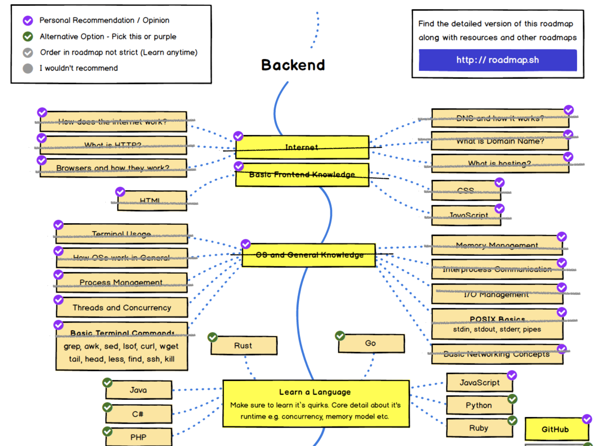
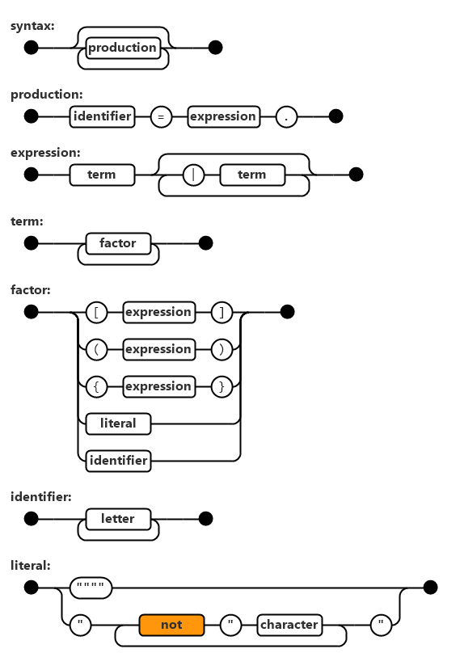

Sin darme cuenta han pasado dos meses desde que escribí el [último post](/blog/2021/04/24/el-camino-del-backend-developer-comandos-de-terminal/) de esta [serie](https://www.programando.org/category/backend-developer/). ¡Vamos a remediar esta situación de inmediato!.
Nos pondremos al día con uno de los aspectos en la formación de un desarrollador backend que más me gusta: los lenguajes de programación.

Repasemos nuestro roadmap:



En la figura he tachado lo que hemos recorrido hasta ahora. A partir de este artículo entramos al territorio de los lenguajes de programación.

La guía provista por el sitio [roadmap.sh](https://roadmap.sh/backend) recomienda primero aprender ciertos conceptos básicos y luego aprender algún lenguaje. 

En esta serie yo he asumido que ya sabes programar, incluso he usado Python, Javascript, Rust y C para demostrar los distintos conceptos abordando usando código. 
Así que esta sección, dedicada a los lenguajes de programación, la usaremos para destacar las características especiales de cada uno. 

Este primer artículo de esta sección será una breve introducción teórica a los lenguajes formales, donde introduciremos las gramáticas y construiremos un pequeño "parser".

En el segundo artículo de esta sección veremos los principales paradigmas de programación que existen. Y luego revisaremos los lenguajes propuestos por [roadmap.sh](https://roadmap.sh/backend) y algunos más que me parecen interesantes.

# Lenguajes 

El lenguaje, así en general, es para mi la tecnología de la información más antigua. Algunos historiadiores y antropólogos posicionan la invención del lenguaje como el hito más importante de nuestra evolución como especie. Gracias al lenguaje hemos podido asociarnos y cooperar entre nosotros, primero como pequeños grupos, luego como tribus hasta desarrollar complejas sociedades.

El lenguaje que usamos para comunicarnos, ya sea de forma hablada o escrita lo conocemos como **lenguaje natural**. Pero los seres humanos hemos creado otros lenguajes para comunicarnos o expresarnos (como el lenguaje musical, por ejemplo).

Todos hemos sido expuestos en mayor o menor grado a un tipo de lenguaje más riguroso: "el lenguaje matemático".

Pero existen lenguajes más rígidos aún, son los llamados **"lenguajes formales"**.

## Lenguajes formales

Los lenguajes formales se definen de forma bastante rigurosa y matemática. 

En un lenguaje formal tenemos un *alfabeto* que denominaremos $\Sigma$. Este es un conjunto de símbolos, por ejemplo, las letras del alfabeto.

Cuando juntamos varios símbolos en una _cadena_ obtenemos lo que llamamos una palabra, o _word_. Por ejemplo, la palabra `perro` es la concatenación de las letras `p`, `e`, `r`, `r` y `o`.

El conjunto de todas las palabras generadas a partir de un lenguahe $\Sigma$ se conoce como $\Sigma^{\star}$ (sigma estrella).

Entonces un lenguaje formal $L$ es un subcojunto de $\Sigma^{\star}$ ($L \subseteq \Sigma^{\star}$).

Cuando tenemos palabras podemos organizarlas en **expresiones**.

¿Cómo sabemos cuáles son las palabras que pertenecen a $L$? Por otro lado, ¿cuáles son las expresiones que podemos formar con las palabras de $L$?

Para responder a estas preguntas es que los lenguajes formales definen una serie de *reglas* para delimitar adecuadamente la conformación de palabras y expresiones.

Veamos un ejemplo[^1], definamos el lenguaje $L$ de la siguiente forma:

- El alfabeto que usaremos es: $\Sigma = \{ 0, 1, 2, 3, 4, 5, 6, 7, 8, 9, +, =\}$
- La palabra "0" pertenece a $L$ (las palabras las encerraremos entre comillas, las comillas no son parte del alfabeto).
- Cualquier palabra no vacía que no empiece con "0" y no contenga "+" ni "=" pertenece a $L$
- Una palabra que contenga "=" pertenece a $L$ si y sólo si contiene exactamente un "=" y este separa dos palabras válidas en $L$
- Una palabra que contenga "+" pero que no contenga "=" pertenece a $L$ si y sólo si cada "+" separa dos palabras válidas en $L$
- Sólo las palabras que se ajusten a las reglas anteriores pertenecen a $L$

Con estas reglas tenemos que la cadena "23+4=555" pertenece a $L$ mientras que la cadena "=234=+", no.

El lenguaje $L$ definido de esta forma expresa a los números naturales, las adiciones "bien formadas" y las igualdades entre adiciones bien formadas. Sin embargo describe la forma en que estas expresiones se ven, es decir, su **sintáxis**, pero no su sentido o significado, en otras palabras, no define su **semántica**.

La teoría de lenguajes formales se hace cargo del problema de especificar un lenguaje formal mediante el uso de las **"Gramáticas Formales"**.

Una gramática no define el significado de las palabras de un alfabeto, sino que formaliza cuáles palabras son válidas en un lenguaje.

Para cumplir con esta tarea, las gramáticas se apoyan de **"reglas de producción"**

Estas reglas empiezan con un **símbolo de partida** (start symbol) y describen cómo se pueden generar las palabras del lenguaje a partir de este símbolo de partida. Estas reglas se pueden usar también para construir un reconocedor del lenguaje.

Una regla de producción tiene la forma $u \rightarrow v$, donde $u$ y $v$ son strings arbitrarios de *terminales* y *no terminales*. Un *terminal* es un símbolo final que aparecerá en la cadena final, un *no terminal* son símbolos auxiliares que pueden ser reemplazados. Los símbolos no terminales pueden no pertenecer al alfabeto del lenguaje.

Veamos otro ejemplo, continuemos con nuestro lenguaje para expresar adiciones e igualdades en números natuales.

Si $S$ es nuestro símbolo de partida, entonces las reglas para $L$ serían:

$$ S \rightarrow A $$
$$ S \rightarrow E $$
$$ A \rightarrow N $$
$$ A \rightarrow N + S $$
$$ E \rightarrow A = A $$
$$ N \rightarrow Z $$
$$ N \rightarrow D $$
$$ N \rightarrow D N $$
$$ Z \rightarrow 0 $$
$$ D \rightarrow 1 $$
$$ D \rightarrow 2 $$
$$ D \rightarrow 3 $$
$$ D \rightarrow 4 $$
$$ D \rightarrow 5 $$
$$ D \rightarrow 6 $$
$$ D \rightarrow 7 $$
$$ D \rightarrow 8 $$
$$ D \rightarrow 9 $$
  

Por ejemplo, la expresión "23+4=55" se generaría así:

$$ S \rightarrow A $$
$$ A \rightarrow N + S $$
$$ N + S $$
$$ (N \rightarrow D N) + (D \rightarrow E)$$
$$ (D N) + E $$
$$ ((D \rightarrow 2) (N \rightarrow D)) + (E \rightarrow A = A) $$
$$ 2 D + A = A $$
$$ 2 (D \rightarrow 3) + (A \rightarrow N) = (A \rightarrow N) $$
$$ 23+ N = N $$
$$ 23+ (N \rightarrow D) = (N \rightarrow D N) $$
$$ 23+ D = (D N) $$
$$ 23+ (D \rightarrow 4) = (D \rightarrow 5) (N \rightarrow D) $$
$$ 23+4=5 D $$
$$ 23+4=5 (D \rightarrow 5) $$
$$ 23+4=55 $$


Esto aparece bastante largo y engorroso, pero para eso tenemos a los computadores, que pueden hacer estas tareas repetitivas muchas veces sin chistar.

Estas gramáticas son las usadas para definir los lenguajes formales que usamos en el día día.
Por fortuna existen formas más concisisas de escribir estas reglas, por ejemplo, la gramática para $L$ puede ser escrita de la siguiente forma:

$$ S \rightarrow A | E $$
$$ A \rightarrow N | N + S $$
$$ E \rightarrow A = A $$
$$ N \rightarrow 0 | [1-9][0-9]* $$


Acá el símbolo $|$ separa producciones alternativas. $S \rightarrow A | B$ significa que el no terminal S puede ser reemplazado por el no terminal A o el no terminal B.
También usamos $[0-9]$ para definir un rango de símbolos, en este caso entre el 0 y el 9, pero sólo se elige un sólo de los símbolos en este rango. El $*$ al final del rango significa repetición de 0 ó más veces (potencialmente infintas).

Otra forma de escribir la regla $N$ sería;

$$ N \rightarrow 0 | [1-9] | [1-9][0-9]+ $$

Acá el signo $+$ significa repetir 1 o más veces.

## Notaciones para gramáticas 

Hay diversas notaciones para poder expresar de forma sucinta y eficente los lenguajes formales. Una muy popular es la notación [Backus-Naur Extendida](https://en.wikipedia.org/wiki/Extended_Backus–Naur_form). 

Usando esta notación la gramática quedaría así:

```python
expresion = adicion | igualdad 
adicion = numero | numero, "+", expresion
igualdad = adicion, "=", adicion 
numero = digito excluyendo cero { digito } 
digito excluyendo cero = "1" | "2" | "3" | "4" | "5" | "6" | "7" | "8" | "9" 
digito = "0" | digito excluyendo cero 
```

Otra notación es la inventada por Niklaus Wirth, que representa las reglas de producción mediante un diagrama:



Todos los que aprendieron a programar con Turbo Pascal en los noventa están muy familiarizados con esta notación.


Las gramáticas formales son utilizadas para especificar los lenguajes que usamos para desarrollar software, como los lenguajes de marcado o los lenguajes de programación.

Pueden ver un ejemplo de gramática en este sitio https://docs.python.org/3/reference/grammar.html que contiene la especificación de Python 3.9.

Veamos un segmento de esa gramática:

```python
function_def:
    | decorators function_def_raw 
    | function_def_raw

function_def_raw:
    | 'def' NAME '(' [params] ')' ['->' expression ] ':' [func_type_comment] block 
    | ASYNC 'def' NAME '(' [params] ')' ['->' expression ] ':' [func_type_comment] block 
func_type_comment:
    | NEWLINE TYPE_COMMENT &(NEWLINE INDENT)   # Must be followed by indented block
    | TYPE_COMMENT

params:
    | parameters

parameters:
    | slash_no_default param_no_default* param_with_default* [star_etc] 
    | slash_with_default param_with_default* [star_etc] 
    | param_no_default+ param_with_default* [star_etc] 
    | param_with_default+ [star_etc] 
    | star_etc 

```

El equipo de Python usa una notación que es una mezcla de [EBNF](https://en.wikipedia.org/wiki/Extended_Backus–Naur_form) y [PEG (Parsing Expression Grammar)](https://en.wikipedia.org/wiki/Parsing_expression_grammar)

## Validando expresiones usando una gramática

Para finalizar esta primera parte vamos a aplicar lo que hemos aprendido para implementar un validador de expresiones del lenguaje $L$.

Recordemos la ultima versión de nuestra gramática usando EBNF:

```python
expresion = adicion | igualdad 
adicion = numero | numero, "+", expresion
igualdad = adicion, "=", adicion 
numero = digito excluyendo cero { digito } 
digito = "0" | digito excluyendo cero 
digito excluyendo cero = "1" | "2" | "3" | "4" | "5" | "6" | "7" | "8" | "9" 
```

Usaremos esto para construir una función en Python que valide las expresiones en $L$.

Nuestro test serán estas aserciones:

```python
assert(expresion("2+4"))
assert(expresion("2+4+10"))
assert(expresion("2+4+66=8"))
assert(not expresion("2+4=4=44"))
assert(expresion("23+4=55"))
```

La función `expression` la definiremos así:

```python
# expresion = adicion | igualdad 
def expresion(s):
   if adicion(s):
      return True
   if igualdad(s):
      return True
   return False
```

Validamos si la cadena `s` es una adición o si es una igualdad. Si cualquiera de estas condiciones retornamos `True`, sino `False`.

Veamos la función `adicion`:

```python
# adicion = numero | numero, "+", expresion
def adicion(s):
   if not '+' in s:
      return numero(s)

   parts = s.split('+', 2)
   if not numero(parts[0]): return False
   if not expresion(parts[1]): return False
   return True
```

Si no hay un signo `+` en la cadena `s` entonces validamos si es un número. De lo contrario separamos la cadena `s` en dos partes a partir del símbolo `s`. 
Validamos que la primera parte sea número y que la segunda parte sea expresión. Fíjense que hay una llamada recursiva indirecta a la función `expresion()`.

Nos falta revisar la función `numero()`:

```python
# numero = digito excluyendo cero { digito } 
def numero(s):
   if len(s) == 0: return False
   if not digito_excluyendo_cero(s[0]): return False
   if len(s) > 1:
      for c in s[1:]: 
         if not digito(c): return False
   return True

# digito excluyendo cero = "1" | "2" | "3" | "4" | "5" | "6" | "7" | "8" | "9" 
def digito_excluyendo_cero(s):
   return s in ['1', '2', '3', '4', '5', '6', '7', '8', '9']

# digito = "0" | digito excluyendo cero 
def digito(s):
   return s == '0' or digito_excluyendo_cero(s)
```

Validamos que un número empiece con un dígito excluyendo el 0. 
Fíjense lo directo que es traducir las funciones que validan los dígitos.

Tal como pueden ver, construir un validador, o _parser_ a partir de la gramática es relativamente sencillo. 

Es por esto que las gramáticas son una herramienta tan poderosa usada para construir intérpretes y compiladores de lenguajes de programación.

Con esto cerramos este capítulo dedicado a los lenguajes formales, de los cuales los lenguajes de programación son una aplicación práctica.

Si te gustó este post te recuerdo que puedes apoyar este proyecto con tu apoyo patrocinado esta serie a través de la plataforma [Ko-fi](https://ko-fi.com/lnds), mediante ese auspicio podré publicar estos posts como un libro. 

Espero tu apoyo:




El código fuente del parser se encuentra en este repo en github: https://github.com/lnds/desafios-programando.org/tree/master/2021-06-28


[^1]: Tomado de Wikipedia: https://en.wikipedia.org/wiki/Formal_language