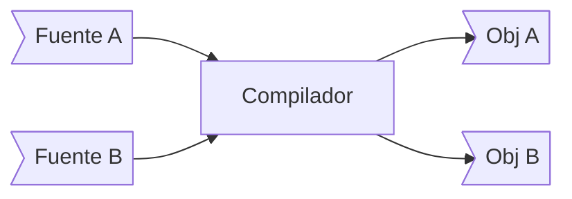

Este post es un pequeño desvío en [nuestro roadmap](/category/backend-developer/), lo escribí para cerrar algunos aspectos más teóricos sobre los lenguajes de programación. Si te interesa saber cómo funcionan los compiladores, intérpretes, transpilers, etc, este post te puede interesar.

## Assembly

En los primeros años de la programación las y los programadoras configuraban las máquinas con las instrucciones que se debían ejecutar, literalmente cableando el computador.



Después Von Neunmann aplicó las ideas de [Alan Turing y su Máquina Universal](/blog/2021/08/07/el-camino-del-backend-developer-lenguajes-de-programacion/), y diseñó una computadora que almacenaba las instrucciones del programa en la misma memoria donde residían los datos.

De este modo la computadora procesaba las instrucciones a partir de cierta dirección de memoria. Esto fue crucial, porque permitió el desarrollo del código de máquina. El desafío fue construir un lenguaje que fuera entendible por los humanos y se pudiera traducir al lenguaje de máquina. Con esto nacieron los **ensambladores**.


Para entender cómo funcionan los ensambladores vamos a proponer un modelo sencillo de operación. En este modelo la memoria de un computador se organiza de este modo:

```
    +-----------+
    | LOADER    |
    +-----------+
    | ASSEMBLER |
    +-----------+
    | PROGRAM   |
    +-----------+
    | TEXT      |
    +-----------+
    | DATA      |
    +-----------+
```

Acá `LOADER` es un programa escrito en lenguaje de máquina, igual que el programa `ASSEMBLER`. El programa `LOADER` es lo primero que ejecuta el computador. Su función es preparar y cargar el programa `ASSEMBLER`. Este a su vez se encargará de **traducir** el programa que se encuentra en el área `PROGRAM`.

`PROGRAM` es un conjunto de datos: las instrucciones en assembler del progrma. Por ejemplo, podría ser algo así:

```
MOV CX, @1
ADD CX, 1
STO CX, @2
````

Este es un programa muy simple, lo que hace es cargar la data en la dirección @1 a un registro acumulador `CX`[^1]. Luego agrega 1 al acumulador. Finalmente almacena lo que está en el acumulador `CX` en la dirección @2. 

Este es un lenguaje ensamblador, que acabo de inventar. Pero servirá para explicar estos conceptos más adelante.

Cada uno de los símbolos del programa en assembly ocuparán un espacio en memoria, probablemente un byte, así que se verían de este modo:

```
         +-+-+-+-+-+-+-+-+-+-+-+-+-+-+-+-+-+-+-+-+-+-+-+-+-+-+-+-+-+-+-+
PROGRAM: |M|O|V| |C|X|,| |@|1| |A|D|D| |C|X|,| |1| |S|T|O| |C|X|,| |@|2|
         +-+-+-+-+-+-+-+-+-+-+-+-+-+-+-+-+-+-+-+-+-+-+-+-+-+-+-+-+-+-+-+
```

Nuestro programa en assembler es simplemente una secuencia de caracteres. Lo que hace `ASSEMBLER` es darle sentido a cada una de esas instrucciones y traducirlas a código de máquina. Esta traducción se deja en el área que hemos llamado `TEXT`.

Supongamos que `MOV` es la primera instrucción en nuestro código de máquina, entonces su código sería 1, `ADD` sería la instrucción 2, `STO` la instrucción 3. `CX` sería el registro 0 de nuestra máquina.
Y asumiremos que cada instrucción ocupa 3 bytes, el código de operación, y sus dos operandos.

```
+--------+---------+---------+
| BYTE 1 | BYTE 2  | BYTE 3  |
+--------+---------+---------+
|OPERADOR|OPERANDO1|OPERANDO2|
+--------+---------+---------+
```

Entonces, cuando `ASSEMBLER` haya finalizado su traducción dejará el área `TEXT` del siguiente modo:

```
      +-+-+-+-+-+-+-+-+-+
TEXT: |1|0|1|2|0|1|3|0|2|
      +-+-+-+-+-+-+-+-+-+
```

En más detalle, esta es la traducción que hace `ASSEMBLER`:

```
    |MOV|CX|@1| -> |1|0|101|
    |ADD|CX| 1| -> |2|0|  1|
    |STO|CX|@2| -> |3|0|102|
```

Lo siguiente que hace `ASSEMBLER` es instruir al computador para que empiece a ejecutar las instrucciones ubicadas en el área `TEXT`.

Las direcciones `@1` y `@2` hacen referencia al área DATA, acá hemos asumido que `DATA` empieza a partir de la dirección de memoria 100[^2].

## Lenguajes de Alto Nivel

Estos lenguajes ensambladores fueron reemplazados después por lenguajes más abstractos, o de alto nivel.

Uno de los primeros lenguajes de este tipo fue  [FORTRAN](https://en.wikipedia.org/wiki/Fortran). 

En FORTRAN el programa en assembly descrito antes se podría haber escrito más o menos de este modo:

```fortran
C DEJA EN LA VARIABLE B EL SUCESOR DE LA VARIABLE A
  100 B = A
      STOP
      END
```

Una estrategia para traducir esto a lenguaje de máquina puede ser traducir de FORTRAN a ASSEMBLER y dejar que ASSEMBLER traduzca a lenguaje de máquina. Así nacieron los primeros **compiladores**. 

Un `compilador` es una __"persona que produce una lista o un libro ensamblando información o material escrito recolectado desde diversas fuentes"__. Y precisamente eso hacen los compiladores, gráficamente funcionan así:


Uno de los primeros compiladores fue escrito por [Grace Hopper](https://en.wikipedia.org/wiki/Grace_Hopper) y se llamaba el Sistema A-0. De hecho fue ella quien acuñó el término **compilador** para referirse a este tipo de herramientas.



Los compiladores modernos se saltan el paso de llamar al assembler pues implementan ellos mismos esa fase. Normalmente lo que hace un compilador es generar el código de máquina intermedio en un archivo binario, lamado 
__código objeto__. Esto se resume en este esquema:




Estos archivos son "enlazados" posteriormente por un programa especial llamado `LINKER`, que une los archivos generados por el compilador con otros archivos objetos compartidos, por ejemplo, con bibliotecas de funciones escritas por otros programadores, provistas por el propio lenguaje o provistas por el sistema operativo.

Este proceso se resume en el siguiente esquema:


En el diagrama he representado la biblioteca estándar del lenguaje como `Lib Std` y `Lib A` representa otra biblioteca, quizás generada con otro lenguaje de programación, o provista por el sistema operativo.


Este proceso de compilación no es interactivo. Primero hay que escribir el código del programa en un lenguaje de alto nivel y luego pasar por el proceso de compilar y ensamblar para poder ejecutar el código.

Esto es lento y puede ser frustrante si los computadores son lentos, como era en ese tiempo, considerando además que muchas veces este proceso era controlado por un operador humano, ante [la falta de un sistema operativo](/blog/2021/02/09/el-camino-del-backend-developer-sistemas-operativos/).

## Intérpretes

Un intérprete es algo que surgió también en los primeros años de la programación. En teoría se puede construir un intérprete de assembler que vaya ejecutando cada instrucción en la medida que se va interpretando. También puede simular la ejecución de la instrucción. Son distintas estrategias, la primera tendrá un mejor desempeño que la segunda, pero es más dificil de implementar.

De hecho, los primeros lenguajes de alto nivel eran bastante sencillos y las CPUs no tan complejas como las actuales, así que era más fácil construir un compilador que un intérprete. Además los computadores de esa época tenían menos recursos que los actuales (especialmente  memoria), lo que complicaba la creación de intérpretes.

Uno de los primeros ejemplos exitosos de intérpretes fue [LISP](https://en.wikipedia.org/wiki/Lisp_(programming_language)), lenguaje inventado por John McCarthy en 1958. Junto con FORTRAN son los lenguajes de alto nivel más antiguos que existen.



El objetivo de McCarthy era usar las computadoras para analizar símbolos para apoyar sus investigaciones en inteligenica artificial. Para esto propuso un modelo computacional basado en el [cálculo lambda](https://en.wikipedia.org/wiki/Lambda_calculus). Este es un modelo formal alternatio a la Máquina de Turing, pero igual de poderoso.

La clave para construir el intérprete de LISP fue la implementación de la función `EVAL`. [Steve Russell](https://en.wikipedia.org/wiki/Steve_Russell_(computer_scientist)) se dio cuenta de que podía implementar el concepto de __función universal__ en código de máquina, y usó esta idea para escribir el primer intérprete para lisp en una IBM 704. Este hecho asombró a McCarthy, que no estaba seguro de que pudiera hacerse. 



A partir de ese momento el proyecto LISP decantó en el uso de un intérprete, por sobre un compilador.

## READ - EVAL - PRINT - LOOP

La estructura del interprete de LISP se basaba inicialmente en tres funciones:

- `READ`: que leía el código fuente y lo dejaba en una estructura intermedia para ser evaluado por `EVAL``
- `EVAL`: que evaluaba la estructura intermedia del lenguaje y realizaba la computación del programa.
- `PRINT`: que escribía el resultado en algún dispositivo de salida.

La interactividad vino después al ejecutar estos tres pasos en un ciclo infinito (`LOOP`). Si podemos hacer que cada instrucción sea escrita de manera interactiva y la procesamos con estas tres funciones, el programador puede interactuar en un bucle que permite probar cada expresión una y otra vez.

Este ciclo se conoce como  `REPL` y fue implementado en las primeras [`LISP Machines`](https://en.wikipedia.org/wiki/Lisp_machine). 

Este concepto es usado hoy por muchos lenguajes, principalmente los lenguajes dinámicos, para brindar un entorno interactivo donde puedes probar expresiones. Incluso hay un sitio llamado [REPLIT.COM](https://replit.com) que entrega entornos virtuales de programación y deriva su nombre de esta expresión.

Vamos a mostrar como funciona todo esto escribiendo un intérprete muy sencillo de un subconjunto de LISP. Para esto usaremos Python[^3].

## Un interprete de LISP

Vamos a aplicar parte de [los conocimientos adquiridos](/blog/2021/06/28/el-camino-del-backend-developer-lenguajes-formales/) para interpretar la sintaxis de nuestro mini lenguaje.

En LISP todo se expresa como listas que se encuentra encerradas por paréntesis, del siguiente modo:

```lisp
(esta es una lista)
```

Por supuesto pueden haber listas dentro de listas:

```lisp
(esta lista (tiene otra lista) incluida)
````

A los elementos de la lista los llamaremos átomos. 

Un átomo en nuestro lenguaje puede ser un símbolo o un número. Un símbolo puede ser `+` o `var`, o `nil?`. En general cualquier cosa que no sea número la consideraremos un símbolo.

Una expresión en nuestro dialecto de LISP es un átomo o una lista.

Dado esto declararemos entonces nuestros tipos básicos en Python:

```python
Symbol = str             
Number = (int, float)    
Atom   = (Symbol, Number)
List = list
Expression = (Atom, List)
```

### La función READ

La función `read` es muy simple:

```python
def read(source: str) -> list:
  tokens = sep_tokens(source)
  return parse_tokens(tokens)
```

y se apoya en dos funciones, primero `sep_tokens()`:

```python
def sep_tokens(source: str) -> list:
  return source.replace('(', ' ( ').replace(')', ' ) ').split()
```

Esta función coloca espacios entre cada paréntesis para poder llamar después a split.

Si haces:

```python
sep_tokens('(hola mundo)')
```

obtienes:

```python
['hola', 'mundo']
```

La función `parse_tokens` es recursiva porque debemos manejar el caso de que tenemos listas dentro de listas. Este es el código:

```python
def parse_tokens(tokens: list) -> list:
  if len(tokens) == 0:
    raise SyntaxError('unexpected EOF')
  
  token = tokens.pop(0)
  if token == '(':
    l = []
    while len(tokens) > 0 and tokens[0] != ')':
      l.append(parse_tokens(tokens))
    if len(tokens) == 0:
      raise SyntaxError('unexpected EOF')
    tokens.pop(0)
    return l
  
  if token == ')':
    raise SyntaxError('unexpected )')
  else:
    return atom(token)
```

La función `atom()` convierte un token a un átomo (número o símbolo)

```python
def atom(token: str) -> Atom:
  try: 
     return int(token)
  except ValueError:
    try: 
      return float(token)
    except ValueError:
      return Symbol(token)
```

### La función EVAL

La función eval es el corazón de nuestro intérprete. En LISP tenemos **formas** especiales, que corresponden estructuras especiales que son interpretadas de manera especial por el intérprete.

Por ejemplo, en LISP el IF se expresa así:

```lisp
(IF COND CONSEQUENCE ALTERNATIVE)
```

Por ejemplo, si queremos testear por el valor minimo entre dos variables `a` y `b` podemos hacer:

```lisp
(if (< a b) a b)
```

Acá `if` es una palabra clave que será interpretada por `eval` como el inicio de la forma especial `IF`. Acá `a` y `b` son símbolos, igual que `<`, pero este último es interpretado en su forma estándar, es decir, compara si `a` es menor que `b`.

Fíjense que en LISP la notación es inversa, se coloca el operador primero y luego los operandos: 

```lisp
(OPERADOR OPERANDO-1 OPERANDO-2)
```

En nuestro lenguaje tendremos las siguientes formas básicas:

- `if`: para evaluación de condicionales
- `def`: para definir símbolos
- `fn`: que nos permite crear expresiones lambda (funciones)
- `quote`: que interpreta un símbolo literalmente (sirve para saltarse la evaluación de una expresión)
- `set!`: que sirve para asignar un nuevo valor a un símbolo

Por ejemplo, las formas `def` y `fn`nos premiten definir funciones, acá pueden ver la forma en que podemos definir una función que calcula el área de un círculo:

```lisp
(def circle-area (fn (r) (* pi (* r r))))
```

Noten que hay un símbolo pre definido `pi`, este y otros símbolos están predefinidos, como las operaciones aritméticas (`+`, `-`, `*`, `/`), de comparación (`<`, `>`, `>=`, `<=`), algunas funciones matemáticas (como `sqrt`, `tan`, `cos`, `sin`, etc.). Y las clásicas operaciones sobre listas de LISP: `car`, `cdr`, `cons`.

Estos símbolos pre definidos se guardan en un entorno de operación que denominaremos `Enviroment`, que implementamos con la siguiente clase:

```python
class Environment(dict):
  def __init__(self, parms=(), args=(), outer=None):
    self.update(zip(parms, args))
    self.outer = outer

  def find(self, var):
    return self if (var in self) else self.outer.find(var)
```

Esta clase deriva de `dict` y mantiene un mapa de los símbolos predefinidos. Para pre poblarlo hemos definido la función `standard_env()`:

```python
import math
import operator as op

def standard_env() -> Environment:
  env = Environment()
  env.update(vars(math)) # sin, cos, sqrt, pi, etc...
  env.update({
    '+': op.add,
    '-': op.sub,
    '*': op.mul,
    '/': op.truediv,
    '>': op.gt,
    '<': op.lt,
    '>=': op.ge,
    '<=': op.le,
    '=': op.eq,
    'not': 
    'apply': lambda proc, args: proc(*args),
    'begin': lambda *x: x[-1],
    'car': lambda x: x[0],
    'cdr': lambda x: x[1:],
    'cons': lambda x, y: [x] + y,
    'max': max,
    'min': min,
    'list': lambda *x: List(x),
    'list?': lambda x: isinstance(x, List),
    'number?': lambda x: isinstance(x, Number),
    'procedure?': callable,
    'symbol?': lambda x: isinstance(x, Symbol),
  })
  return env


prelude = standard_env()
```

Fíjense que hemos asignado el entorno estándar en la variable `prelude`.

Con un ambiente pre definido podemos declarar nuestra función `eval()`:

```python
def eval(x: Expression, env=prelude) -> Expression:
  if isinstance(x, Symbol):
    return env.find(x)[x]
  elif not isinstance(x, List):
    return x

  op, *args = x
  if op == 'if':
    (test, conseq, alt) = args
    expr = conseq if eval(test, env) else alt
    return eval(expr, env)

  if op == 'def':
    (symbol, expr) = args
    env[symbol] = eval(expr, env)
    return None

  if op == 'set!':
    (symbol, expr) = args
    env.find(symbol)[symbol] = eval(expr, env)
    return None

  if op == 'fn':
    (parms, body) = args 
    return Procedure(parms, body, env)
  
  if op == 'quote':
    return args[0]

  proc = eval(op, env)
  vals = [eval(arg, env) for arg in args]
  return proc(*vals)
```

Se puede notar en los diversos `ifs` que manejan a las distintas __formas especiales__.

Falta explicar la clase `Procedure` que es la que usamos para poder definir expresiones lambda (funciones). Su declaración es la siguiente:


```python
class Procedure(object):
  def __init__(self, parms, body, env):
    self.parms, self.body, self.env = parms, body, env

  def __call__(self, *args):
    return eval(self.body, Environment(self.parms, args, self.env))

```

Esta clase sobre escribe el método __call__, así si declaras un objeto de tipo `Procedure` se comporta igual que una función y puedes hacer lo siguiente:

```python
area = Procedure('r', ['*', 'r', 'r'], prelude)
area(10)
# retorna 100
```

El constructor de esta clase recibe los argumentos de la función, el cuerpo (que es una lista de símbolos), y el entorno. Esto es usado después porque `__call__` pasa estos elementos a `eval`, pero creando un entorno local, que incluye los argumentos como nuevos símbolos.


### REPL

Sólo nos falta definir el REPL, con todo lo anterior definido su implementación es muy sencilla:

```python
def repl(prompt='lispy> '):
  while True:
    val = eval(read(input(prompt)))
    if val:
      print(lisp_fmt(val))
```


Para implementar la función `print` usamos la función homónima de Python, pero antes le damos un formato tipo list a las listas usando la función `lisp_fmt()`.

```python

def lisp_fmt(expr):
  if isinstance(expr, List):
    return '('+' '.join(map(lisp_fmt, expr))+')'
  return str(expr)
```

Todo el código de este intérprete lo dejé en [REPLIT.COM](https://replit.com/@lnds/Lispyparser#main.py), pero también pueden ejecutarlo interactivamente acá:
    

    

Para ejecutarlo deben presionar el botón play (la flecha verde arriba), y luego en la consola deben escribir `repl()`. Con esto el entorno entra en modo interactivo y pueden probar el lenguaje. 

Esta captura de pantalla muestra una sesión en que definimos un par de funciones:


## Entornos de Ejecución

Es notable que nuestro intérprete ocupa muy pocas líneas de código y aún así es bastante poderoso. 

Permite crear nuevas funciones, incluso funciones recursivas. Este mini lenguaje puede ser usado para resolver una gran variedad de problemas (¿es Turing Completo?). 

Claro que le faltan funciones de entrada y salida, y manejo de strings, pero agregar esas funcionalidades es bastante sencillo y estas funcionalidades no aportarían muchas líneas de código adicionales.En suma, en menos de 200 líneas de código en Python tenemos un dialecto de LISP. 

Claro que podemos alegar que esta brevedad se sostiene por el soporte dado por el entorno de ejecución de Python.

Efectivamente, los intérpretes siempre cuentan con un entorno de ejecución que incluye, además de ciertas funciones básicas, otros elementos, como la gestión de memoria, acceso a periféricos, interfaces con el sistema operativo, etc.

Los lenguajes interpretados son poco habituales en la actualidad. Lo más frecuentes es que el código fuente de estos lenguajes sea compilado a un formato intermedio, conocido como `bytecode`, y es este `bytecode` el que es interpretado por lo que se conoce como __"máquina virtual"__.  

Los casos más conocidos son la [Máquina virtual de Java](https://en.wikipedia.org/wiki/Java_virtual_machine), el [CLR de .Net](https://en.wikipedia.org/wiki/Common_Language_Runtime), y [BEAM](http://www.cs-lab.org/historical_beam_instruction_set.html) de Erlang (y Elixir).

Este esquema es un paso intermedio, y brinda un mejor performance que un intérprete tradicional. Muchas veces esta etapa de compilación se ejecuta sin que lo note el usuario. Y permite técnicas avanzadas de compilación intermedia hacia código de máquina nativo como [JIT](https://en.wikipedia.org/wiki/Just-in-time_compilation) o [AOT](https://en.wikipedia.org/wiki/Ahead-of-time_compilation).

 Por ejemplo, originalmente Python tenía sólo su implemeentación estándar, conocida como CPython, que correspondía a un intérprete (de un bytecode). Posteriormente se desarrollaron otras implementaciones del intérprete, siendo una de las ma´s conocidas PyPy que implementa un compilador JIT, con lo que logra un mejor desempeño que CPython.

 Por otro lado, en la actualidad el motor [V8](https://v8.dev), para JavaScript, es usado principalmente por [Node](https://nodejs.org/en/) y [Deno](https://deno.land).

Un nuevo entorno, que se está volviendo cada vez más relevante es [Web Assembly](https://webassembly.org), que corresponde a una máquina virtual, basada en stack, desarrollada para brindar un ambiente portable entre distintos navegadores web. La extensión [WASI](https://wasi.dev) permite ejecutar código para Web Assembly en entornos externos a un navegador web (por ejemplo, directamente en el sistema operativo).

Los lenguajes compilados dependen de bibliotecas para poder interactuar con el "mundo exterior", en este caso hablamos de bibliotecas de tiempo de ejecución, o __runtime libraries__. Es habitual típico que un lenguaje cuente con una runtime library básica. 

También los lenguajes compilados pueden interactuar con otros lenguajes porque comparten el mismo código de máquina al final. Lo que ocurre es que para poder enlazarse usando el `LINKER`, los lenguajes generan sus archivos intermedios en formatos estándares para el código objeto.

Existen ciertos estándares, conocidos como ABI ([Application Binary Interface](https://en.wikipedia.org/wiki/Application_binary_interface)), que definen el set de instrucciones del procesador, la estructura de registros y stack, alineamiento en memoria, la forma en que se pasan los parámetros entre funciones, e incluso el formato de los archivos binario del código objeto. Esto permite no sólo la compatibilidad entre distintos lenguajes en un mismo entorno, también permite la portabilidad binaria entre distintos sistemas operativos e incluso arquitecturas de computadores.

## Transpilers

Otra técnica habitual es la traducción entre lenguajes. Por ejemplo, se puede traducir de Python a Javascript[^4].

Esta técnica se ha usado en proyectos como [TypeScript](https://www.typescriptlang.org) o [ClojureScript](https://clojurescript.org).

Un transpiler  traduce de un lenguaje directo a otro, no genera código de máquina directamente. 

Por ejemplo, en TypeScript el proceso puede ser este:


## Lenguajes Dinámicos e Intérpretes

Hay algunas personas que confunden lenguajes interpretados con lenguajes dinámicos. En un próximo post, cuando hablemos de Python y JavaScript, veremos con más detalle qué son los lenguajes dinámicos. Lo importante es hacer la distinción.

En teoría podemos construir un intérprete para cualquier lenguaje, porque basicamente lo que hace un intérprete es simular el comportamiento de una CPU real. 

Los intérpretes surgieron como una forma de resolver ciertos problemas que planteaban modelos de programación que se alejaban del modelo de Turing. En particular, para explorar el cálculo lambda y sus derivados. El ejemplo clásico es LISP. 

Todo eso llevó a la creación de los primeros lenguajes dinámicos, lo que requirió el desarrollo de intérpretes, porque era la forma más simple de resolver el problema en ese momento.

Es normal que los lenguajes dinámicos usen intérpretes (directos o mediante máquinas virtuales), porque es la forma más sencilla de implementarlos. Pero nada impide tener lenguajes dinámicos que corran directamente en código de máquina nativo. De hecho hay compiladores de lenguajes dinámicos.

En resumen un intérprete y un compilador son herramientas que permiten la ejecución de programas escritos en algún lenguaje de alto nivel. Lo que algunos llaman lenguajes interpretados suelen ser lenguajes dinámicos, que es un término más preciso. Pero sobre estos últimos hablaremos en el próximo post.

----


Si te gustó este artículo, o esta serie, puedes apoyarme donando tu aporte a través de [Ko-Fi](https://ko-fi.com/lnds/), en este enlace: https://ko-fi.com/lnds/donate




[^1]: Un registro es una estructura interna de la CPU que puede guardar un dato (típicamente una palabra o word, que corresponde a cierta cantidad de bytes, 2 o 4, dependiendo de la arquitectura). Un registro acumulador es un registro que es usado para operaciones aritméticas.

[^2]: Este modelo es muy sencillo y no quize complicarlo con el direccionamiento de la memoria, por eso que usé una dirección de memoria que se puede expresar en un byte (100). En una máquina real esta estructura es más compleja.

[^3]: Nuestro parser es simplemente una adaptación del escrito por Peter Norvig: http://norvig.com/lispy.html

[^4]: [Skulpt](http://skulpt.org) es un proyecto que permite hacer esto.