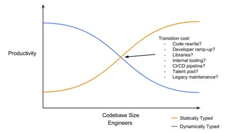

La definición de lenguaje dinámico suele ser confusa para muchas personas. Hay algunos que confunden lenguaje interpretado con lenguaje dinámico. Tal como vimos antes, la existencia de un intérprete es una conveniencia, que permitió la creación de lenguajes dinámicos, como LISP, pero hay compiladores de lenguajes dinámicos, así que esa no es la característica principal de los mismos.

Lo que suele ocurrir con los lenguajes dinámicos modernos, es que casi todo estos requieren de un entorno de ejecución tipo máquina virtual. Pero hay lenguajes estáticos que también corren sobre una máquina virtual, como ocurre con C# y Java.

El hecho de ser interpretados no es lo que define a estos lenguajes como dinámicos, sin embargo, un intérprete facilita mucho la implementación de los lenguajes dinámicos. Un lenguaje dinámico se caracteriza porque algunas operaciones realizadas en tiempo de compilación se pueden realizar en tiempo de ejecución. 

Por ejemplo, en javascript puedo cambiar el tipo de una variable:

```javascript
var v = “hola”
console.log(v)
v = 10
console.log(v)
```
Acá he declarado v como una variable y le he asignado un string, y más abajo he cambiado su valor a integer. La variable v tiene un tipo asociado a partir de su asignación, pero puede cambiar con el tiempo, sin ningún problema. En los lenguajes en que el tipo se define de manera estática esto no es posible. Ahora bien, el cambio de tipos no es lo único que puedo hacer en un lenguaje dinámico.

Por ejemplo:

```javascript
class Rectangulo {
  constructor(alto, ancho) {
    this.alto = alto
    this.ancho = ancho
  }

  area() {
          return this.alto * this.ancho
  }
}

var rect1 = new Rectangulo(10, 10)
console.log(rect1.area())

Rectangulo.prototype.area = function() {
        return this.alto + this.ancho
}

var rect2 = new Rectangulo(20, 10)
console.log(rect1.area())
console.log(rect2.area())
```

En este ejemplo, hemos redefinido en forma dinámica el método `area()`, lo que normalmente es imposible en lenguajes estáticos. Dependiendo del lenguaje podremos hacer cambios más avanzados en el código en ejecución, un ejemplo notable de esto son las macros de Lisp. 


## Sistemas de tipos

En Python, que también es un lenguaje dinámico, podemos escribir algo como esto:

```python
number = 10
numbr = (number + 20)/2
print(number)
```

Fíjense en que hay un error de escritura en la segunda variable `numbr`, seguramente el programador esperaba que la salida de este programa fuera 15, pero obtiene 10. La razón es que al ser un lenguaje dinámico Python introduce la variable `numbr` sin problemas.

En javascript esto no es posible, porque cada variable debe ser declarada previamente usando `var`:


```javascript
var number = 10
numbr = (number + 20)/2 // <- error
console.log(number)
```

Hay otra característica adicional, tanto Python como Javascript implementan un __sistema dinámico de tipos__, es decir, su tipo puede cambiar durante la ejecución del programa:

```
number = 10
print(number)
number = “diez”
print(number)
```

En lenguajes de tipo estático esto no es posible, porque, aparte de tener que declarar la variable (como en javascript), además hay que declarar el tipo de la misma, y este no puede cambiar. Por ejemplo, este fragmento en java:

```java
int number;
number=5;
number = “string”; // <- error de compilación
```

Los sistemas de tipos pueden resolver varios problemas como el de tipeo que vimos antes, pero necesitan de una fase de compilación más estricta y lenta. Los lenguajes dinámicos permiten obtener feedback temprano, e incluso prototipar muy rápido una solución. Los lenguajes de tipo estático pueden ser más robustos, y con un mejor desempeño en tiempo de ejecución, a costa de esta mayor flexibilidad.

Las diferencias entre ambos tipos de lenguajes se pueden resumir de este modo:

-	Un lenguaje estático puede llegar a ser menos productivo en cuanto a la producción de software, porque toma más tiempo escribir el código
-	Los lenguajes estáticos requieren de compiladores, los lenguajes dinámicos no requieren de esta fase de compilación lo que permite ciclos de desarrollo más rápidos
-	Los lenguajes dinámicos fallan en tiempo de ejecución, para solventar esto se requiere implementar una batería de tests, pero es difícil construir una cobertura total de pruebas (tanto unitarias como de integración)


Sin embargo, las ventajas de los lenguajes estáticos se hacen evidentes cuando las bases de código crecen, tal como lo propone este gráfico [^1]:

 
 


¿Por qué se da esto?

1.	Se reduce la cantidad de errores, la mayor parte de los errores se darán por problemas en la lógica, en vez de erorres por escribir mal el nombre de una variable, o confundir el tipo de las mismas
2.	Al pensar más en la arquitectura de tipos se reduce una gran cantidade de errores lógicos
3.	El refactoring del código es más sencillo, menos propenso a errores y genera menos ansiedad, porque el compilador (y los IDEs) avisan de manera temprana sobre errores asociados a los tipos de variables
4.	Los sistemas de tipo permiten manejar más casos, de los que normalmente considerarías
5.	Mejora la documentación y la estructura del código.


Hoy en día varios lenguajes dinámicos han introducido elementos de tipado estático, como las “type hints” en Python 3.5+, o la introducción de TypeScript, que es un super conjunto de javascript.

En Python 3.5+ los type hints no es estricto, hay que hacer uso de linters, type checkers o bibliotecas que validan estas declaraciones.

En Python 3.5+ el hinting se realiza de este modo:

```python
Vector = list[float] # introduce el tipo Vector

def scale(scalar: float, vector: Vector) -> Vector
   return [scalar * num for num in vector
```

Por otro lado, varios lenguajes estáticos modernos han incorporado ciertas características que los acercan a los lenguajes dinámicos. La razón es aumentar la productividad al escribir código, mediante técnicas como la inferencia de tipos.

Por ejemplo en Go podemos hacer:

```go
type Vector = []float64

func norm(vector Vector) float64 {
   sum := 0.0
   for i := range vector {
     sum = vector[i]*vector[i]
   }
   return math.Sqrt(sum)
}

var r2 = norm(Vector{1.0, 1.0})
```

Acá no es necesario declarar los tipos de `sum`,  o de `r2`.

## Gestión de Memoria

Cada variable que ocupamos en nuestros programas representa o apunta a una sección en la memoria del computador. La memoria es limitada y en lenguajes de bajo nivel su gestión es responsabilidad del programador.

Por ejemplo, en C:

```c
char* str = (char*) malloc(14);

strcpy(str, “Hello world\n”);

printf(“%s”, str);
free(str) 

printf(“%s”, str);
```

Si no hacemos la llamada a `free()`,  la memoria ocupada por str no puede ser reutilizada, generando un problema conocido como “memory leak”. Por otro lado, la segunda llamada a `printf()` muestra otro problema, conocido como `dangling pointer reference`, tratar de acceder a un área de memoria que fue liberada.


Ambos tipos de errores generan bugs, que pueden llegar a ser catastróficos. Es por esto que se introdujeron técnicas, como `garbage collection`, por ejemplo en Java:

```java
static void main() {
  String str = “Hello world\n”
  System.out.print(str)
}
```


Como la variable `str` ha dejado de ser usada esta será liberada posteriormente mediante un proceso llamada “garbage collection” (recolección de basura). Normalmente es un thread alternativo que se encarga de revisar todas las referencias objetos que ya no están siendo usadas, las marca y luego se encarga de liberarlas. La ejecución de esta proceso no es algo que podamos controlar ni forzar (algunos ambientes proveen funciones para forzar la ejecución del garbage collector, pero hacer eso en general,  no es una buena idea).

El lenguaje Rust tiene una propuesta innovadora, y resuelve este tipo de cuestiones en tiempo de compilación. Para esto introduce una serie de reglas para el uso de las variables.

Por ejemplo, veamos este código en Rust:

```rust
fn main() {
  let str = “Hello world\n”;
  print!(“{}”, str)
}
```

Acá la regla que aplica es que la memoria usada por str es reclamada al salir de la función main.

Rust tiene reglas de propiedad (“ownership”) de las variables muy estrictas, que le permiten implementar la gestión de memoria en tiempo de compilación. Por ejemplo, este código genera un error:

```rust
let s1 = String::from(“Hello”)
let s2 = s1;
println!(“{}, world!”, s1); // <- error
```

Esto porque la referencia s1 ha dejado de ser la propietaria de la referencia al string “Hello”. En Rust se dice que la propiedad se mueve al hacer una asignación (o incluso cuando se pasa como argumento a una función).

Para poder solventar esta situación, lo que corresponde es realizar una “clonación” de la variable s1:

```rust
let s1 = String::from(“Hello”)
let s2 = s1.clone()
println!(“s1 = {}, s2 = {}”, s1, s2); // <- ok
```

Entonces, hemos visto tres maneras de gestionar la memoria:

-	Explícita (como en C), en que, como programadores, debemos encargarnos de reclamar y liberar la memoria.
-	Automática (como en Java), en que es el entorno de ejecución el que se encarga de liberar la memoria, nosotros como programadores sólo reclamamos el espacio
-	Implícita (como en Rust), en que estas operaciones se resuelven en tiempo de compilación, mediante reglas estrictas de propiedad de las variables

El modelo de Rust es nuevo y pemite resolver problema de `dangling pointers`, y también `data races`. Este último problema se da en la programación concurrente, y se da cuando un thread trata de acceder a un área de memoria al mismo tiempo que otro thread está tratando de escribir sobre esa área. En Rust también hay reglas específicas en el código que impiden que  se produzcan `data races`.

## El error de los mil millones de dólares

Tony Hoare hace unos años atrás dictó una charla que titulo “Null References: The Billion Dollar Mistake”, en que explica cómo él al crear el concepto de la referencia nula creo una serie de errores (del tipo “dangling pointer”), que el estima ha causado más de mil millones de dólares en pérdidas.

La charla está [acá](https://www.youtube.com/watch?v=ybrQvs4x0Ps), por si les interesa:



En varios lenguajes, tanto dinámicos como estático podemos declara referencias nulas:

Por ejemplo:

```java
String a = null;
```


Al tratar de acceder a esta referencia podemos generar un fallo en nuestro programa.

Varios lenguajes resuelve esto prohibiendo este tipo de variables.

Por ejemplo, en Rust tenemos el tipo `Option<T>`, que resuelve muchos de estos problemas. No voy a entrar en detalles sobre esto, porque lo veremos más adelante, baste con decir acá que al prohibir el concepto de `Null`, más otras características adicionales, en Rust se resuelve el problema de los “dangling pointers”, que está presente en muchos lenguajes (tanto dinámicos como estáticos).

Y con esto hemos dado un pequeño vistazo a estos aspectos generales, importantes para entender los distintos lenguajes y como resuelven ciertos problemas comunes. 

Finalizaremos esta etapa de la serie en el próximo artículo, donde resolveremos un ejercicio en TypeScript (usando Deno), Python (con Sanic), Rust y Go. Los espero.

---

Si te gustó este artículo, o esta serie, puedes apoyarme donando tu aporte a través de [Ko-Fi](https://ko-fi.com/lnds/), en este enlace: https://ko-fi.com/lnds/donate




[^1]: https://itnext.io/performance-impact-of-dynamic-vs-strictly-typed-language-javascript-vs-f-97c70aacd695


