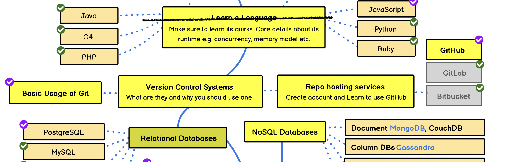
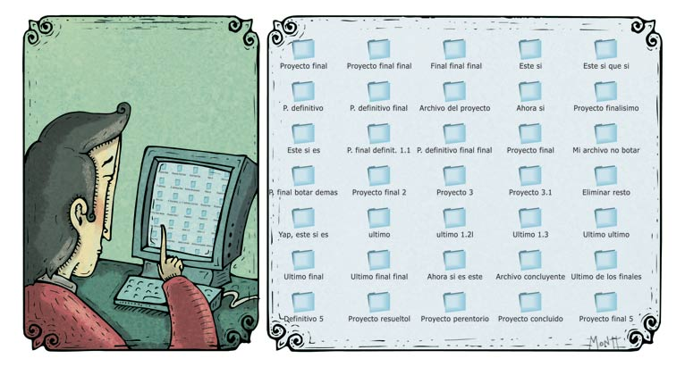
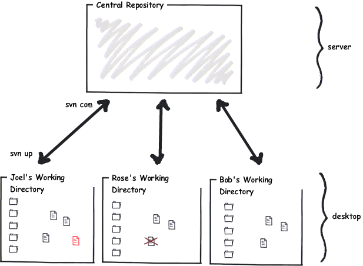
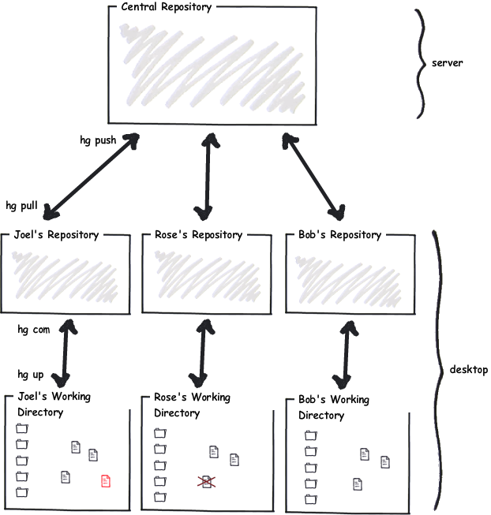

Después de varios meses continuamos con esta serie que he llamado [el camino del backend developer](/category/backend-developer/). En esta oportunidad vamos a revisar lo referente a Sistemas de Control de Versiones.

Recuerda que si quieres apoyar este proyecto y su futura publicación como libro, puedes patrocinarme a través de la plataforma Ko-fi: https://ko-fi.com/lnds



# Sistemas de Control de Versiones

De acuerdo a nuestro roadmap debemos explorar lo relacionado con los sistemas de control de versiones y luego centrarnos en Git. 




## El problema del control de versiones

Dicen que una imagen vale más que mil palabras, así que lo mejor es usar esta graciosa ilustración de Alberto Montt[^1]:



Si no conoces lo que es un sistema de control de versiones de seguro te pasa lo que se muestra en la ilustración. Para no perder tus cambios, o para poder recupar algo en lo que trabajaste antes,  copias tu trabajo en diversos archivos. Esto empeora cuando estás trabajando en equipo y debes compartir archivos, con el tiempo todo eso se vuelve inmanejable.

Cuando era joven y estaba aprendiendo a programar, para gestionar las diversas versiones creaba una carpeta con la fecha y copiaba en esta las fuentes en el estado de ese día. Luego lo comprimía. Así tenía diversos archivos comprimidos.

El primer Sistema de Control de Versiones (Version Control System o **VCS**) que aprendí a usar fue [RCS](https://www.gnu.org/software/rcs/). Era un sistema muy sencillo que hizo bastante popular a fines de los ochenta y principio de los noventa, sobretodo en los entornos Unix.

RCS es muy simple (es probable que todavía esté disponible en tu distro de Unix/Linux porque es parte de GNU). Es un sistema en que cada cambio se guarda en tu entorno local.

Para operar con RCS solo basta conocer tres comandos: `rcs`, `ci` y `co`. 

`ci` es la abreviación de check-in, y `co` por check-out. `rcs` es un comando que permite realizar otras operaciones sobre el repositorio.

Para respaldar tus archivos en RCS primero debes agregar en tu directorio de trabajo un sub directorio especial, llamado RCS.

Esta sería una sesión para crear un repositorio RCS para controlar la versiones de nuestro programa hello.c:

```bash
   % ls
   hello.c
   % mkdir RCS
   % ls
   RCS  hello.c
   % ci hello.c
   RCS/hello.c,v  <--  hello.c
   enter description, terminated with single '.' or end of file:
   NOTE: This is NOT the log message!
   >> mi programa hola mundo
   >> .
   initial revision: 1.1
   done
   % ls
   RCS
   % ls RCS
   hello.c,v
```

Notarás que el archivo `hello.c` ha desaparecido de nuestro entorno. Pero en el subdirectorio RCS se ha creado un archivo llamado `hello.c,v`. Este archivo contendrá los cambios que haremos en `hello.c`. Supongamos que quieres editar el archivo, entonces debes ejecutar:

```bash
  % co -l hello.c
  RCS/hello.c,v  -->  hello.c
  revision 1.1 (locked)
  done
```

Con esto nos enteramos de que nuestro archivo se encuentra en la versión 1.1 y que se encuentra bloqueado (locked) para que podamos editarlo.

Luego de editar mi archivo puedo usar el comando `rcs diff` para ver los cambios que he aplicado a mi programa:

```bash
% vi hello.c
% rcs diff hello.c
RCS file: RCS/hello.c,v
retrieving revision 1.1
diff -r1.1 hello.c
0a1,2
> #include <stdio.h>
```

Acá vemos que he agregado una línea al inicio de mi archivo. Si queremos guardar esos cambios en RCS entonces invocamos al comando `ci` nuevamente:

```bash
% ci hello.c
RCS/hello.c,v  <--  hello.c
new revision: 1.2; previous revision: 1.1
enter log message, terminated with single '.' or end of file:
>> incluimos biblioteca stdio.h
>> .
done
```


Si no queremos tener que hacer `co -l` cada vez, podemos hacer `ci -l` que nos permite mantener el archivo editable dentro de nuestro directorio.

```bash
  % co -l hello.c
  % vi hello.c
  % ci -l hello.c
  RCS/hello.c,v  <--  hello.c
  new revision: 1.3; previous revision: 1.2
  enter log message, terminated with single '.' or end of file:
  >> cambiamos hello world por hola mundo
  >> .
  done
    % ls
    RCS hello.c
  ```

  Si quisiera recupera la versión 1.2 puedo hacer:

  ```bash
    % co -l -r1.2 hello.c
    RCS/hello.c,v  -->  hello.c
    revision 1.2 (locked)
    writable hello.c exists; remove it? [ny](n):
  ```

Al hacer esto es como que hubiéramos retrocedido en el tiempo, pues hemos recuperado el archivo tal como estaba en la _revisión_ 1.2.
Podemos agregar nuevos cambios a partir de ese momento. Esto puede generar algunos problemas de consistencia, pero no vamos a seguir profundizando al respecto, por ahora. Tampoco vamos a seguir explorando RCS, porque es un sistema demasiado antiguo, lo quiero que notes es que hemos introducido un patrón acá:

1. Creamos nuestros archivos
2. Configuramos el VCS (creando el directorio RCS en este caso)
3. Existe un comando que permite registrar una nueva versión de nuestro código (`ci` en este caso)
4. Existe un comando que permite recuperar una versión del archivo (`co` en este caso)
5. Es posible ver las diferencias que se han aplicado en el archivo (`rcs diff`)

Esto es lo mínimo que esperamos de un VCS.

La siguiente evolución después de RCS fue [CVS (Concurrent Version System)](http://cvs.nongnu.org/). CVS agregaba una capa cliente-servidor sobre RCS. De este modo se puede gestionar proyectos completos y trabajar en equipo. Las fuentes se guardan en un servidor central al que acceden todos los usuarios.

CVS permite operar con directorios enteros, lo que era más cómodo que con RCS. También introduce el concepto de ramas (branches) que revisaremos más adelante.

El sucesor de CVS fue [**Subversion**](https://subversion.apache.org/), creado originalmente por CollabNet, y mantenido por la fundación Apache, https://subversion.apache.org/. Este sistema sigue siendo usado aún por muchas organizaciones. Presenta algunas ventajas en el manejo de ramas y módulos con respecto a CVS.

También surgieron productos comerciales como [Perforce](https://www.perforce.com/) y [SourceSafe](https://es.wikipedia.org/wiki/Microsoft_Visual_SourceSafe) (este último de Microsoft).

## DVCS

Uno de los principales problemas que tienen sistemas como Subversion o SourceSafe es que al estar centralizados la única manera de hacer un check-in es contra el servidor central. De este modo si alguien hace un check-in del código y este contiene un bug, ese error queda en el repositorio y se distribuye a todos los usuarios. 

Esto promueve una mala práctica: los programadores postergan sus checkins, y se pierden todos los beneficios de tener un control de versiones en el entorno local. Además, cuando los administradores obligan a los programadores a hacer checkin hay tantos problemas por la pérdida de sincronización que se pierde mucho tiempo tratando de coordinar los cambios realizados por los distintos miembros del equipo.

La solución fue la creación de los sistemas de versiones distribuidos ([DVCS](https://en.wikipedia.org/wiki/Distributed_version_control)), como [Darcs](http://darcs.net/), [Bazaar](https://bazaar.canonical.com/en/), [Mercurial](https://www.mercurial-scm.org/) o [Git](https://git-scm.com/).

En estos sistemas todos los desarrolladores tienen su copia local del repositorio y la pueden compartir entre ellos en algún momento, para eso designan un punto común hacia el cual pueden enviar sus cambios (push).

Joel Spolsky[^2] escribió un [tutorial de uso de Mercurial](https://hginit.github.io/) donde explica todo esto, de allí he tomado un par de imágenes para ilustrar la diferencia.

En el caso de un sistema centralizado, como Subversion tenemos esta situación:



En Subversion tú envías tus cambios (check-in) usando el comando `svn commit`. Para obtener los cambios desde el servidor central debes hacer `svn update`. Estas operaciones siempre operan sobre el repositorio central.

En el caso de Mercurial, cada uno de los desarrolladores tiene su repositorio local, de este modo cada cambio que haces localmente lo haces con el comando `hg commit`, estos cambios quedan en tu repositorio local. Si quieres enviarlos al repositorio central haces `hg push`. Si quieres recibir los cambios en el repositorio central haces `hg pull`.



A primera vista esto parecerá un tanto engorroso, pero no lo es. La autonomía y el control que tienes sobre tu repositorio local te permite ir avanzando en paralelo. Además, cuando se integran tus cambios al repositorio central estas herramientas resuelven las diferencias en una gran cantidad de casos, lo que no ocurre con Subversion. La razón está en la forma en que estos distintos sistemas administran los cambios.

Una diferencia fundamental entre los sistemas centralizados y los distribuidos es la manera en que estos modelan los cambios. En los sistemas centralizados desde RCS hasta Subversion el concepto central es la **revisión**, que corresponde a la imagen del archivo en un punto en el tiempo. 

En los sistemas distribuidos lo que importa es el conjunto de cambios o **changeset**, que es la lista de cambios para pasar de una revisión hasta la siguiente. Como los sistemas clásicos o centralizados están orientados a la gestión de archivos, manejan los cambios masivos de manera masiva, hacia el interior de los directorios y sus subdirectorios (en profundidad). Por otro lado, los  DVCS al gestionar changesets, pueden aplicar cambios transversalmente través de diversos archivos y directorios. 

## Git

Git fue creado en 2005 por Linus Torvalds para poder gestionar el proyecto del Kernel de Linux, antes de eso la comunidad usaba un software propietario llamado [BitKeeper](https://en.wikipedia.org/wiki/BitKeeper), pero diversos conflictos obligaron a buscar alternativas. Linus comenzó a trabajar en Git el 3 de abril de 2005, el 6 de abril lo anuncia, y el primer merge masivo de código utilizando esta herramienta se hizo el 18 de abril. Lo que te dice mucho de la productividad de Linus. 

No es la idea acá enseñar a usar Git, hay muchos cursos, libros y tutoriales disponibles, dos buenas referencias son:

1. El libro de Git: https://git-scm.com/book/es/v2 (versión en español)
2. Los tutoriales de Atlassian: https://www.atlassian.com/git/tutorials

Una advertencia, Git no es fácil de aprender. 

Aun así, los primeros pasos son sencillos, por ejemplo vamos a crear un repositorio para nuestro proyecto `hola_mundo`

```bash
% mkdir hola_mundo
% cd hola_mundo
% vi hola.c
% git init .
Initialized empty Git repository in ~/hola_mundo/.git/
% git add hola.c
% git commit -m "primer commit"
 1 file changed, 3 insertions(+)
 create mode 100644 hola.c
 ```

 Todo se ejecuta empleando el comando `git`. En este caso con `git init` hemos generado un repositorio local. Esto produce un subdirectorio llamado `.git` que en muchos sistemas operativos es invisible. 
 El comando `git add` permite agregar archivos, o carpetas enteras. Finalmente, el comando `git commit` permite colocar nuestros cambios dentro de nuestro repositorio local. El parámetro `-m` permite agregar un mensaje al commit, para recordar de qué se trata.


Lo interesante ocurre cuando queremos compartir este repositorio con el resto del mundo. Para eso deberíamos configurar un servidor donde "publicaremos" nuestro repositorio. Esta puede ser una tarea engorrosa y que además puede requerir conocimientos de seguridad avanzados, especialmente si queremos gestionar el código fuente de nuestra empresa.

## Hospedaje de Repositorios

Como este es un problema muy común, con el tiempo surgieron varios servicios de hospedaje (hosting) de repositorios, uno de los primeros y más importantes es [GitHub](https://github.com/), pero existen otros como [GitLab](https://gitlab.com/) y [BitBucket](https://bitbucket.org/).

 Casi todos estos servicios son gratuitos para uso personal y te permiten guardar repositorios públicos y privados. GitHub ofrece una versión empresarial, lo mismo que GitLab y BitBucket, que permiten instalar estos servicios en nuestros propios servidores (on premise).


 Cuando ya tenemos configurado un repositorio en uno de estos servicios de hosting podemos agregar un `remote` que corresponde a una URL donde compartiremos nuestro proyecto.

 Por ejemplo, supongamos que he configurado un repositorio remoto en GitHub en la URL `git@ggithub.com:lnds/hola_mundo`, yo puedo agregar esa URL a mi proyecto así:

 ```bash
 % git remote add origin git@github.com:lnds/hola_mundo
 ````

La url tiene una forma un tanto inusual, normalmente esta URL te la entrega el proveedor de hosting de repositorios, en este caso estamos usando una url basada en el protocolo ssh, por eso tiene esa forma. Puedes aprender más al respecto leyendo los tutoriales respectivos provistos por cada uno de estos proveedores de servicios de hosting de reposotorios.

Para compartir mis cambios con todo el mundo ejecuto:

```bash
% git push origin main
```

Te preguntarás ¿qué es main en este comando?

Corresponde a la **rama** en la que estás trabajando. Por defecto Git siempre está trabajando en una rama de trabajo, que es donde tú vas depositando tus cambios (o commits). Git permite crear múltiples ramas (lo que es una de sus características más poderosas). Siempre debes indicar a que "remoto" quieres conectarte y cuál rama quieres enviar.

Puedes pensar en las ramas como en diversas "líneas temporales" de la historia de tu repositorio (historias alternativas), tal como se ve en este diagrama provisto por [Atlassian](https://www.atlassian.com/git):


Esto puede ser útil si estamos trabajando en personalizaciones de nuestro producto, o si estamos trabajando en un feature nuevo, pero no queremos afectar la rama principal, etc.

La forma en que los equipos usan las ramas origina diversos tipos de flujos de trabajo o **git workflows**. Puedes aprender de estos leyendo al respecto en la guía de Bitbucket: https://www.atlassian.com/git/tutorials/comparing-workflows


Git se ha convertido en una de las herramientas más utilizadas día a día por los desarrolladores de todo el mundo, aprenderlo te ayudará mucho en tu carrera de backend developer. Pero eso no es todo. 

Si llegas a trabajar en una empresa de tecnología de gran envergadura es probable que oigas sobre conceptos tales como "Mono Repo" y "Trunk Based Development". Hay cierta envergadura de proyectos y bases de códigos tan grandes que estas empresas han desarrollado sus propias herramientas para gestionarlas, es por eso que emplean técnicas como las mencionadas.

Si quieres aprender más al respecto te recomiendo el sitio/libro: https://trunkbaseddevelopment.com/

## El futuro cercano

Hemos avanzado mucho desde la era de los gestores primitivos de código como RCS, estamos en una fase en que se están desarrollando herramientas que operan con bases de código masivas, donde están surgiendo herramientas post-git, que permiten trabajar sobre estos enormes monorepos. Estas herramientas aún se encuentran en evolución, pero pronto serán de uso masivo y permitirán manipular y analizar el código a niveles insospechados. Súmenle a eso toda la analítica que se puede hacer de estas bases de código, más el poder de la inteligencia artificial. Veremos en unos años más como todo esto se incorpora en nuestra caja de herramientas de desarrolladores.

Si te gustó te invito a apoyarme en [Ko-fi](https://ko-fi.com/lnds), tu apoyo permitirá publicar en el futuro un libro basado en esta serie.



Volveremos en unos días con algunas entradas sobre bases de datos. Nos vemos.

[^1]: Ilustrador humorístico chileno, autor del blog [Dosis Diarias](http://www.dosisdiarias.com), imagen tomada de http://www.dosisdiarias.com/2006/12/blog-post_14.html

[^2]: Famoso Blogger y co creador del famoso sitio [StackOverflow](https://stackoverflow.com/). Su blog: https://www.joelonsoftware.com/.
