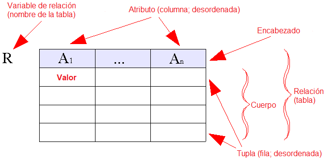
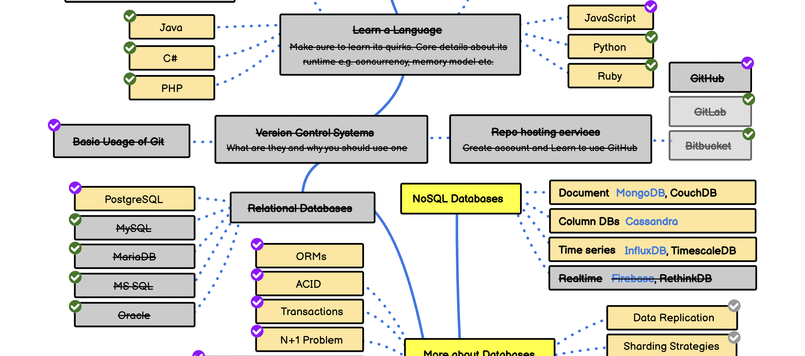

Continuando con nuestro recorrido por el ["roadmap para el desarrollador backend"](https://roadmap.sh/backend) exploraremos el capítulo sobre bases de datos.

Antes de seguir quiero recordarte que si quieres apoyar [este proyecto](http://localhost:1313/category/backend-developer/) y su futura publicación como libro, puedes patrocinarme a través de la plataforma Ko-fi: https://ko-fi.com/lnds



## Bases de Datos

Cuando trabajamos en resolver problemas de negocios en la vida real nos encontramos con el desafío de organizar y gestionar masivas cantidades de datos.

Hoy en día tenemos al alcance una diversidad de herramientas que facilitan la recolección, almacenamiento y gestión de datos de manera sencilla, una de las más comunes son las planillas de cálculo (como Microsot Excel, Apple Numbers o Google Spreadheet).

Es sorprendente como muchas organizaciones son capaces de trabajar y soportar la operación usando estas herramientas de ofimática, a veces a niveles extremos e incluso peligrosos[^1].

Si bien estas herramientas nos dan flexibilidad y son fáciles de utilizar, presentan varios problemas cuando debemos procesar de forma masiva, segura y con alto desempeño los datos. Es por esto que se inventaron los sistemas de gestión de bases de datos. Pero definamos algunas cosas primero.

## Datos

Es una representación simbólica de un atributo o variable cuantitativa o cualitativa. 

Veamos algunos ejemplos:

Datos Cualitativos, que se refieren a cualidades de entidades del mundo real:

- Nombre: Juan 
- Ocupación: Ingeniero 
- Domicilio: Avenida Los 3 cerditos 4560
- Género: Masculino

Datos Cuantitativos, que se refieren a cantidades de ciertos atributos:

- Edad: 54 
- Altura: 170 
- Número de Hijos: 3 
- Años en el cargo: 4

El dato es el valor que va después de los dos puntos. Lo anterior a los dos puntos corresponden al atributo o variable. Pero fíjense que hay cierta imprecisión en estos valores. Por ejemplo la altura, ¿en qué unidades está expresada? Lo mismo pasa con la edad. Asumimos que son centímetros y años respectivamente, pero no siempre es evidente esto. Por eso que antes debemos establecer las características propias de las variables, a esto lo llamaremos **meta data**.

Por ejemplo:

- La variable Edad está expresada en años enteros 
- La altura estará expresada en centímetros 
- En la variable Nombre solo nos interesa guardar el nombre de pila

Esta meta data nos ayuda a darle sentido a estos datos.

Cuando procesamos y organizamos los datos, estableciendo un contexto y dándole sentido, entonces hablamos de **información**. Por ahora no vamos a adentrarnos en ese tópico, nos conformaremos con la noción de dato.

## Sistemas de Gestión de Bases de Datos

En computación una base de datos es una colección de datos organizados y almacenados de manera electrónica.

Normalmente, se tiende a confundir el término "bases de datos" con el software específico que nos permite administrarlas, a los que nos referimos formalmente como "sistemas de gestión de base de datos", abreviados como SGBD o en inglés DBMS, por Data Base Management System.

El desarrollo de los sistemas de almacenamiento directo (cómo los discos duros o los tambores de datos) en la década de 1960, junto con el desarrollo de los [sistemas de archivos](/blog/2021/03/06/el-camino-del-backend-developer-sistemas-de-archivos/), permitieron el desarrollo de sistemas interactivos para la exploración de los datos. El término base de datos apareció en 1962[^2].

Los primeros DBMS eran "navegacionales", y se basaban en modelos jerárquicos y de red, para organizar los datos[^3]. La característica esencial. Estos sistemas era la capacidad de navegar por los datos siguiendo las relaciones que tenían los registros.

Por ejemplo, expresado en pseudo código una forma de "navegar los datos" en estos primeros sistemas habría sido algo del estilo.

``` 
get department with name='Sales' 
get first employee in set department-employees 
until end-of-set do { 
	get next employee in set department-employees 
	process employee 
} 
```

Lo importante es que acá lo que hacemos es decirlo al sistema **como** encontrar los registros que requerimos.

Acá hemos usado la palabra **registro** para referirnos vagamente a un grupo de atributos correspondiente a un elemento que hemos almacenado en nuestra base de datos. En el ejemplo, asumimos que hay un registro por cada empleado en el sistema, y cada empleado tiene atributos con datos como nombre, edad, cargo, etc.

Pero en vez de indicarle al sistema cómo navegar por los datos, podemos diseñar nuestro sistema de modo que solo nos preocupemos de qué es lo que necesitamos recuperar.

En ese caso podríamos escribir algo así:

```
find employees, departments 
where employee.department-code = department.code 
and department.name="Sales"
```

En este caso le pedimos al sistema que queremos que encuentre los registros que cumplan las relaciones que hemos puesto de manera explícita.

Este cambio en la forma de consultar nuestras bases de datos abrió el camino para el desarrollo de los sistemas de base datos relacionales.

## Bases de datos relacionales

Las bases de datos relacionales son aquellos sistemas de gestión de datos que implementan el modelo relacional.

Hay varios modelos para implementar los SGBD, algunos los mencionamos de pasada como el jerárquico o el de redes, otro modelo es el que soporta las [bases de datos de grafos](https://en.wikipedia.org/wiki/Graph_database), que exploraremos más adelante. También existen modelos que son usados para diseñar bases datos, como el modelo entidad-relación, que también exploraremos. O modelos que se centran en el modo en que se almacenan los datos como el modelo de [Objetos](https://en.wikipedia.org/wiki/Object_database) o el [Documental](https://en.wikipedia.org/wiki/Document-oriented_database) que revisaremos después en esta serie de artículos.

El modelo relacional fue propuesto por Edgar F. Codd en 1969 y su propuesta se basa en el uso de la [lógica de primer orden](https://es.wikipedia.org/wiki/L%C3%B3gica_de_primer_orden). 


En este modelo los datos se representan en **tuplas** los que se pueden agrupar en relaciones.

Este diagrama ayuda a clarificar estos conceptos:



La relación es una tabla donde cada columna es un atributo. El encabezado de la columna corresponde al nombre del atributo y en cada celda en el cuerpo de cada columna están los valores. Cada fila del cuerpo de la tabla es una tupla. El nombre de la tabla se conoce como variable de relación.

Por ejemplo, la relación **Empleados** puede ser esta tabla:

  | Nombre  | Sueldo | Cargo      | Departamento | Apellido | Identificador | Antigüedad |
  | ------- | ------ | ---------- | ------------ | -------- | ------------- | ---------- |
  | Juan    | 5000   | Ingeniero  | Desarrollo    | Pérez    | 1-9           | 5          |
  | Pedro   | 4500   | Supervisor | Operaciones  | Gómez    | 2-7           | 8          |
  | Alberto | 6500   | Gerente    | Ventas      | Cortés   | 3-5           | 10         | 

Fíjense que en una relación no tienen por qué estar ordenados los atributos, ni tampoco las tuplas.

Podemos crear una relación de Departamentos de este modo:

| Departamento | Ubicación    | Encargado |
| ------------ | ------------ | --------- |
| Ventas       | Santiago     | 3-5       |
| Desarrollo   | Concepción   | 89-5      |
| Marketing    | Viña del Mar | 28-3      |

De este modo podemos relacionar un Departamento con todos sus empleados a través del atributo `Departamento`.

Sobre el modelo relacional se crearon un álgebra relacional y un cálculo relacional que permiten operar sobre estas relaciones y hacer consultas y operaciones sobre las mismas. Si bien estas herramientas son interesantes desde el punto de vista teórico, la aplicación del cálculo relacional más práctica resultó ser un lenguaje de programación declarativo muy poderoso conocido como SQL.

## SQL

Basándose en las ideas de Codd, IBM desarrolló el sistema de gestión conocido como [System R](https://es.wikipedia.org/wiki/System_R). Una parte de este sistema era el lenguaje SEQUEL (Structured English Query Language),  el que, por temas de registro de marca, terminaron llamando SQL por Structured Query Language.

A fines de los 70, la empresa Relational Software Inc. vio el potencial de las ideas de Codd y de System R y desarrollaron su propio Sistema de Gestión de Bases de Datos Relacionales (SGBDR o RDBMS en inglés) que llamaron Oracle, posteriormente la empresa cambió su nombre a Oracle Corporation.

SQL es bastante sencillo y poderoso. A modo de ejemplo, supongamos que queremos obtener el nombre, departamento y sueldo de todos los empleados que tienen más de cinco años de antigüedad en la empresa. La sentencia SQL que nos permite hacer esto es:

```SQL
select Nombre, Departamento, Sueldo
from Empleados
where Antiguedad > 5
```

La estandarización del lenguaje fue impulsada por el NIST originando la primera versión conocida como SQL-86. El estándar actual es conocido como ISO/IEC 9075.


Cada SGBDR define sus propias extensiones al lenguaje. Actualmente, los sistemas que usan SQL más populares son:

	- ORACLE
	- PostgreSQL
	- MySQL
	- MariaDB
	- MS SQL

Oracle es la plataforma más antigua, es propietaria y muy extendida en el mundo empresarial. MS SQL también es propietaria y pertenece a Microsoft. PostgreSQL es un poderoso gestor de código abierto que contiene características bastante avanzadas. Por último MySQL es un proyecto que fue adquirido por Sun MicroSystem y posteriormente por Oracle, lo que llevó a la creación del proyecto alternativo MariaDB.

Más adelante hablaremos en detalle sobre SQL y algunas características más avanzadas del mismo. En el próximo artículo de esta serie hablaremos sobre modelos no relacionales modernos conocidos como "Bases de Datos NoSQL".

Por ahora tachemos un tópico más en nuestra ruta:



Si te gustó te invito a apoyarme en [Ko-fi](https://ko-fi.com/lnds), tu apoyo permitirá publicar en el futuro un libro basado en esta serie.



[^1]: Consideren el caso del servicio de salud británico que usó Excel para llevar registro de los pacientes durante la pandemia de COVID de 2020, proceso que implicó la pérdida de información. https://www.bbc.com/news/technology-54423988
[^2]: https://en.wikipedia.org/wiki/Database#History
[^3]: En estos sistemas cada registro está enlazado directamente con otros mediante una suerte de puntero o enlace. En el modelo jerárquico la estructura es de árbol, en el modelo de red la estructura subyacente es un grafo. Puedes aprender más sobre estos modelos acá: https://en.wikipedia.org/wiki/Hierarchical_database_model y acá https://en.wikipedia.org/wiki/Network_model

