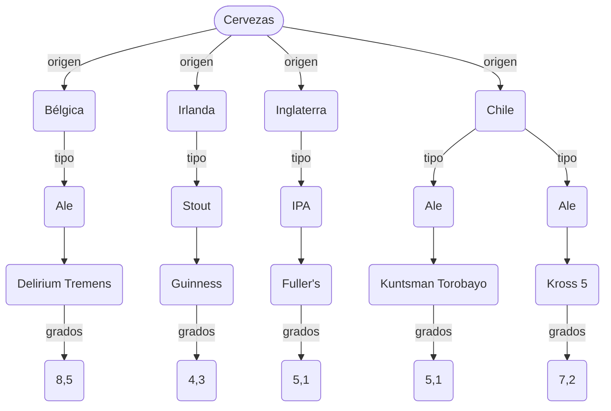
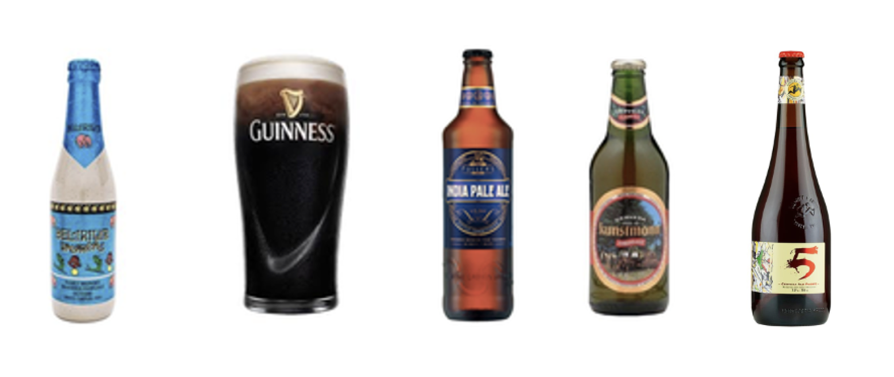
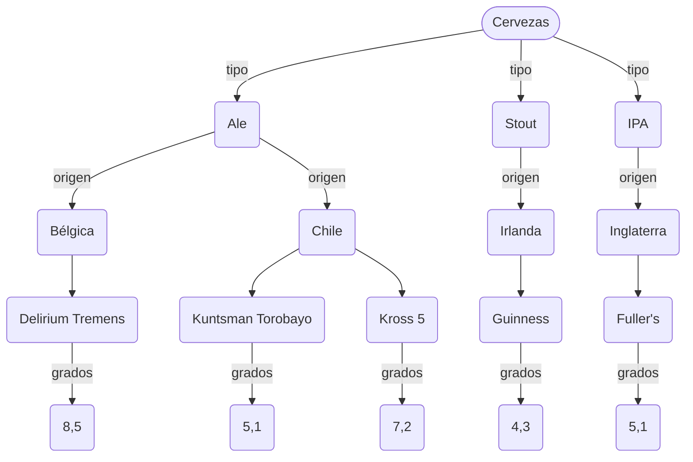
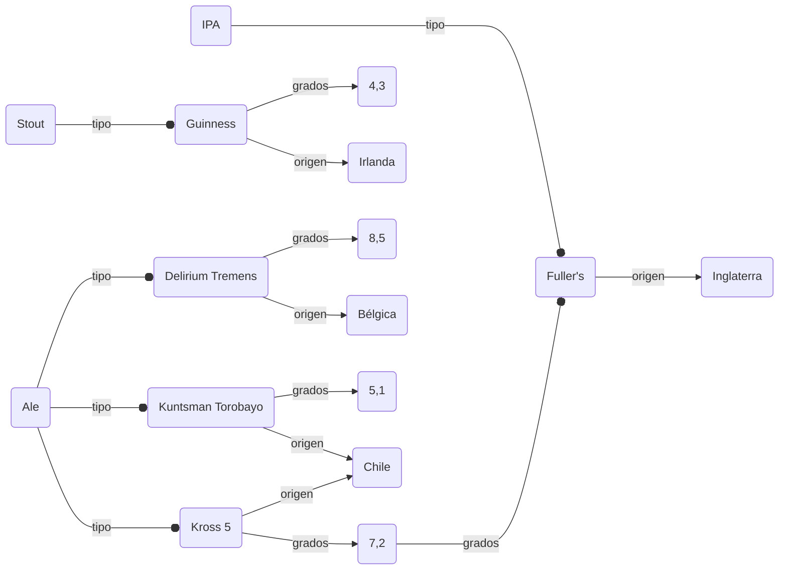

Tal como prometimos en el artículo anterior de esta serie exploraremos las bases de datos NoSQL.

Como siempre, aprovecho de recordarte que si quieres apoyar la futura publicación como libro de  [este proyecto](/category/backend-developer/) puedes patrocinarme a través de la plataforma Ko-fi: https://ko-fi.com/lnds



## Modelos de Datos

Cuando trabajamos con bases de datos necesitamos poder describir su estructura de cierta forma. Ya vimos que en [el caso de las bases de datos relacionales](/blog/2022/03/06/el-camino-del-backend-developer-bases-de-datos/) el modelo es la relación, que se representa como tablas. 

Pero existen otras maneras de organizar la información. A esta estructura o forma en que disponemos los datos la llamamos **"Modelo de Datos"**. Es una descripción de alto nivel, es decir, que oculta los detalles de implementación. Pero nos permite comunicar la estructura que tendrá nuestra base de datos. También nos permite establecer los objetos que estamos modelando y las relaciones que existen entre estos.

Para entender mejor esto vamos a usar como ejemplo el modelado de una base de datos de cervezas.

Una manera de representar este conjunto de datos sería disponerlos como una jerarquía o árbol, de la siguiente forma:

Nuestro modelo comienza desde una raíz (`Cervezas` en este caso) y se navega siguiendo las flechas, cada flecha nos indica el atributo al que apunta cada nodo.

También podríamos modelar esta misma jerarquía de esta forma:

Este es un modelo tipo árbol y su principal ventaja es que es fácil de entender. Pero tiene el problema de que algunos valores se repiten. Además, debemos encontrar una jerarquía natural para poder modelar de forma adecuada, lo que no siempre es posible.

Otra alternativa es modelar nuestra base de datos como un grafo, del siguiente modo:

Vemos que el modelo tipo grafo es flexible, elimina la duplicación de datos, incluso permite la no completitud de los datos. La desventaja es que no hay un esquema obvio.

Por último el modelo relacional, que ya vimos en nuestro [artículo anterior](/blog/2022/03/06/el-camino-del-backend-developer-bases-de-datos/), nos permite describir esto de la siguiente forma:

| Nombre            | Tipo   | Grados | Origen     | 
| ----------------- | ------ | ------ | ---------- |
| Delirium Tremens  | Ale    | 8,5    | Bélgica    |
| Guinness          | Stout  | 4,3    | Irlanda    |
| Fuller's          | IPA    | 5,1    | Inglaterra |
| Kuntsman Torobayo | Ale    | 5,1    | Chile      |
| Kross 5           | Ale    | 7,2    | Chile      |

Este modelo es sencillo e intuitivo. Pero requiere que tengamos el esquema predefinido, el agregar una nueva columna puede ser complicado, por ejemplo. Más adelante, veremos que es posible duplicar la duplicidad de datos mediante un proceso conocido como "normalización".

Una última forma de almacenar nuestra información sería mediante la técnica llamada "llave - valor", del siguiente modo:

| Llave             | Valor                                        |
| ----------------- | -------------------------------------------- |
| Delirium Tremens  | {tipo: Ale; Grados: 8,5; Origen: Bélgica }   |
| Guinness          | {tipo: Stout, Grados: 4,3; Origen: Irlanda } |
| Fuller's          | {tipo: IPA, Grados: 5,1; Origen: Irlanda }   |
| Kuntsman Torobayo | {tipo: Ale; Grados: 5,1; Origen: Chile }     |
| Kross 5           | {tipo: Ale; Grados: 7,2; Origen: Chile }     |

Acá hemos decidido que la llave será el nombre de la cerveza, y el valor corresponde a una estructura con los datos adicionales.

Es posible organizar los datos de muchas maneras y estas distintas formas se reflejan en los modelos alternativos de bases de datos, también conocidas como NoSQL.

## Bases de datos NoSQL

El término NoSQL se usa de manera informal para referirse a todas aquellas bases de datos que no siguen el modelo relacional. También hay otros que interpretan este término como "Not Only SQL", porque en algunos casos estas bases de datos también usan SQL o una variación de este lenguaje.

Los principales tipos de bases de datos NoSQL son las siguientes:

- Llave-Valor: Emplean el modelo de arreglos asociativos, bastante popular en varios lenguajes de programación. Ejemplos: Redis, DynamoDB.
- Bases Documentales: El principal elemento que se almacena es el documento. La definición de documento depende de cada implementación, pero la idea es que la data se codifica utilizando un formato "semi estructurado", como [XML](https://en.wikipedia.org/wiki/XML), [JSON](https://en.wikipedia.org/wiki/JSON) o [YAML](https://en.wikipedia.org/wiki/YAML). Algunos permitan almacenar algunos formatos binarios como [BSON](https://en.wikipedia.org/wiki/BSON). Ejemplos: MongoDB, eXist.
- Bases de datos basadas en grafos: Siguen el modelo de grafos que presentamos recién, estas bases de datos permiten [consultas semánticas](https://en.wikipedia.org/wiki/Semantic_query) y son muy flexibles. Acá las relaciones se definen a través de los arcos que unen los nodos del grafo. Ejemplos: Neo4j, TerminusDB.
- Bases de datos columnares (wide-column): Algunos incluyen entre las bases de datos NoSQL a las bases columnares (en especial al modelo conocido como [wide-column store]()), en que la data se organiza en columnas en vez de filas, como en el modelo relacional clásico. Esta estructura permite consultas más eficientes, aunque algunas operaciones son más costosas. Algunos SGBR han incorporado estas técnicas también, por lo que incluir esta clasificación en NoSQL puede ser discutible, pero hay exitosas bases NoSQL como Cassandra y HSQL que operan sobre este modelo. Ejemplos, Cassandra, BigTable.
- Bases de Datos de Series de Tiempo: sistemas optimizados para almacenar [series de tiempo](https://es.wikipedia.org/wiki/Serie_temporal). En este caso se optimiza la indexación de los datos en función del tiempo. Normalmente se almacenan pares (tiempo, valor) y son muy utilizadas en aplicaciones de monitoreo o en [IoT](https://en.wikipedia.org/wiki/Internet_of_things). Ejemplo: [InfluxDB](https://github.com/influxdata/influxdb)
- Real Time Databases: son sistemas gestores de bases de datos que se extienden con capacidades de procesamiento en tiempo real, para manejar cargas de trabajo cuyo estado está en permanente cambio. Estas se usan en juegos online, aplicaciones de mercados de valores, streaming, apps colaborativas. Ejemlos: [Firebase](https://firebase.google.com/), [RethinkDB](https://rethinkdb.com/)

## Datos  No Estructurados y Semi Estructurados

Los datos no estructurados (o data no estructurada) corresponde a información que no se encuentra organizada de acuerdo a un modelo de datos preestablecido. Cuando algo tiene una estructura hablamos de un "esquema de datos" o _schema_. Cuando algo no tiene este esquema, o no es fácil mapear su estructura a uno, hablamos de data no estructurada y, por tanto, no es posible almacenarla de forma directa en una base de datos relacional.

Muchos documentos de negocios y la información en distintos medios como imágenes, videos, emails, documentos generados por soluciones ofimáticas, etc., corresponde a datos no estructurados.

Sin embargo, cuando consideramos los meta datos de un email, podemos reclasificarlo y decimos que un email, con su metadata incluida corresponde a un tipo de dato semi estructurado.

La data estructurada está organizada de modo que la búsqueda es sencilla. La data no estructurada, existe en formatos diversos como audio, video y entradas en social media, y normalmente no es fácil realizar búsquedas sobre esta usando herramientas convencionales.

La data semi estructura tiene ciertas propiedades que permiten un grado de organización, lo que facilita el análisis y búsqueda de la información. Normalmente, la data semi estructurada tiene ciertas etiquetas que nos permiten agrupar y crear jerarquías de información.

Algunos ejemplos de datos semi estructurados:

- Email con meta data
- Documentos XML
- Data en formato JSON

Hay bases de datos especializadas en la gestión de datos semiestructurados, como [MongoDB](https://mongodb.com/) o [CouchDB](https://couchdb.apache.org/).

## El Teorema CAP y NoSQL

Otra forma de explicar el origen de NoSQL es entendiendo el teorema CAP y sus consecuencias.

El Teorema CAP o de Brewer (por su autor, Eric Brewer) nos dice que todo almacenamiento distribuido de datos solo puede proveer dos de las siguientes tres garantías:

- Consistencia (Consistency): Toda lectura de datos recibe el valor más recientemente escrito, o un error.
- Disponibilidad (Availability): Todo requerimiento de datos recibe una respuesta no errónea, sin garantía de que se está recibiendo el último valor escrito.
- Tolerancia a la Partición (Partition Tolerance): El sistema continúa operando a pesar de que se pierda un número arbitrario de mensajes por fallos en la red que conecta a los nodos.

En mi blog ["La Naturaleza del Software"](https://lnds.net/) expliqué hace unos años el Teorema CAP en este artículo: https://lnds.net/blog/lnds/2012/05/25/dos-de-tres-el-teorema-cap/.

El título CAP viene de las siglas en inglés Consistency-Availability-Partition tolerance.

Este diagrama nos muestra las posibles combinaciones que podemos tomar dentro del teorema CAP y los tipos de bases de datos que los soportan:

Las bases de datos relacionales garantizan Disponibilidad (A) y Consistencia. Bases de datos como MongoDB, BigTable o Redis garantizan Consistencia (C) y Tolerancia a la Partición (P). Mientras que algunas bases de datos como Dynamo o Cassandra se concentran en garantizar Disponibilidad (A) y tolerancia a la Partición (P).

En el próximo artículo de esta serie exploraremos, con código, algunas diferencias entre los distintos tipos de bases de datos. Además, explicaremos otra consecuencia del teorema CAP, los modelos transaccionales ACID y BASE, que define otra gran diferencia entre las bases relacionales y las NoSQL.

Si te gustó este artículo te invito a apoyarme en [Ko-fi](https://ko-fi.com/lnds), con este auspicio podré publicar en el futuro un libro basado en esta serie.


